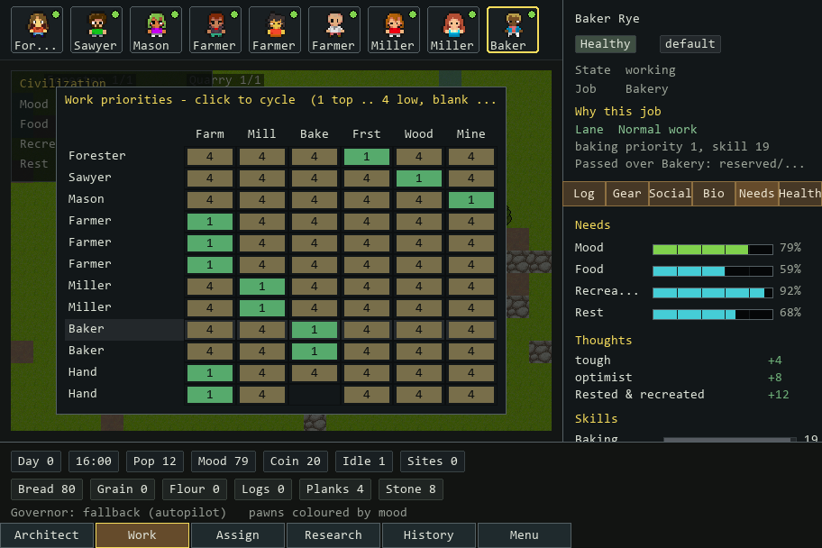

# Local Agent Town

A local desktop prototype for watching one LLM-governed civilization run on autopilot.

This is intentionally not web based. The simulation core is deterministic Python;
Pygame is the local viewer for the civilization state.

## Current State Screenshot


This is a screenshot of the current local viewer state: an Age/Townsmen-style
macro strip, RimWorld-style pawn roster, readable civilization map, right-side
alerts plus selected-pawn inspection, and a bottom command strip. Persistent UI
now stays in reserved regions instead of covering the map. Pawns self-select
their work through the lane-based arbiter, and the selected-pawn inspector keeps
the "Why this job" trace visible.

Every bottom command opens one real panel. **Architect** shows build costs,
counts, slots, missing inputs, and construction blockers. **Work** opens the
RimWorld-style priority grid; click a cell to cycle a pawn's priority (1 highest
.. 4 lowest, blank disables it). **Assign** opens a direct override browser:
select a pawn, pin them to an open job slot, or click an occupied slot to inspect
the worker holding it. The right-side inspector tabs (`Log`, `Gear`, `Social`,
`Bio`, `Needs`, `Health`) are live. **Research** shows the current research spine
and honest disabled future entries. **History** opens a live decisions + events
timeline; click a Governor decision to inspect proposed, applied, and rejected
policy payloads plus the after-state goods/needs and causality map. **Menu**
shows run controls, 1x/8x/20x watch speed, local model status, proof path, and
overlay toggles/status.



## Architecture Stance

The current scale decision is: keep Pygame as the prototype viewer, but keep the
engine testable and measurable without the viewer.

That means new scale work should start with evidence instead of an engine
rewrite:

- benchmark the headless civilization engine, governor context building, and dummy
  draw loop;
- keep the Governor as policy only, never a pawn micromanager;
- migrate engines only if benchmark evidence shows rendering, editor tooling,
  or Pygame-specific limits are the blocker.

Project structure follows the `LLM_Workbench` pattern:

- `AGENTS.md` - agent instructions, scope, and verification rules.
- `BLUEPRINT.md` - stable project definition and architecture.
- `ROADMAP.md` - active plan, backlog, and verification log.
- `RUNBOOK.md` - setup, run, test, and troubleshooting commands.
- `BOOTSTRAP_CHECKLIST.md` - workbench adoption checks.
- `UNATTENDED_WORK_POLICY.md` - guardrails for longer agent work.
- `VISUAL_DESIGN.md` - local visual baseline.

## Research Papers

The `research_papers/` folder contains GPT Pro reference papers for the games
and UI patterns this project is borrowing from. They are used as source leads
and design inputs, then reduced into `BLUEPRINT.md` decisions and `ROADMAP.md`
implementation slices.

Current intake order:

1. RimWorld mood/thoughts.
2. RimWorld hunger/nutrition.
3. RimWorld autonomous pawn work priorities.
4. Townsmen-style economy loops.
5. Age of Empires settlement readability.
6. Observer-first RimWorld + Age UI.
7. Scale from 12 pawns to 1000 pawns.

When a paper conflicts with current code, the conflict is tracked as a roadmap
task instead of being treated as already implemented.

## Run

From this folder:

```powershell
.\setup.ps1
.\run.ps1
```

Or double-click:

```text
Launch Local Agent Town.cmd
```

## Controls

- Pan: `WASD` or arrow keys.
- Zoom: mouse wheel, `+`, or `-`.
- Select pawn: click a pawn or press `Tab`.
- Open a command panel: click `Architect`, `Work`, `Assign`, `Research`,
  `History`, or `Menu` in the bottom strip.
- Watch speed: open `Menu` and click `1x`, `8x`, or `20x`.
- Local model governor: press `L` to connect or disconnect LM Studio/Ollama.
- Close panel / quit: `Esc` closes an open panel first; with no panel open, `Esc`
  or `Q` quits.

## Optional Local AI

The civilization runs without an LLM. To let a local model govern policy, start an
OpenAI-compatible local server such as LM Studio, then set:

```powershell
$env:AGENT_TOWN_LLM_MODEL = "google/gemma-4-e4b"
$env:AGENT_TOWN_LLM_BASE_URL = "http://localhost:1234/v1"
.\run.ps1
```

Ollama can use the same adapter with
`AGENT_TOWN_LLM_BASE_URL=http://localhost:11434/v1`.

## What Exists Now

- A deterministic build-1 civilization engine.
- Twelve pawns with skills, traits, needs, mood, schedule, assignments, and
  break states.
- Production chains for logs, planks, stone, grain, flour, and bread.
- Construction, daily tax, and a fallback Governor that keeps the civilization moving.
- A local LLM Governor behind the same interface, with hard fallback on any
  error.
- A Pygame civilization viewer with camera pan/zoom, pawn selection, a top macro
  strip, pawn roster, right-side alerts and pawn inspector, bottom command strip,
  local model status, and docked command panels.
- A lane-based work-priority arbiter: pawns self-select their best legal job
  (manual priority -> work-type order -> skill), never double-claim a slot, and
  expose a decision trace. The Work button opens a clickable priority grid, and
  Assign opens a distinct forced-assignment/slot-inspection browser.
- A conservation-safe water slice: Water Well production, stockpiled water,
  pawn drinking, thirst mood pressure, Civ Water readout, and a `low_water`
  governor exception.
- A live History decision audit plus Governor observer surfaces for current plan,
  bottleneck, confidence, proposed/applied/rejected policy actions, recent
  policy change, after-state goods/needs, and active exceptions.
- Menu watch-speed controls for 1x, 8x, and 20x viewer pacing.
- CC0/provenance-tracked civilization sprites under `src\agent_town\assets\colony`.
- A repeatable civilization scaling benchmark for 100, 500, and 1,000 pawns.

## Next Useful Upgrades

- Keep lethal starvation deferred until the malnutrition/death timing slice can
  add status, exceptions, viewer surfacing, and food-chain urgency together.
- Add the first Paper 7 scale foundations before larger populations:
  reachability-region rejection and deterministic update phases.
- Add district storage/market pressure before comfort chains.
- Add save state once the civilization persistence model is designed.
- Add pathfinding benchmarks before larger maps or blocked terrain.
