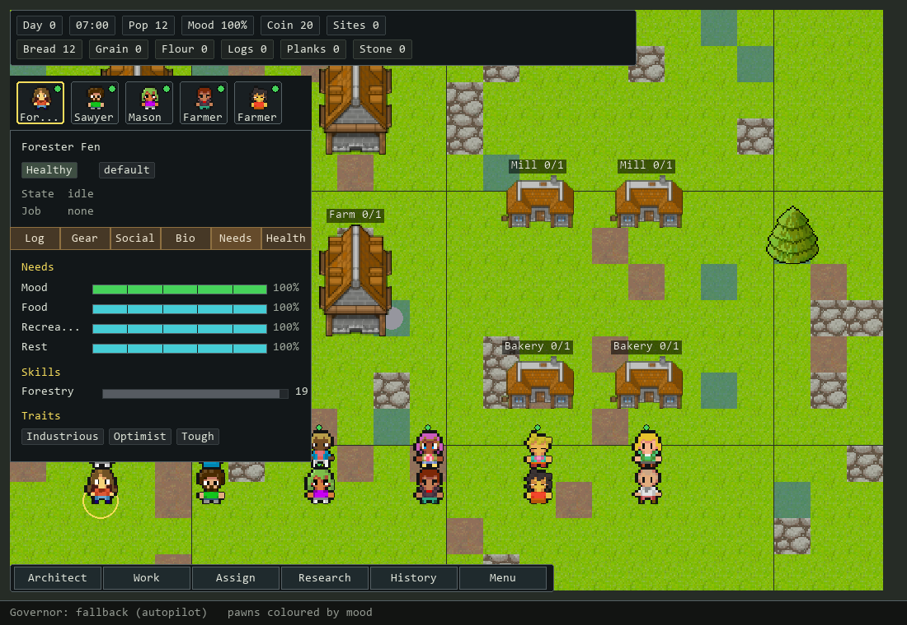

# Local Agent Town

A local desktop prototype for watching one LLM-governed colony run on autopilot.

This is intentionally not web based. The simulation core is deterministic Python;
Pygame is the local viewer for the colony state.

## Current State Screenshot



This is a screenshot of the current local viewer state. It shows the intended
near-term direction: a larger readable colony map with in-map overlays for the
RimWorld-style pawn roster, selected-pawn sheet, resource HUD, and command
strip. The bottom command buttons are visual placeholders right now; they do not
trigger build, work, assign, research, history, or menu actions yet.

## Architecture Stance

The current scale decision is: keep Pygame as the prototype viewer, but keep the
engine testable and measurable without the viewer.

That means new scale work should start with evidence instead of an engine
rewrite:

- benchmark the headless colony engine, governor context building, and dummy
  draw loop;
- keep the Governor as policy only, never a pawn micromanager;
- migrate engines only if benchmark evidence shows rendering, editor tooling,
  or Pygame-specific limits are the blocker.

Project structure follows the `LLM_Workbench` pattern:

- `AGENTS.md` - agent instructions, scope, and verification rules.
- `BLUEPRINT.md` - stable project definition and architecture.
- `ROADMAP.md` - active plan, backlog, and verification log.
- `RUNBOOK.md` - setup, run, test, and troubleshooting commands.
- `BOOTSTRAP_CHECKLIST.md` - workbench adoption checks.
- `UNATTENDED_WORK_POLICY.md` - guardrails for longer agent work.
- `VISUAL_DESIGN.md` - local visual baseline.

## Run

From this folder:

```powershell
.\setup.ps1
.\run.ps1
```

Or double-click:

```text
Launch Local Agent Town.cmd
```

## Controls

- Pan: `WASD` or arrow keys.
- Zoom: mouse wheel, `+`, or `-`.
- Select pawn: click a pawn or press `Tab`.
- Local model governor: press `L` to connect or disconnect LM Studio/Ollama.
- Quit: `Esc` or `Q`.

## Optional Local AI

The colony runs without an LLM. To let a local model govern policy, start an
OpenAI-compatible local server such as LM Studio, then set:

```powershell
$env:AGENT_TOWN_LLM_MODEL = "google/gemma-4-e4b"
$env:AGENT_TOWN_LLM_BASE_URL = "http://localhost:1234/v1"
.\run.ps1
```

Ollama can use the same adapter with
`AGENT_TOWN_LLM_BASE_URL=http://localhost:11434/v1`.

## What Exists Now

- A deterministic build-1 colony engine.
- Twelve pawns with skills, traits, needs, mood, schedule, assignments, and
  break states.
- Production chains for logs, planks, stone, grain, flour, and bread.
- Construction, daily tax, and a fallback Governor that keeps the colony moving.
- A local LLM Governor behind the same interface, with hard fallback on any
  error.
- A resizable Pygame colony viewer with camera pan/zoom, pawn selection, in-map
  roster/sheet/HUD/command overlays, and local model status.
- A command strip that shows the target control surface, but is not wired to
  gameplay actions yet.
- CC0/provenance-tracked colony sprites under `src\agent_town\assets\colony`.
- A repeatable colony scaling benchmark for 100, 500, and 1,000 pawns.

## Next Useful Upgrades

- Finish final viewer cleanup after the social-sim retirement.
- Add build-2 depth: water, clothes/beauty, storage caps, repair, wages, and
  work priorities.
- Add save state once the colony persistence model is designed.
- Add pathfinding benchmarks before larger maps or blocked terrain.
