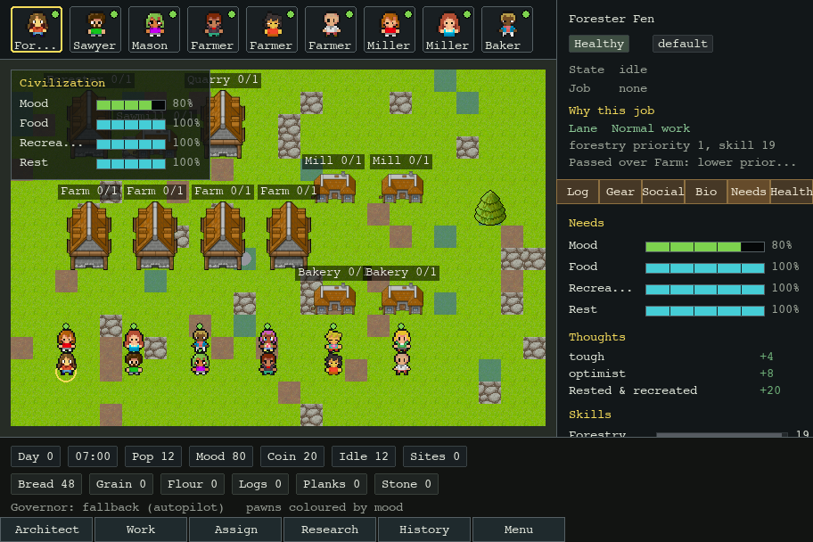
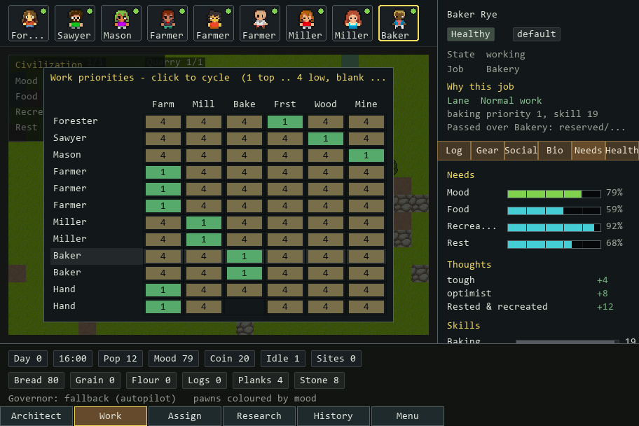

# Local Agent Town

> Generated from LLM Workbench v2.1. See `RUNBOOK.md` -> Upgrading The Harness.

A local desktop prototype for watching one LLM-governed civilization run on
autopilot. It is intentionally not web based: the simulation core is deterministic
Python and Pygame is the local viewer for the civilization state. One Governor
agent sets policy; a deterministic engine runs about a dozen RimWorld-style pawns
and the economy. You watch; you do not play.

## Current State Screenshot



The current local viewer: a RimWorld-style pawn roster, selected-pawn sheet,
readable civilization map, resource HUD, Civ stats panel, Governor observer card,
right-edge exception stack, and bottom command strip. Pawns self-select work
through the lane-based arbiter; the map separates hover from selection, shows idle
pawns with an overhead badge, and renders construction sites as ghosts. The
**Work** button opens the work-priority grid; the **History** button opens the
live event feed. The other command buttons (Architect, Assign, Research, Menu)
are visual placeholders.



## How This Project Is Run

This repository is governed by a small set of control documents. Read them before
changing anything:

- [`AGENTS.md`](AGENTS.md) - how agents behave here: authority order, read/edit
  scope, the task-selection loop, documentation ownership, and proof rules.
- [`BLUEPRINT.md`](BLUEPRINT.md) - what this project is: identity, direction,
  architecture, the frozen contract, invariants, and preserved decisions.
- [`TASKBOARD.md`](TASKBOARD.md) - the live work queue and append-only proof log.
  Its **Executive Brief** (top of the file) is the one-glance status.
- [`RUNBOOK.md`](RUNBOOK.md) - how to set up, run, test, and recover the project,
  plus the verification commands that gate "done".
- [`HARNESS_FEEDBACK.md`](HARNESS_FEEDBACK.md) - the return channel to the LLM
  Workbench harness these docs came from.

Local visual baseline: [`VISUAL_DESIGN.md`](VISUAL_DESIGN.md). The one-time
migration that produced these v2 docs is preserved as a decision in `BLUEPRINT.md`;
the pre-v2 harness docs are archived under `archive/legacy-harness/`.

## Getting Started

Windows:

```powershell
.\setup.ps1
.\run.ps1
```

macOS/Linux:

```bash
python3.12 -m venv .venv
.venv/bin/python -m pip install -e .
.venv/bin/python -m agent_town
```

Full setup, environment, testing, and troubleshooting steps live in
[`RUNBOOK.md`](RUNBOOK.md).

Controls: pan `WASD`/arrows; zoom mouse wheel / `+` / `-`; select pawn click or
`Tab`; local model toggle `L`; quit `Esc`/`Q`.

## Optional AI

The civilization runs without an LLM. To let a local model govern policy, start an
OpenAI-compatible local server (LM Studio/Ollama) and set `AGENT_TOWN_LLM_MODEL`
and `AGENT_TOWN_LLM_BASE_URL` (see `RUNBOOK.md`). Hosted OpenAI is opt-in testing
only; keep `OPENAI_API_KEY` in an ignored local env file.

## Research Papers

`research_papers/` holds reference papers (RimWorld mood/hunger/autonomy,
Townsmen economy, Age-of-Empires readability, observer UI, scale to 1000 pawns,
and a synthesis) that this project borrows from. They are source leads and design
inputs, reduced into `BLUEPRINT.md` decisions and `TASKBOARD.md` slices. When a
paper conflicts with current code, the conflict is tracked as a task, not treated
as already implemented.

## What Exists Now

- A deterministic build-1 civilization engine (~12 pawns; wood/food/stone/water
  chains; construction; daily tax).
- Pawns with skills, traits, needs, RimWorld-style mood/thoughts, schedules,
  nutrition, and break states.
- A deterministic `FallbackGovernor` (the winnability oracle) and an `LLMGovernor`
  behind the same interface with a hard fallback on any error.
- A Pygame viewer with camera pan/zoom, pawn selection, roster, pawn sheet, HUD,
  Civ stats, local model status, Governor card, and exception stack.
- A lane-based work-priority arbiter with reservations and a decision trace, a
  water essential slice, finite storage caps with pressure badges, and a first
  wage/market money loop with sales tax and service-pressure signal.
- A live History event feed, CC0/provenance-tracked sprites, and a repeatable
  scaling benchmark.

## Project Status

See the **Executive Brief** at the top of [`TASKBOARD.md`](TASKBOARD.md) for the
current shipping state, health, decisions, blockers, and next milestone. In short:
build 1 is essentially done and build-2 depth is underway; the next code task is
repair debt, then Paper 7 scale foundations.

## License

No license file yet; see `TASKBOARD.md` -> Pending Decisions (D-001).
