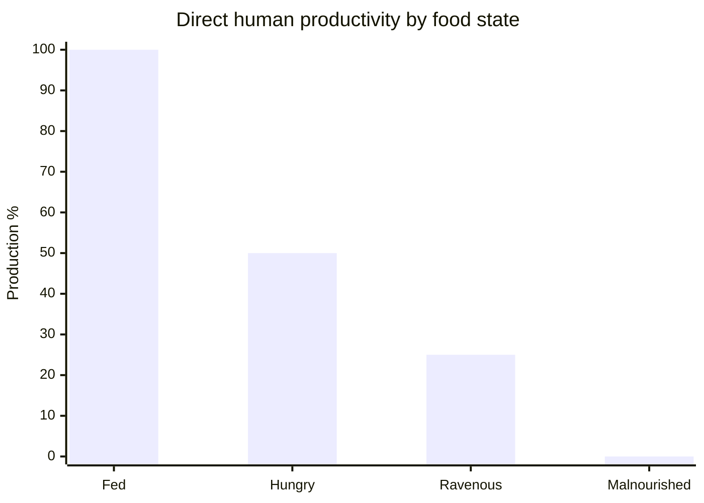
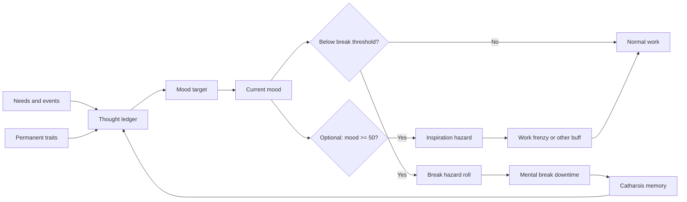

# RimWorld Mood System for a Small Local Agent Town Simulation

## Executive summary

For a 12-pawn Local Agent Town sim, the smallest faithful RimWorld mood model is this: keep a per-pawn thought ledger, compute a **mood target** from base mood plus active thought offsets, move **current mood** toward that target with RimWorld’s asymmetric smoothing, trigger **mental break risk** from trait-modified thresholds, add **Catharsis** after completed breaks, and model **productivity** as mostly indirect through breaks, with one major direct exception: hunger. In vanilla core, mood itself does **not** apply a generic work-speed multiplier. Productivity changes primarily because hungry humans work at reduced production rates, exhausted pawns can collapse, low mood causes downtime from breaks, and high mood can optionally produce inspirations. citeturn12view0turn19view0turn30view0turn31view0turn38view0

The most important design choice for a simplified sim is whether to include **expectations**. In vanilla, expectations are foundational because storyteller base mood alone can be as low as 32 on Strive to Survive, while the default minor break threshold is 35. Without expectation moodlets or an equivalent baked-in settlement bonus, a scope-limited sim that excludes rooms, relationships, ideology, drugs, and many other mood sources will systematically understate average mood and overproduce breaks. For a small town sim, the cleanest fix is to treat expectations as a single settlement-level baseline bonus, or fold them into a configurable base mood. citeturn15view0turn15view1turn42view0

## Scope and assumptions

This report stays inside the mechanics you requested: mood target versus current mood, the thought or moodlet ledger, hunger thoughts, rest and recreation thoughts, trait offsets, mental break thresholds, Catharsis, and productivity effects. It excludes room impressiveness, prisoners, ideology, drugs, relationships, and late-game systems except where they are foundational to making the scoped model behave like RimWorld. citeturn12view0turn19view0turn42view0

Assumptions for the simplified implementation are: adult humanlike omnivorous pawns, no social links, no prisoner state, no DLC-only systems, no pain/injury/temperature/room thoughts, and no direct modeling of colony wealth except optionally as a single expectations bonus. For exact food thresholds, I treat the current decompiled code as source of truth. That code derives human hunger thresholds from `FoodLevelPercentageWantEat = 0.3`, yielding **Hungry at below 24%** food and **Urgently Hungry at below 12%** food, while some wiki tables round these to roughly 25% and 12.5%, and an older Thoughts page still lists 30% and 20%. For a rigorous sim, use the code values. citeturn39view0turn33view0turn38view2turn9view0

## Verified mechanics

### Mood target and current mood

Vanilla mood has two layers. The **instant mood target** is calculated from base mood plus the sum of mood thought offsets, plus the storyteller’s colonist mood offset, then clamped to `[0, 100]`. The **current mood** then moves toward that target over time instead of snapping instantly. RimWorld’s documented movement limits are **+12 mood points per in-game hour when rising** and **-8 mood points per in-game hour when falling**. When a pawn is sleeping or otherwise unconscious, current mood does not move and break risk is paused. citeturn12view0turn15view0turn25search16

The decompiled mood code also exposes the UI danger bands. A pawn is “About to break” below the extreme threshold, “On edge” for the next **5 mood points** above the extreme threshold, and “Stressed” below the minor threshold. That is useful in a simplified sim because it gives you cheap state labels without implementing RimWorld’s full inspect pane. citeturn12view0

### Thought ledger and memory behavior

RimWorld’s mood ledger is conceptually two streams: **situational thoughts** and **memory thoughts**. The engine gathers all active mood thoughts, collapses them into **distinct thought groups**, and computes total mood offset by summing the offset of each group. For grouped thoughts, stacking is not pure addition. Instead, the code applies a geometric stacked-effect multiplier within the group, which is a fidelity detail you can treat as optional in a small sim. citeturn19view0

Memory thoughts age in **150-tick intervals**. A memory is discarded when its age exceeds its duration, unless it is marked permanent. Memory mood can also be linearly faded toward zero when the thought definition requests it. For a lightweight sim, you do not need the full definition system. You only need ledger rows with: `key`, `type`, `offset`, `start`, `end or duration`, `stack_group`, and `permanent flag`. citeturn19view1

A concise comparison of the scoped thought sources is below.

| Thought class | Trigger | Exact vanilla value | Duration | Direct productivity effect | Simplified sim recommendation | Source |
|---|---|---:|---|---|---|---|
| Mood target aggregation | Base mood + active mood thought offsets + storyteller colonist mood offset, clamped to `[0,100]` | Exact formula in `Need_Mood` | Continuous | Indirect via mood, breaks, inspirations | Essential | Code citeturn12view0turn19view0 |
| Situational thoughts | Derived live from current state, needs, environment, etc. | Active while condition holds | N/A | Depends on thought | Essential for hunger, rest, recreation only | Code citeturn19view0turn32view0turn12view1turn12view2 |
| Memory thoughts | Event-driven moodlets stored in memory ledger | Offset depends on thought | Thought-specific | Usually indirect | Essential only for Catharsis in this scope | Code citeturn19view1 |
| Group stacking | Same-group memories or thoughts stack with geometric multiplier | Definition-driven | Thought-specific | Indirect | Optional fidelity feature | Code citeturn19view0 |
| Catharsis | Completed mood-caused break | `+40` | `3` days | Indirect via break prevention | Essential | Wiki citeturn9view3 |

### Hunger, rest, recreation, and trait offsets

For adult omnivorous humans, current code uses `FoodLevelPercentageWantEat = 0.3`, then sets **Hungry below 24%** and **Urgently Hungry below 12%** food. Once food hits `0%`, category becomes **Starving**, and the hunger thought stage is driven by the current stage of `Malnutrition`. The mapped mood stages are **Hungry -6**, **Urgently hungry -12**, then starvation stages **-20, -26, -32, -38, -44**. In the current code path, starvation is category-based and stage-selected from malnutrition severity. citeturn39view0turn33view0turn32view0turn14search4

Rest thresholds in code are exact and clean: **Tired below 28%**, **Very Tired below 14%**, **Exhausted below 1%**. The corresponding mood thoughts are **Drowsy -6**, **Tired -12**, and **Exhausted -18**. Rest falls and rises in 150-tick intervals, and a pawn at or near zero rest can involuntarily collapse into sleep. The rest system does **not** directly reduce work or combat stats in vanilla core, but collapse obviously destroys productivity. citeturn34view1turn12view2turn26view1

Recreation thresholds are also exact in code: **Empty below 1%**, **Very Low below 15%**, **Low below 30%**, **Satisfied below 70%**, **High below 85%**, else **Extreme**. These map to mood thoughts as **Recreation-starved -20**, **Recreation-deprived -10**, **Recreation unfulfilled -5**, **Recreation satisfied +5**, and **Recreation fully satisfied +10**. Base recreation gain is **36% per hour** before activity multiplier and tolerance, which is why a simplified sim can safely use a single generic recreation action if you omit tolerance. citeturn34view0turn12view1turn24view1

Permanent trait mood thoughts in the core set are straightforward: **Sanguine +12**, **Optimist +6**, **Pessimist -6**, **Depressive -12**, and **Tortured artist -8**. These are additive, always-on entries in a simplified ledger. Separate from mood offsets, several traits modify the **minor break threshold stat** itself: **Iron-willed -18**, **Steadfast -9**, **Nervous +8**, **Volatile +15**, **Too smart +12**, **Neurotic +8**, and **Very neurotic +14**, with the final minor threshold clamped between **1% and 50%**. Major threshold is always **4/7** of minor, and extreme threshold is always **1/7** of minor. citeturn29view0turn30view0

The scoped offsets are summarized below.

| Thought or trait entry | Trigger or condition | Exact offset | Thresholds or notes | Duration | Source |
|---|---|---:|---|---|---|
| Hungry | Food below `24%` for adult omnivorous human | `-6` | Code-derived threshold from `0.3 * 0.8` | While active | citeturn39view0turn33view0turn32view0turn14search4 |
| Urgently hungry | Food below `12%` | `-12` | Code-derived threshold from `0.3 * 0.4` | While active | citeturn39view0turn33view0turn32view0turn14search4 |
| Starvation stages | Food `0%` and malnutrition stage | `-20/-26/-32/-38/-44` | Stage is read from malnutrition | While active | citeturn32view0turn14search4 |
| Drowsy | Rest below `28%` | `-6` | Code threshold | While active | citeturn34view1turn12view2turn26view1 |
| Tired | Rest below `14%` | `-12` | Code threshold | While active | citeturn34view1turn12view2turn26view1 |
| Exhausted | Rest below `1%` | `-18` | Code threshold, collapse risk near `0%` | While active | citeturn34view1turn12view2turn26view1 |
| Recreation-starved | Joy `0%` | `-20` | Empty category | While active | citeturn34view0turn24view1 |
| Recreation-deprived | Joy `1%-14%` | `-10` | VeryLow category | While active | citeturn34view0turn24view1 |
| Recreation unfulfilled | Joy `15%-29%` | `-5` | Low category | While active | citeturn34view0turn24view1 |
| Recreation satisfied | Joy `70%-84%` | `+5` | High category | While active | citeturn34view0turn24view1 |
| Recreation fully satisfied | Joy `85%+` | `+10` | Extreme category | While active | citeturn34view0turn24view1 |
| Sanguine | Permanent trait offset | `+12` | Always on | Permanent | citeturn29view0 |
| Optimist | Permanent trait offset | `+6` | Always on | Permanent | citeturn29view1 |
| Pessimist | Permanent trait offset | `-6` | Always on | Permanent | citeturn29view2 |
| Depressive | Permanent trait offset | `-12` | Always on | Permanent | citeturn29view3 |
| Tortured artist | Permanent trait offset | `-8` | Also has optional inspiration interaction | Permanent | citeturn29view0turn17search6 |
| Catharsis | Completed mood-caused break | `+40` | Usually not granted if break is interrupted, except Berserk | `3` days | citeturn9view3 |

### Mental break thresholds, Catharsis, and productivity

For a normal pawn, the default thresholds are **35% minor**, **20% major**, and **5% extreme**. Vanilla break timing is governed by mean times between events: **10 days** below minor, **3 days** below major, and about **0.7 days** below extreme. In a sim, these are best treated as hazard rates rather than deterministic clocks. citeturn15view2turn30view0

Catharsis is a strong rebound memory: **+40 mood for 3 days** after a completed mental break caused by poor mood. If the break is interrupted by arresting or downing the pawn, Catharsis is usually not granted, with Berserk being the major exception noted by the wiki. This memory is one of the few post-break systems worth keeping even in a reduced model because it prevents immediate break chaining. citeturn9view3

For productivity, the exact scoped story is sharply asymmetric. **Hunger directly reduces human production rate** to **50% when Hungry**, **25% when Ravenously Hungry**, and **0% when Malnourished**. **Rest does not directly reduce work stats**, but at zero rest a pawn can collapse and stop working. **Mood itself does not apply a generic work-speed multiplier** in vanilla core. Instead, mood affects productivity indirectly through break risk and optionally through inspirations, where high mood can trigger inspirations above **49% mood**, and **Work frenzy** multiplies global work speed by **1.8x for 8 days** if you choose to keep inspiration mechanics. citeturn38view0turn26view1turn31view0

The chart below visualizes the one exact direct productivity multiplier that matters inside the requested scope: hunger state for human pawns.



Those production values come directly from the Saturation mechanics table for humans. citeturn38view0turn38view2

## Essential and optional pieces

For a small 12-agent sim, the **essential** pieces are: a thought ledger, target-versus-current mood smoothing, hunger/rest/recreation situational thoughts, permanent trait offsets, trait-modified break thresholds, a stochastic break trigger, Catharsis memory, and hunger’s direct production penalty. With only these, agent behavior will already feel recognizably RimWorld-like. citeturn12view0turn19view0turn33view0turn34view0turn34view1turn30view0turn38view0

The most useful **optional** pieces are: expectations as a single settlement-level baseline, recreation tolerance and boredom, same-group thought stacking multipliers, interrupted-break rules for Catharsis, involuntary sleep MTB instead of deterministic collapse, and inspirations. Expectations are the only optional feature I would strongly recommend, because excluding them while also excluding many other mood sources materially distorts average mood. By contrast, inspiration is safe to omit unless you want a positive, high-mood productivity payoff. citeturn42view0turn24view2turn19view0turn9view3turn34view1turn31view0

A practical simplification map is below.

| Subsystem | Vanilla behavior | Keep for 12-pawn sim | Why |
|---|---|---|---|
| Thought ledger | Distinct thought groups, situational + memory, stack multipliers | Keep, but simplify to additive keyed entries | Best fidelity-per-complexity trade | 
| Current mood smoothing | Moves toward target, asymmetric rise/fall | Keep exactly | Crucial for believable lag and recovery |
| Hunger thoughts | Exact categories, starvation stages | Keep exactly | Strong mood and exact direct productivity effect |
| Rest thoughts | Exact categories, collapse at zero | Keep exact categories, simplify collapse rule if desired | Important but no direct work-speed penalty |
| Recreation thoughts | Exact bands, gain from activities, tolerance | Keep bands and generic recreation gain, drop tolerance unless desired | Good signal, low complexity |
| Permanent trait mood offsets | Always-on thought entries | Keep exactly for scoped traits | Cheap and important |
| Threshold modifiers | Trait-adjusted break thresholds | Keep exactly | Core break behavior |
| Catharsis | +40 for 3 days after completed break | Keep exactly | Stops break cascades |
| Expectations | Wealth-based mood baseline | Optional but recommended as one scalar | Prevents scope-limited sim from running too sad |
| Inspirations | High-mood positive events | Optional | Adds upside, not required for core loop |

The “keep exactly” and “optional” judgments above are implementation recommendations, not vanilla facts. The vanilla column is source-grounded in the cited code and wiki pages. citeturn12view0turn19view0turn24view2turn30view0turn31view0turn42view0

## Simplified rule set for 12 pawns

### Parameters and update frequency

Use a **10 in-game minute tick** for the town sim. That tick size is small enough to preserve mood lag and break hazard behavior, while remaining cheap for 12 pawns. At 10 minutes, the vanilla mood smoothing rates become **+2.0 mood points per tick when rising** and **-1.333 mood points per tick when falling**. If you want stricter fidelity, you can tick needs every 150 game ticks in the background and expose town logic at 10-minute resolution, but that is not necessary at 12 agents. The vanilla need systems themselves update in discrete 150-tick intervals. citeturn37view0turn33view0turn34view0turn34view1turn19view1

Recommended default parameters for a scoped human town:

| Parameter | Value | Rationale |
|---|---:|---|
| `dt_hours` | `1/6` | 10-minute simulation step |
| `base_mood` | `32` | Strive to Survive storyteller base mood |
| `expectation_bonus` | `+18` default, configurable | Low expectations is a good early-town proxy; if omitted, fold into base mood |
| `mood_rise_per_hour` | `12` | Vanilla mood smoothing |
| `mood_fall_per_hour` | `8` | Vanilla mood smoothing |
| `minor_break_base` | `35` | Vanilla default |
| `major_break_factor` | `4/7` | Vanilla rule |
| `extreme_break_factor` | `1/7` | Vanilla rule |
| `catharsis_offset` | `+40` | Vanilla |
| `catharsis_duration_days` | `3` | Vanilla |
| `inspiration_enabled` | `false` by default | Optional |
| `generic_recreation_gain_per_hour` | `36` | Vanilla base recreation gain before multipliers/tolerance |
| `food_max` | `100` | Normalized from 1.0 nutrition |
| `rest_max` | `100` | Normalized |
| `joy_max` | `100` | Normalized |

The source-backed values here come from the mood, recreation, and break mechanics. The choice to default `expectation_bonus` to `+18` is a simulation recommendation based on vanilla expectations. citeturn15view1turn24view1turn9view3turn30view0turn42view0

### Formulas

Use the following formulas on a 0 to 100 scale.

**Thought ledger to mood target**

\[
\text{mood\_target} = \mathrm{clamp}( \text{base\_mood} + \text{expectation\_bonus} + \sum \text{active\_thought\_offsets}, 0, 100 )
\]

This is the reduced-town version of RimWorld’s instant mood formula. In the real code, the target is built from base mood, storyteller colonist mood offset, and total mood thought offset, then clamped. citeturn12view0turn19view0

**Mood target to current mood**

\[
\Delta =
\begin{cases}
\min(12 \cdot dt\_hours,\ \text{mood\_target} - \text{mood\_current}) & \text{if target > current}\\
-\min(8 \cdot dt\_hours,\ \text{mood\_current} - \text{mood\_target}) & \text{if target < current}\\
0 & \text{otherwise}
\end{cases}
\]

If the pawn is asleep or unconscious, set `Δ = 0`. At `dt_hours = 1/6`, the caps are `+2.0` and `-1.333` mood points per tick. citeturn15view0turn37view0

**Break thresholds**

\[
\text{minor} = \mathrm{clamp}(35 + \sum \text{threshold\_trait\_offsets}, 1, 50)
\]

\[
\text{major} = \text{minor} \cdot \frac{4}{7}
\qquad
\text{extreme} = \text{minor} \cdot \frac{1}{7}
\]

This follows the wiki’s threshold stat definition exactly. citeturn30view0

**Break hazard per tick**

If mood is below a threshold band, convert RimWorld’s mean time between breaks into a per-tick probability:

\[
p = 1 - e^{-dt\_days / MTB\_days}
\]

Use `MTB_days = 10` for minor-only, `3` for major band, and `0.7` for extreme band. At a 10-minute tick, that is about **0.069%**, **0.231%**, and **0.987%** per tick respectively. Those last percentages are derived from the vanilla MTBs and the recommended time step. citeturn15view2

**Direct productivity**

\[
\text{productivity} = \text{hunger\_prod\_mult} \times \text{break\_mult} \times \text{optional\_inspiration\_mult}
\]

with

- `hunger_prod_mult = 1.0 / 0.5 / 0.25 / 0.0` for Fed / Hungry / Ravenously Hungry / Malnourished humans.
- `break_mult = 0.0` while broken, else `1.0`.
- `optional_inspiration_mult = 1.8` only if you implement Work Frenzy and it is active, else `1.0`. citeturn38view0turn31view0

Do **not** add a generic `mood -> work speed` multiplier if your goal is vanilla fidelity. If you want smoother town-level throughput curves, add one only as a deliberate non-vanilla option. citeturn26view1turn31view0

### Reference flow



This flow compresses the decompiled mood code, thought handling, Catharsis, and optional inspiration mechanics into the smallest useful agent loop. citeturn12view0turn19view0turn9view3turn31view0

### Pseudocode

```python
# 10-minute tick, values on 0..100 scale

def update_pawn(pawn, dt_hours=1/6):
    refresh_needs(pawn, dt_hours)
    refresh_scoped_thoughts(pawn)          # hunger, rest, recreation, permanent traits, catharsis
    expire_memory_thoughts(pawn)           # only catharsis in the reduced model

    pawn.mood_target = clamp(
        pawn.base_mood + pawn.expectation_bonus + sum(t.offset for t in pawn.thoughts),
        0, 100
    )

    if pawn.awake and pawn.conscious:
        if pawn.mood_target > pawn.mood_current:
            pawn.mood_current = min(pawn.mood_target, pawn.mood_current + 12 * dt_hours)
        elif pawn.mood_target < pawn.mood_current:
            pawn.mood_current = max(pawn.mood_target, pawn.mood_current - 8 * dt_hours)

    minor = clamp(35 + sum_trait_break_offsets(pawn.traits), 1, 50)
    major = minor * 4 / 7
    extreme = minor / 7

    if pawn.awake and pawn.conscious and not pawn.in_break:
        if pawn.mood_current < extreme:
            maybe_start_break(pawn, severity="extreme", mtb_days=0.7)
        elif pawn.mood_current < major:
            maybe_start_break(pawn, severity="major", mtb_days=3.0)
        elif pawn.mood_current < minor:
            maybe_start_break(pawn, severity="minor", mtb_days=10.0)

    if pawn.in_break and pawn.break_finished_naturally:
        add_or_refresh_memory(pawn, key="Catharsis", offset=40, duration_days=3)

    hunger_mult = hunger_productivity_multiplier(pawn.food_pct)
    break_mult = 0.0 if pawn.in_break else 1.0
    inspiration_mult = 1.8 if pawn.work_frenzy else 1.0

    pawn.productivity = hunger_mult * break_mult * inspiration_mult


def refresh_needs(pawn, dt_hours):
    # Food: adult human baseline, aligned to vanilla hunger categories
    if pawn.food_pct > 24:
        pawn.food_pct -= 6.6667 * dt_hours
    elif pawn.food_pct > 12:
        pawn.food_pct -= 3.3333 * dt_hours
    elif pawn.food_pct > 0:
        pawn.food_pct -= 1.6667 * dt_hours
    else:
        pawn.food_pct = 0
        pawn.malnutrition_pct = min(100, pawn.malnutrition_pct + 2.0 * dt_hours)

    # Rest: exact category thresholds, simplified rise/fall using vanilla rates
    if pawn.sleeping:
        pawn.rest_pct = min(100, pawn.rest_pct + 9.5238 * pawn.rest_effectiveness * dt_hours)
    else:
        if pawn.rest_pct >= 28:
            pawn.rest_pct -= 3.9583 * dt_hours
        elif pawn.rest_pct >= 14:
            pawn.rest_pct -= 2.7708 * dt_hours
        elif pawn.rest_pct >= 1:
            pawn.rest_pct -= 1.1875 * dt_hours
        else:
            pawn.rest_pct -= 2.3750 * dt_hours

    pawn.rest_pct = clamp(pawn.rest_pct, 0, 100)

    # Recreation: no tolerance in the minimal model
    if pawn.doing_recreation:
        pawn.joy_pct = min(100, pawn.joy_pct + 36.0 * dt_hours)
    else:
        if pawn.joy_pct < 1:
            pawn.joy_pct -= 2.5 * dt_hours
        elif pawn.joy_pct < 15:
            pawn.joy_pct -= 1.0 * dt_hours
        elif pawn.joy_pct < 30:
            pawn.joy_pct -= 1.75 * dt_hours
        else:
            pawn.joy_pct -= 2.5 * dt_hours

    pawn.joy_pct = clamp(pawn.joy_pct, 0, 100)
```

The pseudocode is a recommended reduced implementation. Its numerical constants are grounded in the cited vanilla mechanics, but the overall packaging is intentionally simplified for a small local-agent simulation. citeturn33view0turn34view0turn34view1turn15view0turn30view0turn38view0

## Edge cases and test matrix

The most important edge cases are threshold inclusivity, mood-freeze behavior, and break rebound behavior. Several values are easy to get subtly wrong if you convert from wiki summaries instead of code. citeturn12view0turn33view0turn34view0turn34view1

| Test case | Expected result | Why it matters |
|---|---|---|
| Food exactly `24%` | Still **Fed**, not Hungry | Code uses `< 24%`, not `<=` |
| Food exactly `12%` | **Hungry**, not Urgently Hungry | Code uses `< 12%` for urgent |
| Food exactly `0%` | **Starving** and malnutrition can increase | Breaks starvation-stage logic correctly |
| Rest exactly `28%` | Not Drowsy yet | Prevents off-by-one mood loss |
| Rest exactly `14%` | Tired band, not Very Tired | Matches code ordering |
| Rest exactly `1%` | Tired band, not Exhausted | Exhausted is `< 1%` |
| Joy exactly `1%`, `15%`, `30%`, `70%`, `85%` | Verify category transitions match code | Recreation bands are asymmetric |
| Pawn asleep or unconscious | Current mood frozen, no break progression | Core RimWorld behavior |
| Break interrupted early | Usually no Catharsis | Important for anti-chain behavior |
| Completed break | Catharsis `+40` for `3` days | Critical rebound mechanic |
| Minor threshold below `1%` or above `50%` after traits | Clamp to `1%-50%` | Vanilla stat bounds |
| Multiple same-group memory entries | Optional stacking rule applies, not naive sum | Fidelity choice if you keep stacks |
| High mood with inspiration disabled | No extra productivity | Faithful scoped model |
| High mood with inspiration enabled | Possible Work Frenzy `1.8x` | Optional positive payoff |
| No expectations modeled | Average mood too low in scope-limited sim | Foundational omission to watch for |

The first ten expectations in that matrix are source-grounded vanilla behavior. The last five are implementation checks for the recommended reduced-town model. citeturn33view0turn34view0turn34view1turn15view0turn30view0turn9view3turn31view0turn42view0