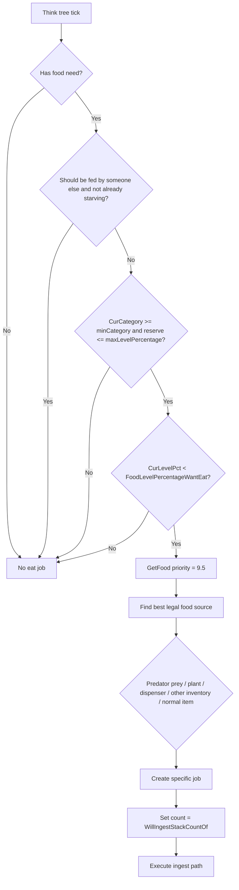
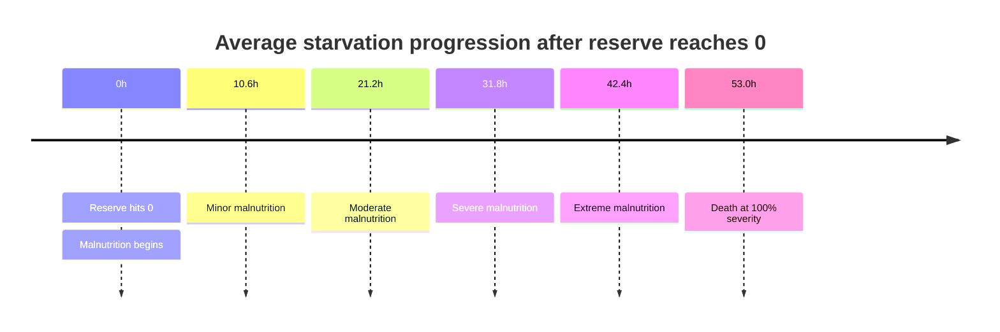

# RimWorld Hunger, Nutrition, Eating Logic, and Starvation

## Executive summary

RimWorld’s hunger system is a continuous nutrition reserve with discrete decision points layered on top. In current decompiled code, a pawn’s food reserve is `CurLevel`, capped by `MaxLevel`, and the missing amount is `NutritionWanted = MaxLevel - CurLevel`. For a baseline adult humanlike, the reserve is typically 1.0 nutrition and baseline daily consumption is 1.6 nutrition, which is why “about 2 meals per day” is the familiar rule of thumb. The drain formula is now driven by `Need_Food.FoodFallPerTickAssumingCategory`, which multiplies a base hunger rate by the current hunger-category multiplier and by modifiers from hediffs, traits, bed stats, lactation, and genes. `Need_Food.NeedInterval()` then subtracts `FoodFallPerTick * 150` each interval. In current code, omnivores/carnivores want to eat below 30% reserve, are classed as Hungry below 24%, Urgently Hungry below 12%, and Starving at 0%. citeturn28view0turn39view0turn14view4

RimWorld does not have true “meal times.” Pawns eat because the think tree gives `JobGiver_GetFood` a priority of 9.5 once reserve drops below the race’s `FoodLevelPercentageWantEat`, and that outranks normal scheduled work, joy, and sleep priorities from `JobGiver_Work` at 9, 2, and 3 respectively, with `Anything` at 5.5. That is why an eligible pawn below the eat threshold will usually interrupt hauling, crafting, joy, and most ordinary jobs to eat. The current code also shows two important gatekeeping rules: patients or prisoners who should be fed by someone else get no self-feed priority unless they are already Starving, and food choice is not “closest item wins,” it is an optimality score driven by distance, food preferability, mood/thought effects, freshness, ingestible offsets, and trait overrides. citeturn33view0turn18search0turn35view2turn35view3

The biggest implementation nuance is portion sizing. RimWorld does not solve an exact fill problem. `FoodUtility.WillIngestStackCountOf()` computes the count as the lesser of `maxNumToIngestAtOnce` and `StackCountForNutrition(NutritionWanted, singleFoodNutrition)`, and `StackCountForNutrition()` uses `Mathf.RoundToInt`, not ceiling. That means portions can slightly overshoot or undershoot the exact deficit. Overshoot becomes real waste once the reserve is already near full; undershoot merely causes an earlier next eating decision. This is the core reason large discrete foods like meals are waste-prone around the default eat threshold, while smaller-granularity foods are more nutrition-efficient. citeturn19search0turn32view0

On starvation, the current decompiled code is materially harsher than many older community references. `Need_Food` now uses `MalnutritionSeverityPerInterval = 0.0011325 * seededVariance(0.8..1.2)`, which implies about 45.3% malnutrition severity per day on average, with death at severity 100% in about 53.0 in-game hours on average, or roughly 44.2 to 66.2 hours depending on the pawn’s seeded variance. The malnutrition hediff stages still step at 20%, 40%, 60%, and 80% severity, progressively lowering consciousness and increasing hunger rate/social-fight chance, with extreme malnutrition capping consciousness at 10%. Community wiki pages that still cite roughly 17% per day or 2% per hour appear to reflect older data, not the current decompiled code path. citeturn28view0turn45view0turn43search4

## Scope and assumptions

Two assumptions matter here. First, you did not specify a RimWorld patch version. I therefore treat the public `Chillu1/RimWorldDecompiled` repository as the main code reference for current mechanics, and I use `josh-m/RW-Decompile` mainly where GitHub’s rendered snippets are easier to cite for the same method names and near-identical logic. Where current decompiled code and older community wiki values disagree, I prioritize current decompiled code and I call out the disagreement explicitly. citeturn26view0turn22view0turn43search4

Second, “bread” is not a vanilla base-game food item. RimWorld Wiki’s food pages list raw foods, pemmican, packaged survival meals, and prepared meals, but not a core vanilla bread item. The RimWorld Wiki modding tutorial uses `BakeBread` and `DeliciousBread` only as XML examples, which makes bread suitable as a custom Build-1 design target, not as a vanilla fact. The Local Agent Town spec below is therefore a mod/spec proposal anchored to vanilla nutrition tiers and vanilla food-selection logic. citeturn14view4turn16view0

## Nutrition drain and reserve

`Need_Food` defines the reserve model directly. In current code, `MaxLevel` comes from the pawn’s `MaxNutrition` stat during play, while `NutritionWanted` is simply `MaxLevel - CurLevel`. For baseline adult humans, community references still align with the historic vanilla intuition: reserve near 1.0 nutrition, daily need near 1.6 nutrition, and roughly two normal meals per day. The current decompiled code also preserves the same base hunger constant through `BaseHungerRate(...)= lifeStage.hungerRateFactor * pawnDef.race.baseHungerRate * 2.6666667E-05f`. citeturn28view0turn27view3turn14view4

The current per-tick drain function is effectively:

```text
FoodFallPerTick(hungerCategory) =
  BaseHungerRate(lifeStage, race)
  * HungerCategoryMultiplier
  * HediffSet.GetHungerRateFactor(except Malnutrition if ignored)
  * traitHungerRateFactor
  * bedHungerRateFactor
  + lactationExtraPerTick
then, if Biotech genes exist:
  multiply by metabolism->food curve
if Anomaly holding platform applies:
  set to 0
```

`Need_Food.NeedInterval()` then applies `CurLevel -= FoodFallPerTick * 150`. The older readable mirror exposes the category multipliers explicitly as Fed `1.0`, Hungry `0.5`, UrgentlyHungry `0.25`, and Starving `0.15`; the current code delegates that part to `hunger.HungerMultiplier()`, but the behavior is consistent with the older readable implementation. citeturn28view0turn25view0turn24view3

For a baseline adult humanlike with no modifiers, the numbers work out cleanly:

- Fed drain: `2.6666667e-05` nutrition/tick, or 1.6/day
- Hungry drain: half that, or 0.8/day
- Urgently hungry drain: quarter, or 0.4/day
- Starving drain: 0.15x, or 0.24/day

That slowing of reserve loss at lower categories is intentional. RimWorld makes the reserve bar drain fastest while well-fed, then progressively slower as the pawn gets hungrier. That does not make starvation safer, because once reserve reaches 0, malnutrition starts accumulating as a separate lethal hediff. citeturn24view0turn25view0

The current category thresholds for omnivores and carnivores come from `RaceProperties.FoodLevelPercentageWantEat => 0.3f`, combined with `Need_Food`’s derived thresholds `Hungry = 0.8 * WantEat` and `UrgentlyHungry = 0.4 * WantEat`. That yields current code thresholds of 30% to start seeking food, 24% for Hungry, 12% for Urgently Hungry, and 0% for Starving. This is one of the clearest places where current source and older community pages differ, because some wiki pages still summarize human hunger bands as 25% and 12.5%. citeturn39view0turn24view3turn43search4

The table below uses current decompiled source for thresholds and drain, not older wiki approximations. citeturn39view0turn24view3turn25view0

| State | Trigger for omnivore/carnivore | Baseline drain multiplier | Baseline human drain |
|---|---:|---:|---:|
| Fed | `>= 24%` reserve | `1.0x` | `1.6/day` |
| Wants food | `< 30%` reserve | n/a | Eat job becomes eligible |
| Hungry | `< 24%` reserve | `0.5x` | `0.8/day` |
| Urgently hungry | `< 12%` reserve | `0.25x` | `0.4/day` |
| Starving | `<= 0%` reserve | `0.15x` | `0.24/day`, plus malnutrition starts |

For timing, a baseline humanlike that starts full at 1.0 reserve reaches the eat-decision threshold of 0.3 in about 10.5 in-game hours, reaches Hungry at about 11.4 hours, reaches Urgently Hungry at about 15.0 hours, and reaches 0 reserve in about 22.2 hours total. A newly spawned humanlike starts at 80% reserve in `SetInitialLevel()`, so the first “want to eat” decision occurs sooner, after about 7.5 in-game hours under baseline conditions. citeturn28view0

Refill is handled indirectly through ingest jobs. Current food search and job creation compute per-eater nutrition via `NutritionForEater(...)` and `GetNutrition(pawn, foodSource, foodDef)`, then use `WillIngestStackCountOf()` to choose an integer count. Because the count is derived from missing reserve, refill behavior is best modeled as “eat a rounded whole-item count close to the deficit,” not “fill exactly to max.” That distinction matters for conservation and for bread-spec tuning. citeturn51view2turn33view3turn19search0

A compact pseudocode model of the current reserve system is:

```text
maxNutrition = pawn.MaxNutritionStat
wantToEatPct = pawn.RaceProps.FoodLevelPercentageWantEat   // 0.3 for omnivore/carnivore
hungryPct    = wantToEatPct * 0.8                         // 0.24
urgentPct    = wantToEatPct * 0.4                         // 0.12

every NeedInterval:
    reserve -= FoodFallPerTick(currentCategory) * 150

if reserve <= 0:
    malnutrition += seededPerInterval
else:
    malnutrition -= seededPerInterval
```

## Eating decisions and timing

The first important rule is that RimWorld does not schedule breakfast, lunch, and dinner. The food job is threshold-driven. `JobGiver_GetFood.GetPriority(Pawn)` returns 9.5 only when all of the following are true: the pawn has a food need, the pawn is not expected to be fed by someone else unless already Starving, the current hunger category is at or above the node’s `minCategory`, reserve is not above any `maxLevelPercentage` gate, and `CurLevelPercentage < pawn.RaceProps.FoodLevelPercentageWantEat`. Otherwise it returns 0. citeturn33view0turn33view1

That 9.5 matters because ordinary work scheduling is lower. `JobGiver_Work.GetPriority()` returns 9 on a Work timetable block, 5.5 on Anything, 3 on Sleep, and 2 on Joy. So once a pawn dips below the eat threshold, food beats ordinary hauling, crafting, cleaning, doctoring-as-work, joy, and sleeping. That matches the community wiki’s practical description that starving colonists prioritize eating over other activities, including firefighting and doctoring. The implementation detail to preserve in any clone is “food job priority beats normal schedule priority,” not “there are fixed meal slots.” citeturn18search0turn33view0turn42view0

Two edge gates are easy to miss and important in practice. First, `FoodUtility.ShouldBeFedBySomeone(pawn)` zeroes self-feeding priority for patients and prisoners before Starving, which is why bedridden pawns may wait to be fed. Second, current code checks `food.CurLevelPercentage > maxLevelPercentage` and refuses an eat job above that ceiling, so any custom thinker that changes `maxLevelPercentage` can suppress routine topping-off. citeturn33view0

Food choice is then delegated to `FoodUtility.TryFindBestFoodSourceFor(...)` and `BestFoodSourceOnMap(...)`. Eligibility filters include food policy, title restrictions, venerated-animal restrictions, ingestibility now, freshness rules, corpse/drug allowances, social propriety, reachability, and reservation. In other words, a pawn does not just “pick the best meal”; it picks the best legal and reachable food source under its current restrictions. citeturn30view0turn33view2

Selection among legal foods is based on `FoodUtility.FoodOptimality(...)`. Current code starts from `300 - distance`, applies a `-150` penalty to desperate-only foods, rejects never-for-nutrition and dessicated foods outright, gives a `+12` boost to fresh food that is about to rot, adds mood-based optimality from ingest thoughts through a `FoodOptimalityEffectFromMoodCurve`, then adds `optimalityOffsetHumanlikes` or `optimalityOffsetFeedingAnimals`, plus any trait-specific ingestible overrides. That is why lavish/fine/simple meals, mood-compatible foods, and foods about to spoil can beat merely nearby raw food. citeturn35view2turn35view1turn35view3

Portion sizing is set after the food source is chosen. The core logic is:

```text
wanted = MaxLevel - CurLevel
count  = min(maxNumToIngestAtOnce, round(wanted / singleFoodNutrition))
count  = max(count, 1)
```

This comes from `FoodUtility.WillIngestStackCountOf()` and `StackCountForNutrition()`. Three consequences follow directly:

- the system uses **round**, not ceiling
- it always eats at least one unit
- it respects the ingestible’s `maxNumToIngestAtOnce`

So “overeating” in RimWorld is not a separate rule. It is a byproduct of integer portion rounding, large nutrition quanta, and reserve caps. Conversely, slight underfill is also possible, which shortens the time until the next meal decision. citeturn19search0turn32view0

The table below shows the practical effect at the humanlike decision threshold near 30% reserve, where the pawn is missing about 0.70 nutrition. Raw values use vanilla wiki nutrition anchors, and the bread row uses the custom spec proposed later. citeturn14view4turn19search0

| Food | Nutrition per unit | Rounded count at ~0.70 deficit | Total eaten | Overshoot vs exact deficit |
|---|---:|---:|---:|---:|
| Raw food / pemmican unit | 0.05 | 14 | 0.70 | ~0.00 |
| Bread spec | 0.25 | 3 | 0.75 | 0.05 |
| Simple or fine meal | 0.90 | 1 | 0.90 | 0.20 |
| Lavish meal | 1.00 | 1 | 1.00 | 0.30 |

The job path itself is also explicit in code. If the chosen source is prey, the pawn gets `PredatorHunt`. If it is a harvestable plant whose harvest product is the ingestible, the pawn gets `Harvest`. If it is a nutrient paste dispenser without enough feedstock, the pawn first tries a hopper-fill job. If the food sits in another pawn’s inventory, current code creates `TakeFromOtherInventory`; otherwise it creates a normal `Ingest` job with the computed stack count. citeturn33view0



## Mood, malnutrition, and starvation progression

The thought-side mapping is split between code and defs. Current code in `ThoughtWorker_NeedFood` is exact about stage selection: Fed gives no thought, Hungry activates thought stage 0, Urgently Hungry activates stage 1, and Starving activates stage `2 + malnutrition.CurStageIndex`. That means the starvation mood state is not a single flat switch in code, it is tied to malnutrition stage progression while reserve remains at zero. citeturn46view0

For practical play, authoritative community pages still summarize the familiar human mood and immunity mapping as follows: Fed no penalty, Hungry `-6`, Ravenously Hungry `-12`, and Malnourished `-20`, with immunity gain speed at 100%, 100%, 90%, and 70% respectively. I would treat those mood values as good community-reference numbers, but I would treat the current decompiled source as authoritative on **when** each state is reached, because current code puts omnivore/carnivore thresholds at 24% and 12%, not the older 25% and 12.5% summary still shown on some wiki pages. citeturn43search4turn48search0turn39view0turn24view3

The best rigorous way to think about starvation is as two coupled systems:

- **nutrition reserve** drains down toward 0, with slower drain at lower categories
- **malnutrition hediff severity** starts only after reserve hits 0, then kills the pawn if severity reaches 100%

Current code increments malnutrition by `0.0011325 * seededVariance` each `NeedInterval` while Starving, and decrements by the same amount while not Starving. Because one in-game day is 60,000 ticks and the food need updates in 150-tick quanta, that is about 400 intervals per day, or roughly 45.3% severity per day on average. The pawn-specific seeded variance is ±20%, so the real daily rate is about 36.24% to 54.36%. citeturn28view0turn45view0

The malnutrition hediff stages from the current wiki are still useful and consistent:

- trivial: 0%+, `-5%` consciousness, `+50%` hunger rate, `x150%` social-fight chance
- minor: 20%+, `-10%` consciousness, `+60%` hunger rate, `x200%` social-fight chance
- moderate: 40%+, `-20%` consciousness, `+60%` hunger rate, `x250%` social-fight chance
- severe: 60%+, `-30%` consciousness, `+60%` hunger rate, `x300%` social-fight chance
- extreme: 80%+, life-threatening, `+60%` hunger rate, consciousness capped at `10%`
- lethal at 100% severity citeturn45view0turn42view2

Using the current source rate, the average timeline after reserve first reaches 0 is:

- minor at about 10.6 hours
- moderate at about 21.2 hours
- severe at about 31.8 hours
- extreme at about 42.4 hours
- death at about 53.0 hours

Because of the seeded ±20% variance, death can land as early as about 44.2 hours or as late as about 66.2 hours after reaching 0 reserve. This is one of the most important implementation details if you want a faithful simulation. citeturn28view0turn45view0



Recovery is straightforward in code. While the pawn is no longer Starving, `Need_Food.NeedInterval()` applies the same magnitude as a negative severity change, so malnutrition recovers gradually rather than disappearing instantly. The hediff description on the community wiki matches that behavior, noting that malnutrition naturally recovers over time once the pawn is re-fed. citeturn28view0turn45view0

Interaction with injuries and disease is mostly indirect but severe. Extreme malnutrition caps consciousness at 10%, and the consciousness system compounds with other caps and offsets such as blood loss, infection-related states, hypothermia, heatstroke, and other hediffs. That means starvation often becomes the tipping factor that downs or kills a pawn in combination states, rather than the only cause. Separately, community references on infection and immunity note that starvation and worse hunger states reduce immunity gain speed, which makes infection races materially worse in starved or malnourished pawns. citeturn42view2turn42view3turn48search0

## Bread-only Local Agent Town Build-1 spec

Because bread is not vanilla, the cleanest Build-1 design is a custom `ThingDef` plus `RecipeDef`, implemented in the normal XML style shown in the RimWorld Wiki modding tutorial. That tutorial explicitly demonstrates `BakeBread`, `recipeUsers`, and a `Bread` thing with `recipeMaker`, which is enough to anchor a minimal mod/spec. citeturn16view0

I recommend this bread spec for a first deterministic, low-surprise implementation:

| Field | Recommended value | Why |
|---|---:|---|
| DefName | `LAT_Bread` | Unique custom item |
| Nutrition per unit | `0.25` | Finer than meals, much less waste than 0.9 meal quanta |
| Preferability | `MealSimple` | Prepared food should outrank raw fallback |
| `maxNumToIngestAtOnce` | `4` | Lets the pawn eat 3 bread at common deficits |
| Stack size | `75` | 18.75 nutrition/stack, manageable hauling |
| Spoilage | `15` days unrefrigerated | Midpoint between raw perishables and preserved foods, design choice |
| Market value | `2.0` USD-equivalent silver | Low-value staple, processed but basic |
| Food type | Human edible, non-drug | Keep selection deterministic |

The nutrition choice is the critical design decision. Vanilla raw foods and pemmican are usually 0.05 nutrition each, while prepared meals are usually 0.9 to 1.0. A 0.25 bread unit sits between those tiers. That sharply reduces threshold waste compared with meals while still avoiding the micromanagement of 0.05-unit foods. At the standard 0.70-ish human deficit near the eat threshold, bread wastes about 0.05 nutrition, while a simple meal wastes about 0.20. citeturn14view4turn19search0

For recipe rules, keep Build-1 simple and nutrition-conserving:

```xml
RecipeDef BakeBread
- recipeUsers: ElectricStove, FueledStove
- ingredients: 5 units of vegetable/grain-class raw food
- products: 1 x LAT_Bread
- workAmount: low-to-moderate
```

With the vanilla anchor of 0.05 nutrition per raw unit, `5 raw -> 1 bread at 0.25` preserves nutrition exactly at the item-definition level. That makes debugging far easier than using opaque conversion ratios. The modding tutorial’s `recipeUsers` pattern is the correct vanilla-compatible way to wire the recipe to stoves. citeturn14view4turn16view0

For pawn behavior, keep the first build intentionally restrictive:

- assign all colonists, prisoners, and patients to a `BreadOnly` food policy
- disable all vanilla meal bills
- do not place nutrient paste dispensers
- forbid raw emergency foods for ordinary colonists, but optionally allow them in a separate emergency policy
- keep all bread on a dedicated shelf or stockpile near dining
- if your variant includes a custom thinker, do **not** change the 30% eat threshold in Build-1; preserve vanilla timing and only reduce food variety citeturn30view0turn33view0turn16view0

Required game-setting and content constraints for deterministic Build-1 are equally important:

- no mods that patch `JobGiver_GetFood`, `FoodUtility`, ingest thoughts, or food policies
- no traits/genes/hediffs that alter hunger rate, raw-food acceptance, or ingestible optimality
- no nutrient paste
- one allowed food in policy, bread
- fixed schedule if you are testing work interruption, ideally Work or Anything
- no medical-rest state unless you are explicitly testing feed-by-other logic citeturn33view0turn35view3

## Deterministic test cases

The goal here is not just “does a pawn eat,” but “does the simulation conserve nutrition, choose the same job every time, and match the source formulas.” Every test below assumes a single baseline adult humanlike omnivore, no mods touching food logic, no genes or traits changing hunger, no beds with hunger modifiers unless specified, and only explicitly listed food available. The expected outcomes below are derived from the current decompiled formulas and the proposed bread spec. citeturn28view0turn39view0turn33view0turn19search0

### Baseline drain from spawn level

**Setup**

- Pawn starts at the vanilla humanlike initial level of 80% reserve.
- No food available.
- No hunger modifiers. citeturn28view0

**Steps**

1. Set `CurLevel = 0.8`.
2. Advance time in the Fed category only.
3. Observe when `CurLevelPercentage` reaches 0.3 and when it reaches 0.24.

**Expected**

- At baseline Fed drain of 1.6/day, falling from 0.8 to 0.3 takes 0.5 / 1.6 = 0.3125 days, or 7.5 in-game hours.
- Falling from 0.8 to 0.24 takes 0.56 / 1.6 = 0.35 days, or 8.4 in-game hours.
- Therefore the pawn starts wanting food **before** gaining the Hungry category thought. citeturn28view0turn39view0turn24view3

### Work interruption at the eat threshold

**Setup**

- Pawn is on a Work timetable block.
- A hauling job is available.
- One stack of bread is reachable and allowed by policy.

**Steps**

1. Set reserve to `0.301`.
2. Query the thinker.  
3. Set reserve to `0.299`.
4. Query the thinker again.

**Expected**

- At `0.301`, `JobGiver_GetFood` returns 0 priority because the pawn is not yet below `FoodLevelPercentageWantEat`.
- At `0.299`, `JobGiver_GetFood` returns 9.5.
- Because Work priority is 9, the eat job should replace hauling on the second check. citeturn33view0turn18search0

### Bread portion count and waste near threshold

**Setup**

- Bread only, `Nutrition = 0.25`, `maxNumToIngestAtOnce = 4`.
- Pawn reserve is `0.30`.

**Steps**

1. Compute deficit: `NutritionWanted = 1.0 - 0.30 = 0.70`.
2. Compute count: `round(0.70 / 0.25) = round(2.8) = 3`.
3. Execute ingest.

**Expected**

- `WillIngestStackCountOf()` returns 3.
- Gross intake is `0.75`.
- Exact deficit was `0.70`, so overshoot is `0.05`.
- If reserve can only effectively use food up to max, that final `0.05` is the expected waste term in the conservation ledger. citeturn19search0turn14view4

### Meal comparison for waste

**Setup**

- Replace bread with one simple meal at `0.9` nutrition.
- Pawn reserve still `0.30`.

**Steps**

1. Compute deficit: `0.70`.
2. Compute count: `round(0.70 / 0.90) = 1`.
3. Execute ingest.

**Expected**

- Pawn takes exactly one meal.
- Gross intake is `0.90`.
- Threshold overshoot is `0.20`, four times the bread-spec overshoot above.
- This is why coarse-grain foods are less nutrition-efficient around the default eat threshold. citeturn19search0turn14view4

### One-day nutrition conservation ledger

**Setup**

- Start full at `1.0`.
- Bread only, same spec as above.
- Pawn re-eats whenever reserve drops below 0.30.

**Steps**

1. Start day at `1.0`.
2. At about 10.5 hours, reserve reaches 0.30 and pawn eats 3 bread.
3. At about 21.0 hours, reserve reaches 0.30 again and pawn eats 3 bread.
4. End day at 24 hours.

**Expected**

- Total baseline drain over the day is 1.6 nutrition.
- Total gross intake is `6 bread * 0.25 = 1.5`.
- Total threshold waste is `0.05 + 0.05 = 0.10`.
- End-of-day reserve should be `1.0 + 1.5 - 1.6 - 0.10 = 0.8`.
- This is the cleanest conservation test for Build-1 bread. citeturn28view0turn14view4turn19search0

### Starvation and malnutrition timeline

**Setup**

- Pawn reserve is forced to `0`.
- No food exists.
- Hunger modifiers unchanged.

**Steps**

1. Start starvation clock at the tick where reserve first reaches 0.
2. Advance time until minor, moderate, severe, extreme, and death.

**Expected**

- Minor at about 10.6h.
- Moderate at about 21.2h.
- Severe at about 31.8h.
- Extreme at about 42.4h.
- Death at about 53.0h average.
- Acceptable deterministic harness tolerance should either fix the pawn identity or explicitly account for the seeded ±20% malnutrition variance. citeturn28view0turn45view0

### Feed-by-other edge case

**Setup**

- Downed patient or prisoner who should be fed by someone else.
- Reachable bread exists.

**Steps**

1. Set patient to Hungry or Urgently Hungry, but not Starving.
2. Query `JobGiver_GetFood`.
3. Then set reserve to 0 and query again.

**Expected**

- Before Starving, self-feed priority is zero because `ShouldBeFedBySomeone(pawn)` blocks self-feeding.
- Once Starving, that gate no longer suppresses the food job.
- This is an exact edge case from the current code and should be preserved in any faithful clone. citeturn33view0

### Deterministic food-source choice

**Setup**

- Bread and raw food are both reachable.
- Food policy allows both.
- Bread has `MealSimple`-like preferability, raw food uses vanilla raw values.
- No special traits or ideology food overrides.

**Steps**

1. Place one bread stack slightly farther away than raw food.
2. Query food selection repeatedly under identical conditions.
3. Then move the raw food closer or farther and repeat.

**Expected**

- Choice should be stable across runs because `FoodOptimality` is deterministic under fixed state.
- Bread should usually beat raw food unless distance shifts enough to overcome its optimality advantage.
- If you want absolute determinism for Build-1, remove the raw alternative from policy rather than relying on optimality margins. citeturn35view2turn35view3turn30view0

## Practical takeaways

If you are implementing a Local Agent Town clone, the three mechanics that matter most are: current-code thresholds are effectively 30% to start eating, 24% Hungry, 12% Urgently Hungry, 0% Starving for omnivores/carnivores; the eat job priority of 9.5 is what makes pawns interrupt normal work and joy; and nutrition efficiency is driven mostly by integer portion rounding, not by any exotic “overeating” subsystem. Bread-only Build-1 should therefore preserve vanilla timing and priority, then tune only food granularity and availability. citeturn39view0turn33view0turn19search0

If you need the safest implementation default, use bread as a simple prepared staple with `Nutrition = 0.25`, `Preferability = MealSimple`, and `maxNumToIngestAtOnce = 4`, disable all other foods in policy, and validate the system with the conservation and threshold tests above before adding variety, ideology edge cases, prisoners, or disease interactions. citeturn16view0turn19search0turn33view0