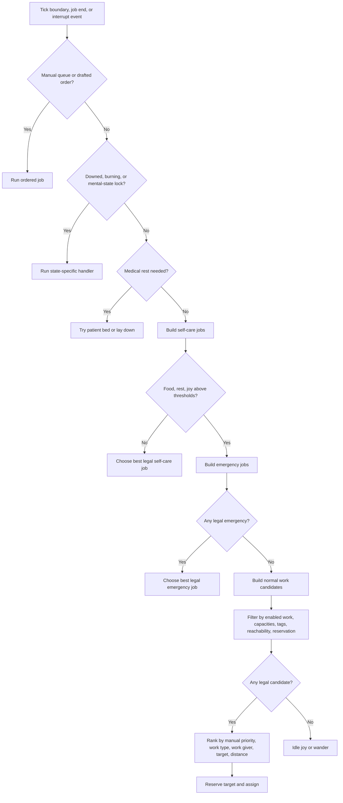

# RimWorld Work Priority Model for Minimal Autonomous Pawns

## Executive summary

This report treats RimWorld-style autonomy as a layered arbitration system, not a single score-based scheduler. In vanilla behavior, hard state handlers run first, such as downed behavior, burning response, mental-state subtrees, queued/manual jobs, and drafted orders. Medical-rest handling and generic need fulfillment come before normal colony work, and colonist-specific emergency work is checked before the main colonist work subtree. Inside the normal work subtree, the decisive hierarchy is: work enabled or disabled, manual priority number, work-type natural order, workgiver order within that type, then target legality, reachability, reservation status, and target-specific priority or distance. Skills matter mostly as performance and success modifiers, while incapabilities, disabled work tags, required capacities, and reservations are the main hard filters. citeturn28view0turn21view0turn21view2turn6view0turn3view0turn1view0

For a simplified Local Agent Town, the right design is not full RimWorld parity. The right design is a small, explicit lane-based arbiter that preserves the important behaviors: forced/manual override, hard interrupts, self-care, emergencies, then normal work. That gives you explainable autonomy, easier debugging, and a spectator UI that can show why a pawn chose one job over another. Exact parity would require reproducing a large XML think tree plus many specialized C# job givers and scanner rules, which is too much complexity for a minimal viable system. citeturn20view0turn6view0turn3view0turn1view2

Assumptions for this design: single-machine local simulation, unspecified agent count, no explicit performance budget, and scope limited to minimal viable autonomy rather than full RimWorld equivalence.

## Source basis and modeling posture

I prioritized the RimWorld Wiki for user-facing semantics, and source-level definitions and decompiled code for runtime behavior. The public code sources available on the web are decompiled mirrors, and one such mirror explicitly states that it is decompiled code and that rights remain with Ludeon Studios. That makes the code citations useful for behavior analysis, but still best treated as source-level evidence rather than first-party published gameplay source. citeturn1view2turn1view0turn34view0

The main facts that matter for implementation are stable across the sources:

- Manual priorities are 1 through 4, blank means disabled, and equal manual priorities are broken by work-type order from left to right in the Work tab. citeturn1view0
- Internally, `Pawn_WorkSettings` sorts active work types by a value dominated by manual priority, with natural work-type priority as the tie-breaker. Emergency and normal workgiver lists are then cached from that work-type order. citeturn6view0
- `JobGiver_Work` then scans the appropriate cached workgiver list, rejects illegal workgivers, and chooses legal jobs through non-scan jobs or scanner-based target search with reachability, forbidden checks, scanner priority, and nearest-target logic. citeturn3view0
- The humanlike think tree places hard-state handlers, medical rest, need satisfaction, emergency work, and only then the main colonist behavior subtree. citeturn28view0turn21view0turn21view2turn29view0

That leads to one important implementation conclusion: if you want minimal viable autonomy, preserve RimWorld’s hierarchy, but flatten it into an explicit, inspectable decision model. Do not reproduce every specialized node.

## RimWorld decision logic

### Plain-English decision loop

Below is the simplified decision loop that best captures the real model while staying implementable.

1. If the pawn is locked into a hard state, do that first. Examples are downed handling, burning response, critical mental state behavior, queued/manual jobs, or drafted/manual orders. These clearly sit ahead of ordinary colony work in the humanlike think tree. citeturn28view0turn28view2

2. If the pawn should seek medical rest, try that before ordinary work. `JobGiver_PatientGoToBed` checks medical-rest conditions, and it can still override the timetable when surgery or immediate tending is needed. In the think tree, this medical-rest tag appears before generic need satisfaction and before normal work. citeturn27view0turn21view4

3. Check self-care needs. In the need-satisfaction cluster, the tree tries food, rest, chemical need, and joy. At source level, `JobGiver_GetFood` uses a higher priority than work once hunger drops below the pawn’s “want eat” threshold, and `JobGiver_GetRest` uses schedule-dependent thresholds. Joy selection is its own weighted process, constrained by boredom and joy tolerances. citeturn21view0turn9view0turn10view0turn9view1turn8view1

4. For colonists, run pre-main housekeeping and emergency checks. The humanlike tree checks safe temperature, inventory cleanup, and emergency work before medium-priority duties and before the main colonist behavior core. It also has an additional starving fallback in this colonist-specific branch. citeturn28view3turn21view2turn29view1

5. Enter the normal work loop. The pawn uses its cached workgiver list, based on either emergency or normal mode. A workgiver is only usable if the pawn is allowed to do that kind of work, lacks no required capacity, is not blocked by disabled work tags, and the workgiver itself does not want to skip the pawn. Then the system scans for legal targets and returns the first valid job from the winning tier. citeturn3view0turn6view0

6. If there is no legal work, idle. RimWorld then falls back to low-stakes idling, such as idle joy when joy is low enough, otherwise wandering. citeturn29view0

### What the priority model is actually doing

The visible Work tab suggests a simple list, but the runtime model is more layered than that.

Manual priority dominates. Internally, the work-type sort key is essentially `naturalPriority + (4 - manualPriority) * 100000`, which means the manual priority bucket overwhelmingly dominates the left-to-right work-type order. Only ties inside the same manual-priority number fall back to work-type natural priority. This matches the wiki description that equal manual priorities resolve left to right. citeturn6view0turn1view0

That left-to-right order is not arbitrary. RimWorld’s core work types carry natural priorities from Firefighter at 1400 down to Research at 100. For example, Patient is 1350, Doctor is 1300, Basic is 1150, Construction is 900, Growing is 700, Hauling is 300, Cleaning is 200, and Research is 100. So when two work types have the same manual number, earlier columns win because they also have higher natural priorities. citeturn22view0

Within a work type, workgivers are also ordered. The core XML gives workgiver priorities such as `DoctorTendEmergency` at 110, `DoctorTendToHumanlikes` at 100, `DoctorRescue` at 60, `GrowerHarvest` at 100, `GrowerSow` at 50, `HaulGeneral` at 15, and `CleanFilth` at 5. `JobGiver_Work` uses these ordered workgivers to search targets, often choosing the closest reachable legal target, or, for prioritized scanners, the higher scanner priority target with distance as a tie-breaker. citeturn22view1turn3view0

Skills are mostly modifiers, not the first-pass arbiter. The wiki explicitly notes that skill level 0 does not make a pawn incapable by itself, it only makes them very bad at the task. True hard exclusion comes from incapabilities, disabled work tags, and missing required capacities. The code matches that by blocking workgivers when the pawn has disabled work tags or is missing a required capacity. Required capacities also appear in the core workgiver defs, commonly Manipulation. citeturn1view0turn3view0turn22view1

Schedules gate when needs should interrupt work. The Schedule UI and the code line up on the main thresholds: under Anything, a pawn keeps working unless recreation falls below about 35 percent, food below 30 percent, or rest below 30 percent; under Work, food can still interrupt at 30 percent, but rest and recreation do not voluntarily interrupt; under Sleep, sleeping is favored once rest drops below 75 percent; under Recreation, recreation is pursued until it is near full, while food and rest can still interrupt. The code for `JobGiver_Work`, `JobGiver_GetFood`, and `JobGiver_GetRest` enforces that schedule-sensitive behavior. citeturn34view0turn9view0turn10view0turn2view0

One subtle but important implementation detail is that schedules are not checked every instant. The Schedule page says pawns continue their current task until it finishes, and only then consult schedule and work tabs again, unless a stronger interrupt happens. That means your minimal system should re-evaluate mainly on job boundary and interrupt events, not after every movement step. citeturn34view0

### Decision flow diagram

The diagram below is the recommended Build-2 interpretation of RimWorld’s layered logic, preserving the important ordering while simplifying the internals.



This is faithful to the source hierarchy, but intentionally makes the arbitration explicit and debuggable. citeturn28view0turn21view0turn21view2turn29view0turn3view0turn6view0

### Small scenarios

A grower with `Grow=1` and `Plant Cut=1`, both legal, should generally sow or harvest before cutting plants, because equal manual priorities fall back to work-type order, and Growing has a higher natural priority than PlantCutting. That is vanilla-consistent and should be preserved in Build-2. citeturn1view0turn22view0turn6view0

A builder on a Work schedule with rest at 25 percent and food at 42 percent should keep working. Under Work schedule, food can interrupt at 30 percent, but rest does not voluntarily interrupt. If the same pawn’s food drops below 30 percent, eating should preempt work. citeturn34view0turn9view0turn10view0turn2view0

A colonist with `Firefight=1` and `Doctor=1` can expose a surprising RimWorld behavior. Because Firefighter natural priority is 1400 and Doctor is 1300, equal manual priority tends to put firefighting ahead of doctor work in the work-type order. For Build-2, I recommend making emergency classes explicit instead of inheriting that hidden coupling directly from work-tab column order. citeturn22view0turn22view1turn6view0

## Build-2 local agent town design

### Required components

A minimal Build-2 system should have eight components.

A **Pawn State Store** holds each pawn’s live status, needs, skills, schedule, work priorities, capacities, and current job. This is the minimum needed to express the same filters RimWorld actually uses. citeturn3view0turn9view0turn10view0

A **Work Catalog** defines your reduced set of work types and job definitions. For Build-2, use a short list: Firefight, Patient, Doctor, Basic, Construct, Grow, Haul, Clean, Research. That preserves RimWorld’s early-to-late work structure without dragging in every specialist system. The underlying work-type ordering should remain explicit rather than hidden in UI column order. citeturn22view0turn22view1

A **Job Extractor Layer** converts world state into concrete jobs. Examples: a fire produces `FightFire`, an injured colonist produces `Rescue` or `Tend`, a blueprint produces `Construct`, filth produces `Clean`, a stockpile mismatch produces `Haul`. RimWorld uses many specialized workgivers for this, but Build-2 should collapse them into a smaller, explainable set. citeturn22view1turn3view0

A **Reservation Manager** prevents two pawns from taking the same target. Source behavior depends heavily on reserve-and-reach checks, so reservations are not optional for believable autonomy. citeturn3view0turn10view1

A **Decision Arbiter** chooses the next job using explicit decision lanes: forced, hard-state, medical rest, needs, emergencies, and normal work. This is the core simplification. Instead of reproducing the full think tree, you flatten its order into one inspectable ranking procedure. citeturn28view0turn21view0turn21view2turn29view0

A **Dispatcher** starts jobs, applies reservations, and handles interrupts. Schedules should be checked on job boundary and on major interrupts, not continuously. citeturn34view0

A **Clock and Schedule Service** provides current hour, 24-slot daily assignment, and boundary events. RimWorld’s schedule screen is explicitly hour-based over a 24-hour day. citeturn34view0turn33search0

A **Spectator Telemetry Layer** logs each decision with the winning lane, rejected candidates, and tie-break reasons. This is essential if you want the system to be understandable to a human observer.

### Recommended core algorithm

For Build-2, do not use one blended numeric score for everything. Use a lexicographic tuple that mirrors RimWorld’s layered behavior.

Recommended ranking key:

1. `lane_rank`
   - forced/manual
   - hard-state
   - medical-rest
   - self-care
   - emergency
   - normal-work
   - idle

2. `manual_priority`
   - lower is better, `1` beats `2`, `0` means disabled

3. `work_type_order`
   - explicit natural order, higher is better

4. `workgiver_order`
   - within-type order, higher is better

5. `target_urgency`
   - for example fire intensity, patient urgency, crop ready, research available

6. `distance_or_path_cost`
   - lower is better

7. `skill_fit`
   - higher is better, but only after legality and hierarchy

That gives you behavior that is both RimWorld-like and easy to explain. The key difference from vanilla is that your Build-2 arbiter is centralized and transparent, while vanilla spreads this across think-tree nodes and jobgiver scanners. citeturn6view0turn3view0turn22view1

### Concise pseudocode for job selection

```text
function select_job(pawn, world):
    if pawn.manual_queue not empty:
        return pawn.manual_queue.pop_front()

    if pawn.state in {DOWNED, BURNING, MENTAL_LOCK, DRAFTED}:
        return state_handler_job(pawn, world)

    if should_seek_medical_rest(pawn):
        job = find_medical_rest_job(pawn, world)
        if job != null:
            return job

    candidates = []

    candidates += build_need_jobs(pawn, world)
    candidates += build_emergency_jobs(pawn, world)
    candidates += build_normal_work_jobs(pawn, world)

    legal = []
    for job in candidates:
        if is_enabled_for_pawn(pawn, job)
           and has_required_capacity(pawn, job)
           and not violates_work_tags(pawn, job)
           and target_is_valid(job, world)
           and target_is_reachable(pawn, job, world)
           and not target_reserved_by_other(job, world):
            legal.append(job)

    if legal is empty:
        return make_idle_job(pawn, world)

    sort legal by (
        lane_rank desc,
        manual_priority asc,
        work_type_order desc,
        workgiver_order desc,
        target_urgency desc,
        path_cost asc,
        skill_fit desc
    )

    return legal[0]
```

The crucial point is that `skill_fit` never rescues a job that failed legality, availability, or higher-level priority ordering. That matches RimWorld much better than “best-skilled pawn always takes the job.” citeturn1view0turn3view0

### Concise pseudocode for multi-agent assignment

```text
function assign_jobs(pawns, world):
    clear_expired_reservations(world)

    free_pawns = [p for p in pawns if needs_replan(p, world)]

    sort free_pawns by (
        interrupt_urgency desc,
        time_since_last_job desc,
        pawn_id asc
    )

    for pawn in free_pawns:
        job = select_job(pawn, world)
        if job == null:
            continue

        if job.target_id != null:
            if not try_reserve(job.target_id, pawn.id, world):
                continue

        start_job(pawn, job, world)
```

`needs_replan` should fire on job completion, target invalidation, reservation loss, schedule-hour change, threshold crossing, or emergency appearance. It should not fire on every micro-movement step. That follows the schedule behavior more closely and keeps the system readable. citeturn34view0

### Build-2 simplifications that still preserve the feel

Use schedule-driven thresholds exactly for the big three needs: food, rest, joy. Under Anything, let joy and rest interrupt only below their thresholds. Under Work, do not allow voluntary recreation, and do not allow rest to interrupt until collapse or a harder state occurs. Under Sleep, let rest take precedence when low enough. This will preserve most of the recognizable player-facing behavior with very little complexity. citeturn34view0turn9view0turn10view0

Use a small emergency lane with explicit classes: `FireContainment`, `RescueOrTendUrgent`, `SeekPatientBed`. That is better than literally inheriting the hidden left-to-right coupling of work-type order for emergencies. It is still source-faithful in spirit because vanilla already treats emergency work separately from normal work, but it is cleaner and safer for a minimal autonomous town. citeturn21view2turn6view0turn22view0

Use simple skill influence. Recommended formula:

```text
skill_fit = clamp(skill_level / 20.0, 0.0, 1.0)
work_speed_multiplier = 0.5 + 0.5 * skill_fit
success_bonus = skill_fit
```

That is not RimWorld-exact, but it preserves the important truth that higher skill improves work quality and speed, while even low skill may still be legal unless the pawn is truly incapable. RimWorld’s skills max at 20, and the wiki explicitly notes that level 0 is not the same as incapability. citeturn32view0turn1view0

## Data model and entity relationships

### Entity-relationship table

| Entity | Primary key | Core relationships | Purpose |
|---|---|---|---|
| `Pawn` | `pawn_id` | 1-to-1 `NeedState`, 1-to-1 `SkillProfile`, 1-to-1 `WorkProfile`, many `Reservation`, 0-or-1 active `JobInstance` | Autonomous actor |
| `NeedState` | `pawn_id` | belongs to `Pawn` | Food, rest, joy, mood, medical-rest flags |
| `SkillProfile` | `pawn_id` | belongs to `Pawn` | Skill levels and passions |
| `WorkProfile` | `pawn_id` | belongs to `Pawn`, references many `WorkTypeDef` | Per-pawn work enablement and manual priorities |
| `SchedulePolicy` | `schedule_id` | one-to-many `Pawn` | 24 hourly slots of Anything, Work, Recreation, Sleep |
| `WorkTypeDef` | `work_type_id` | one-to-many `JobDef`, referenced by `WorkProfile` | Firefight, Doctor, Grow, Haul, etc. |
| `JobDef` | `job_def_id` | belongs to `WorkTypeDef` | Template for a kind of job |
| `JobInstance` | `job_id` | belongs to `JobDef`, targets `WorldObject`, optionally assigned to `Pawn` | Concrete piece of available work |
| `WorldObject` | `object_id` | one-to-many `JobInstance`, many `Reservation` | Map thing, cell, blueprint, filth, fire, patient |
| `Reservation` | `reservation_id` | belongs to `Pawn`, references `WorldObject` or `JobInstance` | Exclusion lock for assignment |
| `EventLog` | `event_id` | references `Pawn`, `JobInstance`, `WorldObject` | Spectator trace and debugging |

This ER shape is intentionally smaller than RimWorld’s real internals, but it preserves the data needed to reproduce the decision hierarchy. The relationships above reflect the same runtime concerns RimWorld uses: per-pawn work settings, schedule state, legal target discovery, and reservation-aware assignment. citeturn6view0turn3view0turn34view0

### All data fields needed for Build-2

The table below is for the minimal autonomy build only. Where a range or enum is directly based on RimWorld behavior, the source is shown in the last column.

| Entity | Field | Type | Range / Enum | Default | Update frequency | Source basis |
|---|---|---|---|---|---|---|
| Pawn | `pawn_id` | UUID / string | unique | generated | never | Build-2 design |
| Pawn | `name` | string | non-empty | generated | rare | Build-2 design |
| Pawn | `position` | grid cell | map bounds | spawn cell | movement tick | Build-2 design |
| Pawn | `state` | enum | `IDLE, MOVING, WORKING, RESTING, EATING, RECREATING, DOWNED, DRAFTED, MENTAL_LOCK` | `IDLE` | event-driven | Mirrors think-tree hard-state handling. citeturn28view0 |
| Pawn | `current_job_id` | nullable string | existing job or null | null | event-driven | Build-2 design |
| Pawn | `manual_queue` | list<string> | job ids | empty | event-driven | Queued jobs exist ahead of normal work. citeturn28view0 |
| Pawn | `drafted` | bool | true/false | false | event-driven | Drafted orders preempt normal work. citeturn28view2 |
| Pawn | `downed` | bool | true/false | false | event-driven | Downed subtree preempts work. citeturn28view0 |
| Pawn | `burning` | bool | true/false | false | event-driven | Burning response preempts work. citeturn28view0 |
| Pawn | `mental_lock` | bool | true/false | false | event-driven | Mental-state subtrees preempt work. citeturn28view0 |
| Pawn | `allowed_area_id` | nullable string | area id or null | null | event-driven | Allowed-area restriction is part of player control. citeturn34view0 |
| Pawn | `bed_object_id` | nullable string | object id or null | null | event-driven | Needed for rest and medical-rest logic. citeturn10view0turn27view0 |
| NeedState | `food` | float | `0.0..1.0` | `0.8` | periodic | Need thresholds in code and menus. citeturn8view0turn34view0 |
| NeedState | `rest` | float | `0.0..1.0` | `0.95` | periodic | Need thresholds in code and menus. citeturn6view2turn10view0turn34view0 |
| NeedState | `joy` | float | `0.0..1.0` | `0.55` | periodic | Joy is a core need with threshold categories. citeturn8view1turn34view0 |
| NeedState | `mood` | float | `0.0..1.0` | `0.5` | periodic | Mood exists, but Build-2 can start as telemetry only. citeturn25search4 |
| NeedState | `medical_rest_needed` | bool | true/false | false | event-driven | Driven by medical-rest checks. citeturn10view1turn27view0 |
| NeedState | `urgent_tend_needed` | bool | true/false | false | event-driven | Used to trigger doctor emergency. citeturn10view1turn22view1 |
| NeedState | `starving` | bool | true/false | false | periodic | Starving gets special handling. citeturn8view0turn21view2 |
| SkillProfile | `skill_level[skill]` | map<string,int> | `0..20` | `0` | event-driven / XP tick | RimWorld skill cap is 20. citeturn32view0 |
| SkillProfile | `passion[skill]` | map<string,enum> | `NONE, MINOR, MAJOR` | `NONE` | rare | RimWorld passions use 0, 1, or 2 flames. citeturn32view0turn1view0 |
| SkillProfile | `incapable_work_tags` | set<string> | tag names | empty | rare | Work tags hard-block work. citeturn3view0turn1view0 |
| SkillProfile | `capacity_flags` | set<string> | `Manipulation`, etc. | all present | event-driven | Missing capacity blocks workgivers. citeturn3view0turn22view1 |
| WorkProfile | `manual_priorities_enabled` | bool | true/false | true | rare | Build-2 should always use manual-priority mode. RimWorld supports it directly. citeturn1view0turn6view0 |
| WorkProfile | `priority[work_type]` | map<string,int> | `0..4` | `0` or `3` for enabled defaults | event-driven | `0` disabled, `1` highest, `4` lowest. citeturn1view0turn6view0 |
| SchedulePolicy | `schedule_id` | string | unique | generated | never | Build-2 design |
| SchedulePolicy | `slots[24]` | array<enum> | `ANYTHING, WORK, RECREATION, SLEEP` | all `ANYTHING` | hour boundary / user edit | RimWorld schedule is 24 hourly slots. citeturn34view0 |
| SchedulePolicy | `current_assignment` | enum | derived from slot | derived | hour boundary | Mirrors `CurrentAssignment`. citeturn2view0turn34view0 |
| WorkTypeDef | `work_type_id` | string | unique | predefined | never | Build-2 design |
| WorkTypeDef | `label` | string | non-empty | predefined | never | Build-2 design |
| WorkTypeDef | `natural_order` | int | higher = earlier | predefined | never | Mirrors natural priority ordering. citeturn22view0turn6view0 |
| WorkTypeDef | `emergency_lane` | bool | true/false | false | never | Needed because vanilla has emergency work mode. citeturn21view2turn6view0 |
| JobDef | `job_def_id` | string | unique | predefined | never | Build-2 design |
| JobDef | `work_type_id` | string | valid work type | predefined | never | Build-2 design |
| JobDef | `workgiver_order` | int | integer, higher = earlier | predefined | never | Mirrors `priorityInType`. citeturn22view1 |
| JobDef | `required_capacities` | set<string> | capacity names | empty | never | Mirrors workgiver capacity requirements. citeturn22view1turn3view0 |
| JobDef | `min_skill` | int | `0..20` | `0` | never | Build-2 simplification |
| JobDef | `self_job` | bool | true/false | false | never | Needed for eat, sleep, joy, patient bed rest | 
| JobInstance | `job_id` | string | unique | generated | never | Build-2 design |
| JobInstance | `job_def_id` | string | valid job def | set on creation | never | Build-2 design |
| JobInstance | `target_id` | nullable string | world object or null | null | event-driven | Build-2 design |
| JobInstance | `target_cell` | nullable cell | in-bounds or null | null | event-driven | Needed for cell jobs |
| JobInstance | `target_urgency` | float | `0.0..1.0` | `0.5` | periodic / event-driven | Mirrors scanner priority concept. citeturn3view0 |
| JobInstance | `danger` | enum | `NONE, SOME, DEADLY` | `NONE` | event-driven | Reachability includes danger constraints. citeturn3view0 |
| JobInstance | `status` | enum | `OPEN, RESERVED, ACTIVE, DONE, FAILED` | `OPEN` | event-driven | Build-2 design |
| JobInstance | `assigned_pawn_id` | nullable string | pawn or null | null | event-driven | Build-2 design |
| JobInstance | `created_tick` | int | `>=0` | now | once | Build-2 design |
| JobInstance | `expiry_tick` | nullable int | `>= created_tick` | null | event-driven | Prevent stale work |
| WorldObject | `object_id` | string | unique | generated | never | Build-2 design |
| WorldObject | `object_type` | enum | `FIRE, PAWN, BLUEPRINT, FILTH, ITEM, STOCKPILE, CROP, BED, BENCH` | required | never | Minimal target set |
| WorldObject | `position` | cell | map bounds | set on create | movement or event | Build-2 design |
| WorldObject | `forbidden` | bool | true/false | false | event-driven | Vanilla filters forbidden targets. citeturn3view0 |
| WorldObject | `reachable_cache` | bool / derived | true/false | derived | on topology change | Build-2 optimization |
| WorldObject | `health_or_progress` | float | `0.0..1.0` | type-dependent | periodic / event-driven | Needed for fire, patient, construction |
| Reservation | `reservation_id` | string | unique | generated | never | Build-2 design |
| Reservation | `holder_pawn_id` | string | valid pawn | required | event-driven | Build-2 design |
| Reservation | `target_id` | string | valid target | required | event-driven | Build-2 design |
| Reservation | `ttl_tick` | int | `>= now` | now + short ttl | event-driven | Avoid dead locks |
| EventLog | `event_id` | string | unique | generated | once | Build-2 design |
| EventLog | `pawn_id` | string | valid pawn | required | once | Build-2 design |
| EventLog | `decision_reason` | string | free text | empty | once | Spectator explainability |
| EventLog | `candidate_snapshot` | json/blob | serializable | empty | once | Spectator explainability |
| EventLog | `chosen_job_id` | nullable string | existing job or null | null | once | Spectator explainability |

Verification note: this field set is intentionally complete for the minimal build, not for full RimWorld parity.

## Spectator UI expectations

A spectator view should answer four questions instantly: what is each pawn doing, why did it choose that, what is blocking work, and what problems are spreading through the town. RimWorld itself surfaces many of these cues through the Work, Schedule, Needs, and colonist bars, but for an autonomous town simulation you need a more diagnostic view than vanilla provides. citeturn1view0turn34view0

### Mock layout

```text
+----------------------------------------------------------------------------------+
| Top Bar: Time | Speed | Colony Alerts | Unassigned Jobs | Fires | Patients | Food |
+--------------------------------------+-------------------------------------------+
| Map View                              | Inspector Panel                           |
|                                      |                                           |
|  [pawn icons + current job glyphs]   |  Selected Pawn                            |
|  [job targets + reservation lines]   |  - Current state                          |
|  [area overlays / danger overlays]   |  - Current job                            |
|                                      |  - Winning decision lane                  |
|                                      |  - Top 5 candidate jobs                   |
|                                      |  - Rejection reasons                      |
|                                      |  - Needs bars                             |
|                                      |  - Schedule ribbon                        |
|                                      |  - Work priorities                        |
+--------------------------------------+-------------------------------------------+
| Bottom Timeline: decision log scrubber | filters | step sim | pause | replay last |
+----------------------------------------------------------------------------------+
```

### Key indicators

At colony level, show counts for open emergencies, open normal jobs by work type, idle pawns, blocked pawns, average hunger, average rest, and reservation conflicts. Those are the quickest signals that the autonomy model is failing, overconstrained, or stuck in pathological loops. citeturn3view0turn34view0

At pawn level, show:

- current job and target
- decision lane that won
- current schedule assignment
- food, rest, joy, mood
- enabled work priorities
- skills relevant to the current job
- red blockers: unreachable, forbidden, no capacity, reserved, disabled work, no path, no bed
- top rejected alternative jobs with exact rejection reasons

That last item is the single highest-value debug tool for autonomous towns. RimWorld’s internal logic makes many choices through negative filters, so seeing why a candidate lost is as important as seeing why the winner won. citeturn3view0turn27view0turn10view1

### Interactions

The spectator should support click-to-follow on pawn and click-to-inspect on job target. Hovering a pawn should reveal a compact tooltip with current action, lane, and top blocker. Clicking a job should show which pawns considered it, which pawn reserved it, and who was rejected due to reservation or legality. This directly surfaces the same filters vanilla uses internally. citeturn3view0turn10view1

You should also include three overlays:

- **Needs overlay**: color pawns by hunger, rest, or joy deficit.
- **Work overlay**: color open jobs by work type and urgency.
- **Reservation overlay**: draw lines from pawns to reserved targets.

The build also needs sim controls for pause, step one decision cycle, and replay last N decisions. Since the design is autonomous, visibility into temporal cause-and-effect matters more than flashy graphics.

## What not to implement yet

Do not implement **full think-tree parity**. The real behavior is spread across XML think-tree defs, multiple subtrees, and many specialized jobgivers. Reproducing that now would create a fragile clone that is hard to verify and hard to explain. Preserve lane order instead. citeturn20view0turn29view0turn21view0

Do not implement **the full joy system** yet. Vanilla joy uses multiple joy givers, boredom, tolerance decay, and weighted random selection. For Build-2, a single nearest-available recreation action is enough. The full system adds complexity without materially improving minimal autonomy. citeturn9view1turn8view1turn33search7

Do not implement **chemical need, psyfocus, or meditation** in the first pass. They are real schedule participants in vanilla, but they are edge systems for a minimal town autonomy model and add special-case thresholds and content dependencies. citeturn21view0turn34view0

Do not implement **guests, prisoners, animals, caravans, or faction-specific duties** yet. RimWorld handles these with different branches, job sets, and duty logic. They are separate autonomy domains, not just extra work types. citeturn28view2turn21view4turn33search5

Do not implement **combat AI and drafted micromanagement** yet. Drafted behavior is explicitly a separate control path ahead of normal work. If you add combat too early, you will muddy the core civilian autonomy model. citeturn28view2

Do not implement **temperature seeking, apparel optimization, food packing, and inventory housekeeping** in Build-2. They exist in vanilla, but they create frequent replans, hidden utility interactions, and noisy spectator output. All of them can wait until core self-care, emergency response, and normal work are stable. citeturn28view3turn29view1

Do not implement **full medical simulation** beyond three states: seek patient bed, tend urgent patient, rescue downed ally. Surgery quality, medicine selection, immunity race logic, and operation workflows are deep systems. They are valuable later, but too expensive for minimal viable autonomy. citeturn10view1turn22view1turn27view0

Do not implement **exact same-priority workgiver quirks** yet. `JobGiver_Work` has source-level subtleties around scanner target capture, grouped `priorityInType`, and per-scanner priority functions. These matter for exact parity, but not for a legible minimal town. Use an explicit tuple-based ranking instead. citeturn3view0

The right milestone for Build-2 is narrower: manual override, hard-state interruptions, schedule-aware self-care, explicit emergency lane, normal work priorities, reservations, and a spectator UI that can explain every choice. If those five things work cleanly, the town will already feel recognizably RimWorld-like without inheriting RimWorld’s full complexity. citeturn6view0turn34view0turn3view0turn21view2