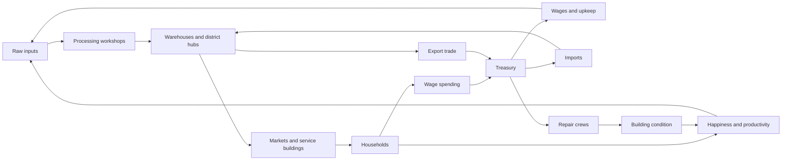
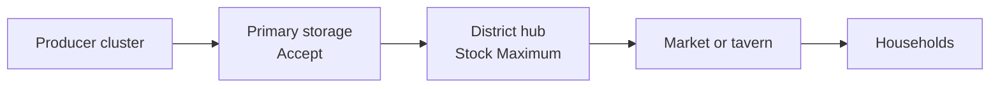
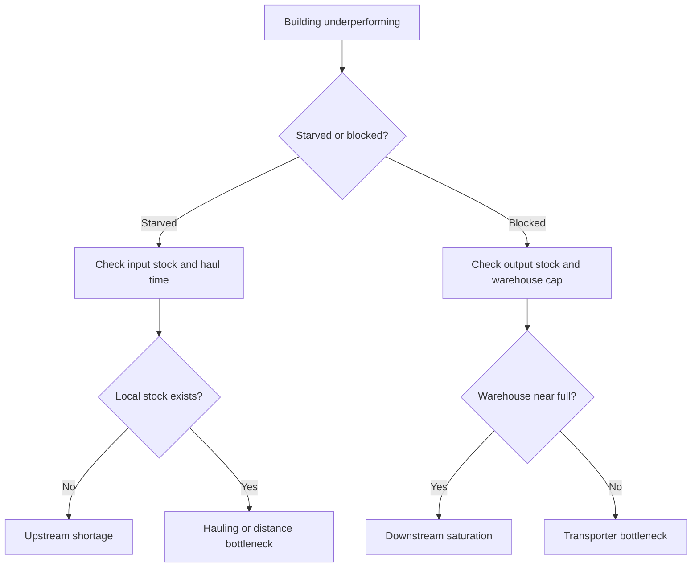
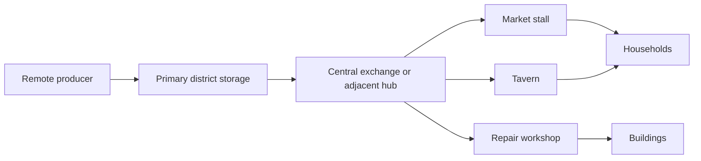

# Townsmen-Style Economy Loops for a Local Agent Town Build-2 Model

## Executive summary

The strongest Townsmen-style economy loops are not just production chains. They are coupled loops: needs fulfillment, logistics, labor assignment, service delivery, and treasury recirculation. Official Townsmen materials explicitly tie happiness to productivity and tax flow, call out seasonal shifts such as higher water demand in summer and higher clothing demand in winter, and position the marketplace as a way to convert surplus goods into treasury gold. Official Foundation documentation reinforces the same structural lesson from another angle: internal storage is limited, workers are highly sensitive to travel distance, and two-tier logistics hubs materially improve market and service supply. Banished, meanwhile, shows why proximity-aware labor rules matter, because long-distance work retrieval wastes production time. citeturn31view1turn31view0turn30view0turn32view0turn23view2

For a Local Agent Town game, the most robust Build-2 model is a hybrid of three ideas: local agent needs and movement, district-level logistics hubs, and a simple treasury loop where wages circulate into household spending and then back through market revenue and taxes. That model is readable to the player, rich enough to generate emergent bottlenecks, and much easier to balance than a fully private-enterprise simulation. The ABM literature supports modeling economy dynamics from interacting households, firms, and government, and operations research supports treating storage, queues, and decay as first-class constraints rather than as cosmetic details. citeturn10view1turn9search14turn10view3turn33search17

The highest-value bottlenecks to surface to players are six specific ones: upstream shortage, downstream saturation, hauling starvation, service queueing, repair debt, and fiscal squeeze. Manufacturing bottleneck research is clear that blocked processes plus full buffers usually indicate a downstream bottleneck, while starved processes plus empty buffers indicate an upstream one. Bottlenecks also shift over time, so a good UI should expose trends, not only current failures. citeturn29search3turn10view3turn29search9

A practical Build-2 ruleset should therefore do four things. First, distinguish essential needs from comfort needs, with water treated as essential and season-sensitive. Second, use internal building storage plus warehouse slotting and district distribution hubs. Third, pay wages in coin, let households spend on goods and services, and capture coin back through sales taxes, income taxes, and town-operated market revenue. Fourth, make export trade the main external coin source, with hard domestic reserve rules so the player cannot accidentally export winter clothes or emergency water stock. This structure is directly aligned with Townsmen’s happiness-tax loop, Foundation’s logistics model, Banished’s proximity lessons, and the broader queueing and bottleneck literature. citeturn31view1turn31view0turn30view0turn32view0turn33search1turn29search16

My recommended starting parameters are deliberately conservative: essential-resource supply capacity at roughly 130 percent of average demand, district buffers measured in days of cover rather than raw units, effective tax rates in the low-to-mid teens, and export automation only above reserve thresholds. Those values are not canonical from any one game. They are proposed starting points inferred from the source games’ emphasis on seasonal variation, short travel distances, and storage-limited logistics, plus operations research findings on buffers, throughput, and variability. citeturn31view0turn31view1turn30view0turn32view0turn33search13turn29search2

## Research basis and assumptions

This report prioritizes primary and close-to-primary sources: official Townsmen pages, Steam store descriptions for Townsmen-like titles, the Official Foundation Wiki and Foundation release notes, Banished developer posts and official store text, and academic papers in queueing theory, bottleneck analysis, and agent-based economics. Where the report proposes new mechanics or numeric defaults, those are explicitly framed as design recommendations inferred from the sources, not as hidden “true values” from existing games. citeturn31view1turn31view0turn30view0turn28view0turn32view0turn23view2turn10view3turn33search17turn10view1

Two cross-game patterns show up again and again in the official documentation. The first is that citizens are the core resource. Banished states this directly, and Townsmen’s official copy frames daily routines, happiness, and taxes the same way. The second is that logistics quality determines whether nominal production turns into actual service delivery. Foundation’s official logistics page is unusually explicit: most buildings have fixed internal storage, storage slot behavior controls resource flow, and consumer buildings often choose the nearest non-zero source even when that source is a bad one for throughput. citeturn23view2turn31view1turn30view0

I am assuming an unconstrained map size and population, as requested. I am also assuming a single-settlement simulation with spatial districts, locally simulated households and workers, and one town treasury. I am not assuming premium timers, energy systems, wait-gating, or any monetization-driven friction. This Build-2 recommendation is intentionally built as a premium-style systemic economy, not a monetized retention economy. The user asked for that exclusion explicitly, and the official Townsmen PC and premium materials do show that this design space works without mobile monetization being central to the economy model. citeturn31view1turn31view0

The final assumption is about modeling philosophy. A Local Agent Town benefits from agent heterogeneity, local movement, and visible household behavior, because wages, spending, and needs become legible when embodied by actual agents. The ABM literature uses that same bottom-up logic for interactions among households, firms, and government, and that is the right level of abstraction for a town game that wants believable local loops without macroeconomic overkill. citeturn10view1turn9search14turn11search6

| Assumption | Report default |
|---|---|
| Map and population | Unbounded unless scenario-capped by the designer |
| Simulation style | Local agents, spatial districts, single town treasury |
| Currency | Coin, with export trade as the primary external source |
| Time model | Daily economy cadence with intra-day agent movement |
| Ownership model | Town-run enterprises for clarity, household spending for circulation |
| Monetization | None, premium-style systems only |

These defaults are chosen because official Townsmen emphasizes daily routines, happiness-tax coupling, seasonal needs, and market gold conversion, while Foundation and Banished show that local distance and logistics decisions are where these loops either work or fail. citeturn31view1turn31view0turn30view0turn32view0

## Common loop patterns

The core design mistake in this genre is to think in chains only. The stronger model is to think in loops. Production matters, but what matters more is whether output reaches the right consumer at the right time, in the right quantity, before it decays, while preserving enough margin for taxes, repairs, and trade. Official Townsmen, Foundation, Banished, Farthest Frontier, and Settlement Survival all point in that direction. citeturn31view0turn30view0turn23view2turn23view1turn27view3



This synthesized loop map combines Townsmen’s happiness-productivity-tax framing, Foundation’s production-consumer-combination building categories and storage logic, Banished’s labor-as-resource framing, and the ABM literature’s wage-demand-tax interaction structure. citeturn31view1turn31view0turn30view0turn23view2turn10view1

### Production and service loop catalog

| Loop pattern | Canonical form | Best use | Strengths | Typical failure mode |
|---|---|---|---|---|
| Direct gather-consume | Source → household or market | Water, berries, fuelwood | Fast early game, low complexity | Breaks from distance and queueing |
| Serial transform | Raw → intermediate → final | Grain → flour → bread, flax → cloth → clothes | Clear progression, good teachability | Upstream shortage hidden by partial inventories |
| Multi-input transform | A + B → C | Ore + coal → iron, cloth + dye → fine clothing | Strong specialization, trade value | One missing input stalls whole chain |
| Service distribution | Stock → stall/counter → household satisfaction | Market food, tavern entertainment, church/service | Converts stock into happiness reliably | Local stockouts despite global surplus |
| Two-tier logistics hub | Producer → primary store → district hub → consumer | Outlying farms, remote wells, industrial districts | Reduces worker walking, increases consistency | Transporters become the real bottleneck |
| Fiscal recirculation | Treasury → wages → household spending → taxes/revenue → treasury | Whole-town coin circulation | Easy to read and tune | Coin stagnation without external inflow |
| External trade arbitrage | Surplus goods → export → coin | Clothing, ale, luxury goods, tools | Main growth lever, solves local overproduction | Exporting needed winter stock |
| Decay-repair stabilizer | Wear → repair demand → repair supply → restored output | Buildings, roads, tools, service uptime | Creates meaningful maintenance planning | Repair debt spiral |

The official sources support nearly every row in that table. Townsmen explicitly calls out deep production chains, market trade for gold, taverns and recreation, and seasonal water and clothing needs. Foundation formally separates production buildings from consumer buildings, gives service counters and market stalls a dedicated role in happiness fulfillment, and documents two-tier logistics chains. Banished shows a contrasting barter model with no money, useful as a comparison case rather than a direct target. Farthest Frontier and Settlement Survival reinforce that trade, storage methods, and prevention of spoilage are part of the same loop, not side systems. citeturn31view1turn31view0turn30view0turn23view2turn23view1turn27view3

### Logistics patterns that matter most

Foundation’s official logistics documentation is unusually useful for Build-2 design because it gives concrete capacities and behaviors. Most buildings have internal input/output storage, output storage is often capped at 50 units, warehouses and granaries have slot-based settings, each slot can store 100 units, and most storage buildings have up to 4 transporters, while Market Halls have 6 slots of 200 each and up to 8 transporters. More importantly, Foundation documents the real behavioral trap: consumer workers often fetch from the nearest non-zero source rather than the best bulk source, which is exactly how “global surplus, local shortage” failures happen. citeturn30view0



That diagram is effectively the Foundation two-tier chain in generalized form. It is the right default pattern for any Local Agent Town economy that wants local shops and services to feel alive without forcing every market tender or tavern keeper to walk back to remote production sites. citeturn26search2turn30view0

### Worker assignment alternatives

| Assignment model | How it works | Pros | Cons | Recommendation |
|---|---|---|---|---|
| Global free-for-all | Any worker can fill any job anywhere | Flexible, low rules overhead | Bad travel waste, unstable output | Avoid for critical jobs |
| Strict fixed assignment | Worker tied tightly to workplace and home | Predictable output, low route chaos | Brittle under shocks | Use for essential specialists |
| District pool | Workers prefer same-district jobs, fallback outward | Good balance of stability and resilience | Needs district UI | Best default |
| Seasonal local reassignment | Off-season workers take nearby secondary work | Good utilization | Can still disrupt timing if too broad | Use with travel caps only |

Banished’s developer notes support the recommendation to avoid global free-for-all for productive specialists. The developer’s stated goal was to stop farmers, tailors, and others from walking across the map needlessly because it kept them away from real work. Foundation’s later UI work on “distance to workplace” shows the same design priority from another angle: commute distance is gameplay-critical enough to expose directly in assignment UI. citeturn32view0turn28view0

### Fiscal and trade alternatives

| Currency model | Example in sources | Strengths | Weaknesses | Fit for Build-2 |
|---|---|---|---|---|
| Pure barter | Banished official model | Elegant, survival-focused | Weak for wage-spending-tax loop | Poor fit |
| Treasury-only command coin | Town pays wages, runs shops, taxes households | Clear player mental model | Less private-economic texture | Strong fit |
| Mixed household-market coin | Households and shops keep balances | Rich emergent behavior | Harder to debug and balance | Good later expansion |

Banished officially has no money and uses barter with trade vessels. Townsmen, by contrast, explicitly links happiness to tax flow and the marketplace to gold accumulation. For the user’s requested wages→spending→taxes loop, a treasury-centered coin model is much closer to the target. citeturn23view2turn31view1turn31view0

## Surfacing bottlenecks to players

A Townsmen-style economy gets frustrating when it fails silently. The best UI pattern is not “warn on empty stock.” It is “show the player whether the problem is upstream, downstream, travel-time, queueing, maintenance, or cash.” That is consistent with manufacturing bottleneck literature, which distinguishes starved states from blocked states, and with Foundation’s own UI direction, which added clickable counters for missing resources and missing workers, plus explicit distance-to-workplace information. citeturn29search3turn28view0

### What the player should always be able to see

| Bottleneck class | Best leading indicator | Player-facing signal | Suggested threshold | Why it matters |
|---|---|---|---|---|
| Upstream shortage | Empty input slots, starved worker time | Yellow “Input Missing” icon on building and district panel | >15 percent work time starved over 1 day | Usually raw shortfall or hauling failure |
| Downstream saturation | Full output storage, blocked production time | Orange “Storage Full” icon and storage-cap overlay | >10 percent blocked time over 1 day | Production exists, movement does not |
| Hauling starvation | Walking or hauling share of workday | Purple “Too Far / Need Hub” suggestion | Critical buildings above 20 percent travel time | Travel waste masquerades as low capacity |
| Service queue | Queue length, average wait, missed need cycles | Red service badge on market, tavern, water point | Wait >25 percent of service window | Households can fail despite full stock |
| Repair debt | Buildings below condition bands | Brown wrench badge and district decay heatmap | >15 percent of buildings below 70 percent condition | Hidden tax on output and happiness |
| Fiscal squeeze | Coin velocity, wage coverage days | Treasury warning card | <7 days wage cover at current burn | Internal loops stall without cash |
| Export overreach | Reserve days after export orders | Blue export caution | Any essential below reserve threshold | Trade should never starve the town |

The upstream-versus-downstream distinction is directly grounded in bottleneck detection research. Roser and Nakano’s approach specifically describes blocked processes and full inventories as symptoms of a downstream bottleneck, while starved processes and empty inventories indicate an upstream bottleneck. That is an extremely UI-friendly rule because it translates one-for-one into icons, overlays, and dashboards. citeturn29search3

### The minimum metric set

A Local Agent Town does not need a giant spreadsheet UI, but it does need a tight metric set that reveals the hidden state of the loop. I recommend the following seven metrics everywhere: days of cover, service fulfillment rate, average worker travel share, starved time, blocked time, queue wait, and wage-cover days. Little’s Law is useful here conceptually, because queue length, arrival rate, and waiting time are tightly linked, and the practical literature emphasizes its use in operations management. The goal is simple: if a market queue doubles, either demand rose, service capacity fell, or replenishment cadence got worse, and the UI should help the player identify which one. citeturn33search1turn33search13

### Alert design rules

Good alerts in this genre should be trend-based, not spam-based. Foundation’s official UI notes are instructive here: clickable counters for missing resources, workers, and construction state are valuable because they are glanceable and navigable. Build-2 should copy that principle. Every alert should answer three questions in one line: what failed, where, and what likely caused it. citeturn28view0

Recommended alert templates:

| Alert | Trigger | Suggested text |
|---|---|---|
| Water district failure | Water cover <1 day or service wait high | “North Ward water shortfall, demand exceeds refill. Add carriers or a cistern.” |
| Clothing risk | Winter starts and clothing cover <3 days | “Winter clothing reserve low, export lock engaged automatically.” |
| Storage deadlock | Producer blocked + nearest warehouse >85 percent full | “Sawmill blocked by storage saturation, add material slots or export overflow.” |
| Repair debt | Buildings <70 percent condition exceed threshold | “Repair backlog rising, carpenter district under-staffed or short on planks/tools.” |
| Wage squeeze | Treasury <7 days burn | “Treasury critical, reduce payroll or export more high-value goods.” |
| Commute inefficiency | Essential worker commute too long | “Tailor walking too far, relocate housing or open district cloth hub.” |

### A practical bottleneck panel

The panel I would ship first is a district bottleneck card. It should rank the top three losses to output in that district by lost worker-hours: travel, missing input, full output, queueing, or repairs. That makes the loop legible. It also matches operations-research practice better than raw stock totals do, because improving a non-bottleneck usually does not improve overall flow. The theory-of-constraints literature is explicit on that point. citeturn10view4



That flow mirrors the literature’s upstream-versus-downstream logic and is also the right internal diagnostic tree for the game’s advisor system. citeturn29search3turn10view3

## Suggested Build-2 economy model

### Core rules

Build-2 should be a locally simulated, district-aware command economy with household spending. The town treasury owns productive buildings and pays wages daily. Households then buy goods and services from markets, taverns, and service buildings. Those sales return coin to the treasury through enterprise revenue, while taxes trim disposable income and shape satisfaction. External traders are the main source of net new coin. This model preserves the user-requested wages→spending→taxes loop without requiring hard-to-debug private firms. It also stays close to Townsmen’s happiness-productivity-tax framing and its explicit use of the marketplace to convert surplus into gold. citeturn31view1turn31view0turn10view1

The rules should separate essential needs from comfort needs. Essentials are water, food, shelter, warmth, and maintenance of basic living conditions. Comfort needs are clothing quality, beauty or hygiene, recreation, and tavern leisure. Townsmen officially highlights water, clothes, marketplace access, recreation, and taverns as key needs drivers, and Foundation’s consumer-building structure provides a clean implementation pattern for food, goods, luxuries, and tavern services. citeturn31view0turn31view1turn30view0

### Entity list

| Category | Build-2 entities |
|---|---|
| Agents | Household, adult worker, child, hauler, builder, repairer, trader |
| Core buildings | House, market, tavern, district warehouse, district granary, treasury/castle |
| Water chain | Well, cistern, water yard, water cart |
| Food basics | Farm, mill, bakery, butcher, garden, fishery |
| Clothing and beauty | Flax farm, sheep fold, spinner, weaver, tailor, soap maker, bathhouse or beauty stall |
| Repair chain | Lumber camp, sawmill, toolsmith, repair workshop, mason yard |
| Trade | Market office, trade depot, caravan yard |
| Support | Road, cart shed, storage expansion, district office |

This list is intentionally compact. It reflects the source games’ building taxonomy but narrows it to the loops the user asked to prioritize: water, clothing/beauty, storage, repairs, wages and taxes, and external trade. citeturn31view1turn31view0turn30view0turn23view1turn27view3

### Proposed production chains

#### Water

| Step | Building | Worker count | Proposed output | Notes |
|---|---|---:|---:|---|
| Extraction | Well | 1 | 30 water/day | Base source |
| Storage and buffering | Cistern | 0 to 1 | 200 water local cap | District buffer |
| Distribution | Water yard/cart | 1 | 80 water/day moved | Replenishes markets and homes |
| Consumption | Households and tavern | n/a | Adults consume 1/day, 1.5/day in summer | Essential need |

The seasonal multiplier is not arbitrary. Townsmen’s official material explicitly says more water is needed during summer, and Farthest Frontier’s official description adds a related environmental constraint by noting that underground water supply can dry up if tree cover is mismanaged. That combination strongly supports making water both seasonal and spatial, rather than a flat commodity. citeturn31view0turn31view1turn23view1

#### Clothing and beauty

| Step | Building | Worker count | Proposed output | Notes |
|---|---|---:|---:|---|
| Fiber source A | Flax farm | 2 seasonal | 24 flax/day in harvest season | Crop-driven |
| Fiber source B | Sheep fold | 1 | 10 wool/day | Stable but slower |
| Intermediate | Spinner/Weaver | 1 | 12 cloth/day | Shared for clothing/beauty |
| Finished goods | Tailor | 1 | 6 clothes/day | Clothing need |
| Hygiene goods | Soap maker | 1 | 8 soap/day | Beauty/hygiene need |
| Delivery | Goods stall / bathhouse | 1 each | Service consumption | Comfort need |

Townsmen’s official description makes clothing seasonal by explicitly calling out higher clothing demand in winter. Foundation’s consumer-goods and luxury categories support separating essential clothing from higher-tier satisfaction goods. My recommendation is therefore to make basic clothes semi-essential in winter and beauty goods optional but high leverage for happiness. citeturn31view0turn30view0turn28view0

#### Repair and decay

| Step | Building | Worker count | Proposed output | Notes |
|---|---|---:|---:|---|
| Raw material | Lumber camp / quarry | varies | logs / stone | Existing economy inputs |
| Intermediate | Sawmill / toolsmith | 1 each | planks / tools | Repair inputs |
| Repair kits | Repair workshop | 1 | 4 kits/day | 1 kit = planks + tool parts |
| Field service | Repair crew | 1 | 4 building-repairs/day | Uses kits and local pathing |

This is a proposed mechanic, not a direct lift from a source game, but it is supported by the genre pattern. Townsmen’s official material emphasizes disasters and environmental damage, Farthest Frontier emphasizes storage and spoilage prevention, and the operations literature treats maintenance, buffers, workforce, and material constraints as core levers in bottleneck elimination. citeturn31view1turn23view1turn10view4

### Worker assignment logic

The default assignment logic should be district-first and need-first. Essential services should fill before comfort services. Within each class, assignment should be based on a weighted score:

```text
Job Score = Need Priority × Skill Fit × Wage Weight × Distance Weight × Shift Fit
```

Where `Distance Weight` drops sharply after a commute threshold. The reason is straightforward. Banished’s developer notes show that long-distance specialist retrieval is a direct productivity killer, and Foundation’s UI literally surfaces workplace distance because it matters that much. citeturn32view0turn28view0

Suggested starting thresholds:

| Worker class | Max target one-way commute | Auto-reassignment rule |
|---|---:|---|
| Water, food, repair | 12 percent of workday | Never reassign outside district unless emergency |
| Core manufacturing | 18 percent of workday | Can spill to adjacent district |
| Services and luxuries | 25 percent of workday | May remain understaffed during labor shortages |
| Haulers/builders | flexible | Pulled globally, but biased toward nearest jobs |

I recommend keeping 10 to 15 percent of adult labor unassigned as a floating hauler/builder/repair reserve. That is an inference, but it is strongly supported by Foundation’s transporter constraints and by bottleneck literature that emphasizes buffers and flexible response at the constraint. citeturn30view0turn29search16turn29search2

### Storage and logistics rules

Build-2 should copy the shape, not the exact numbers, of Foundation’s logistics model. Official Foundation documentation is clear that internal storage caps are small, slotting rules matter, and two-tier hubs reduce bad fetching behavior. I therefore recommend the following starting storage defaults. citeturn30view0

| Storage type | Proposed capacity | Purpose |
|---|---:|---|
| Building internal output | 20 units small workshop, 40 units primary producer | Short local buffer |
| Building internal input | 2 to 4 production cycles | Prevent micro-runs |
| Household pantry | 3 days food, 2 days water, 1 spare clothing item/worker | Personal resilience |
| Market stall | 1 day of served demand | Retail-facing stock |
| District granary | 500 consumables, +250 per upgrade | Food/water/soap/ale |
| District warehouse | 500 materials, +250 per upgrade | cloth/tools/planks/stone |
| Emergency cistern | 200 water | Heatwave and fire resilience |

Slotting rules should be explicit and player-facing:

| Slot state | Meaning |
|---|---|
| Accept | General stocking allowed |
| Reserve | Can receive, cannot export |
| Export | Eligible for trader sale above reserve |
| Empty | Actively drained elsewhere |

This is slightly simpler than Foundation’s “Accept / Refuse / Stock Maximum / Empty Stock,” but it preserves the same important player powers: deciding which storage is source-of-truth, which storage is district hub, and which stock may be drained. citeturn30view0

My recommended district pattern is this:



For water and food, use two-tier logistics by default. For rare materials and luxury goods, use three-tier logistics only if needed. Foundation’s official documentation explicitly warns that three-tier chains require more manual management and can tie up transporters. That is why Build-2 should treat three-tier flow as an optimization tool, not the baseline. citeturn30view0

### Decay and repair mechanics

I recommend three forms of decay:

| Decay type | Starting rule |
|---|---|
| Perishable decay | Food, water, soap lose 2 percent/day after freshness window |
| Wear decay | Clothes lose durability with use, winter increases wear by 50 percent |
| Building decay | Structures lose 0.15 condition/day base, plus traffic and weather modifiers |

These are proposed values. The rationale is that Townsmen emphasizes seasonal demand shocks and disasters, Farthest Frontier emphasizes storage methods to prevent spoilage, and perishable-inventory research shows that steady-state performance of perishable systems is best understood as a flow problem, not just a stock problem. citeturn31view0turn23view1turn33search17

Repairs should be thresholded, not continuous. Suggested bands:

| Building condition | Effect |
|---|---|
| 80 to 100 | No penalty |
| 60 to 79 | -10 percent output or service speed |
| 40 to 59 | -25 percent output, +failure chance |
| 0 to 39 | Severe failure risk, possible shutdown |

Repair priority should be automatically sorted as: water system, food chain, market/service delivery, housing, then luxuries. This is a direct application of constraint thinking: fix the capacity-limiting step first. Improving a non-bottleneck does not restore total flow. citeturn10view4

### Wage, spending, and tax flows

The simplest workable Build-2 fiscal model is:

1. Treasury pays wages daily.
2. Income tax is withheld immediately.
3. Households spend first on essentials, then comforts, then savings.
4. Sales taxes apply at purchase.
5. Building revenue sweeps to treasury at day end.
6. Exports and imports are the net new coin sources and sinks.

This creates the requested wages→spending→taxes loop while staying readable for the player. It also tracks the ABM logic documented by Ballot and Taymaz, where firm activity affects household income through wages and taxes, while household demand affects firm profitability. citeturn10view1

Recommended starting numbers:

| Parameter | Proposed default | Tuning rationale |
|---|---:|---|
| Unskilled daily wage | 6 coin | Keeps essentials affordable |
| Skilled daily wage | 8 coin | Moderate differentiation |
| Specialist daily wage | 10 coin | Supports shops, repair, trade |
| Income tax | 10 percent | Visible but tolerable |
| Sales tax | 5 percent | Mild treasury recapture |
| Property tax | 0.5 coin/house/day | Light housing sink |
| Essential-goods markup | 15 percent | Covers logistics and treasury recirculation |
| Luxury/service markup | 25 percent | Funds comfort economy |

Household spending priority should be rule-based, not utility-maximized. A clear starting behavior is:

```text
Disposable income
→ 100% to unmet essentials until stocked
→ 50% of remainder to comfort goods/services if happiness < 70
→ 25% of remainder to comforts if happiness ≥ 70
→ rest to savings
```

This keeps the wage loop visible. Tax hikes immediately reduce discretionary spending, which hits taverns, beauty stalls, and luxury chains first. That gives the player a readable tradeoff: taxes fund growth, but excess extraction flattens the very economy that produces surplus and happiness. Townsmen’s official material makes exactly that thematic link between happiness, productivity, and tax flow. citeturn31view1turn31view0

### Happiness model

I recommend a bounded 0 to 100 happiness score with weighted needs:

| Need group | Weight | Notes |
|---|---:|---|
| Water | 22 | Essential, seasonal |
| Food | 22 | Essential |
| Housing and warmth | 18 | Essential |
| Clothing | 14 | Seasonal comfort, becomes quasi-essential in winter |
| Beauty or hygiene | 8 | Comfort |
| Recreation and tavern | 8 | Comfort |
| Taxes and unemployment | -8 to -20 | Penalty layer |

Suggested formulas:

```text
Need Fulfillment Score = Σ(weight × fulfillment ratio)
Tax Stress = max(0, effective household tax rate - 12%) × 1.5
Happiness = Need Fulfillment Score - Tax Stress - Overcrowding - Repair Nuisance
```

```text
Productivity multiplier = 0.70 + 0.45 × (Happiness / 100)
Clamp to 0.70 .. 1.15
```

This is proposed, but it matches the official game logic well: Townsmen explicitly connects a joyful town to a more productive workforce and stronger tax flow. citeturn31view1turn31view0

### Market and external trade mechanics

External trade should be the main net coin source. Townsmen says this directly, using the marketplace to sell excess goods for gold, and Settlement Survival goes as far as saying trade is key to population survival. Farthest Frontier similarly frames trade as the way to acquire what the local economy lacks. citeturn31view1turn27view3turn23view1

Recommended rules:

| Rule | Proposed default |
|---|---|
| Trader arrival | Every 3 days per trade depot |
| Export eligibility | Only stock above reserve days |
| Essential reserve | 5 days food/water, 7 days winter clothing, 10 days repair inputs |
| Export price band | 0.9x to 1.2x base value |
| Import price band | 1.1x to 1.4x base value |
| Emergency import override | Player can import essentials at premium when reserve <2 days |

Recommended export priorities for early-mid game:

| Priority | Good | Why |
|---|---|---|
| High | Clothes | High labor value, low spoilage |
| High | Soap / beauty goods | High markup, lower essential risk |
| Medium | Ale / tavern goods | Good surplus sink if water is stable |
| Medium | Tools | High value, but risky if repair loop is weak |
| Low | Raw water, raw food | Avoid unless extreme surplus |

This is where Build-2 should differ from many frustrating city builders. Export automation must be reserve-aware by default. Exporting essentials below reserve should require a manual override. That prevents the classic “I sold all my winter coats because they looked like surplus in autumn” failure. Official Foundation trade UI improvements and Townsmen’s framing of seasonal demand both support this reserve-first approach. citeturn28view0turn31view0turn31view1

### Balancing heuristics

These are my recommended starting heuristics for first-pass tuning:

| Heuristic | Starting target |
|---|---|
| Essential production capacity | 130 percent of average demand |
| Comfort production capacity | 110 percent of average demand |
| Critical queue utilization | Keep under 80 percent |
| District days of cover | 3 days essentials, 5 days seasonal goods, 10 days repairs |
| Hauler share of adult labor | 10 to 15 percent |
| Repair crew density | 1 crew per 50 buildings |
| Market density | 1 market per 35 to 45 households |
| Water-point density | 1 water service point per 25 to 30 adults |
| Taverns | 1 tavern counter per 60 to 80 adults |
| Tailors | 1 tailor per 50 adults temperate, 1 per 40 adults cold maps |

The queue-utilization target is an inference, but it is the right way to think about service loops. Little’s Law and queueing practice make clear that waiting and in-system load rise with flow and time, while perishable-inventory work shows that stable performance depends on treating shelf life and flow together. In game terms, that means water points and market counters should not run “hot” if you want them to survive seasonal spikes without visible collapse. citeturn33search1turn33search13turn33search17

### Example scenarios

#### Stable mid-game district

| Variable | Value |
|---|---:|
| Population | 90 adults, 24 children |
| Wells | 4 |
| Cisterns | 2 |
| Water carriers | 3 |
| Tailors | 2 |
| Soap makers | 1 |
| Markets | 2 |
| Taverns | 1 |
| District warehouses | 2 |
| Repair crews | 2 |
| Treasury | 3,200 coin |
| Export good | Clothes + soap |

Expected outcome: stable water cover above 4 days, winter clothing cover above 8 days, happiness in the 72 to 80 range, productivity around 1.02 to 1.06, and treasury growth driven mostly by export sales rather than taxation. This is the desired “healthy town” shape implied by Townsmen’s official happiness-productivity-tax loop. citeturn31view1turn31view0

#### Heatwave stress test

| Variable | Change |
|---|---|
| Water demand | +50 percent for 5 days |
| Worker efficiency | -10 percent outdoors |
| Cistern evaporation | +1 percent/day |
| Tavern demand | +10 percent |
| Beauty demand | flat |

Expected player-visible bottleneck: service queueing first, then district water stock drawdown, then productivity loss if queueing is unresolved. Correct fixes: add a temporary water carrier, suspend nonessential exports, prioritize cistern refill, and if needed import emergency water. This scenario exists because official Townsmen explicitly makes water seasonal and because queueing logic says wait-time spikes are often the first visible failure at fixed service capacity. citeturn31view0turn33search13

#### Export overreach failure

| Variable | Change |
|---|---|
| Clothes export rule | lowered to 2 days reserve |
| Winter begins | clothing demand rises |
| Treasury | initially strong |

Expected outcome: treasury spikes briefly, then winter clothing stock drops below comfort threshold, happiness falls, productivity slides, and repair completion slows as labor efficiency declines. This is exactly the kind of delayed, systemic failure that makes trade interesting, and why essential reserve locks are worth shipping even in Build-2. citeturn31view0turn31view1turn10view4

## Failure modes and mitigation

The common failures in this genre are systematic, not random. The reason players often feel that the economy is “lying” is that the map shows inventory totals, while the actual constraint is elsewhere: travel time, queueing, service reach, or repair debt. The bottleneck literature explicitly warns that different detection methods can produce different answers, which is why the UI should focus on causal state, not just stock counts. citeturn10view3

| Failure mode | Root cause | Early signal | Strong mitigation |
|---|---|---|---|
| Global surplus, local famine | Nearest-source fetching beats best-source fetching | Empty stall next to full remote warehouse | Add district hub between source and consumer |
| Water collapse in summer | Capacity sized to average not peak | Long queues before stock is empty | Size wells and carriers to summer peak, not annual mean |
| Clothing shock in winter | No seasonal reserve logic | Clothing exports look “safe” in autumn | Reserve days and seasonal export lock |
| Storage deadlock | Output caps reached, warehouses saturated | Buildings blocked with full output | Overflow export, more slots, more haulers |
| Repair debt spiral | Too few crews or no repair inputs | Condition bands degrading district-wide | Always reserve tools/planks/stone for repairs |
| Fiscal death spiral | High taxes or payroll with weak exports | Treasury falling, happiness dropping, luxury sales collapse | Lower taxes, pause luxuries, push exports |
| Hauler starvation | Too many resource types through too few transporters | Producer output blocked though stock exists nearby | Split warehouses by class, add district haulers |
| Luxury trap | Player overbuilds taverns and beauty before essentials | High service uptime, low essentials cover | Need-based staffing priority and auto-downgrade luxuries |
| Growth overshoot | Housing and births outrun jobs and supply | Unemployment and empty services rise together | Soft growth caps, immigration pause, housing permits |

Two of those are especially typical. First, shifting bottlenecks. The literature is very clear that bottlenecks move as process conditions change, so Build-2 should log the “top lost-hours cause” over time rather than showing only a single current bottleneck. Second, non-bottleneck overinvestment. Goldratt-style logic still applies in city builders: adding more output to a step that is not the constraint often changes nothing that matters. citeturn29search9turn29search21turn10view4

The mitigation strategy I would hard-code into Build-2 is therefore not just “warn the player.” It is “suggest the likely fix class.” If the problem is upstream shortage, recommend more source capacity or imports. If it is downstream saturation, recommend slotting, export overflow, or more hauling. If it is commute loss, recommend housing or a district hub. If it is repair debt, reserve repair inputs and raise repair priority automatically. Foundation’s official UX work, especially issue counters and distance-to-workplace data, provides a strong genre precedent for this kind of actionable visibility. citeturn28view0turn30view0

The last mitigation is economic governance. Keep tax tuning narrow in Build-2. I would ship default taxes at 10 percent income, 5 percent sales, and 0.5 coin property tax per house per day, with a soft warning once an average household effective tax burden exceeds roughly 15 percent. That is not because 15 percent is universally optimal. It is because Townsmen’s official loop makes taxes important but also dependent on happiness and productivity, so the system works best when taxes are a pressure valve, not the entire engine. The real growth engine should be surplus production plus external trade. citeturn31view1turn31view0