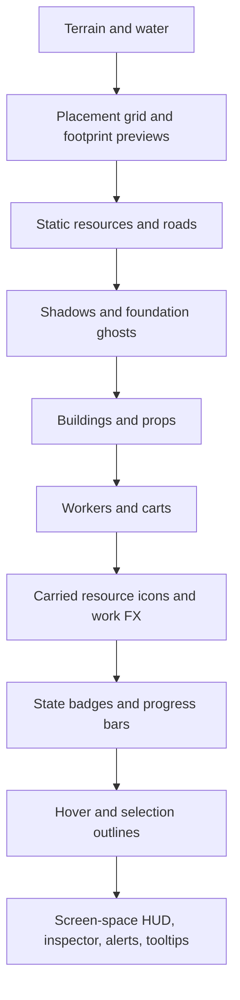
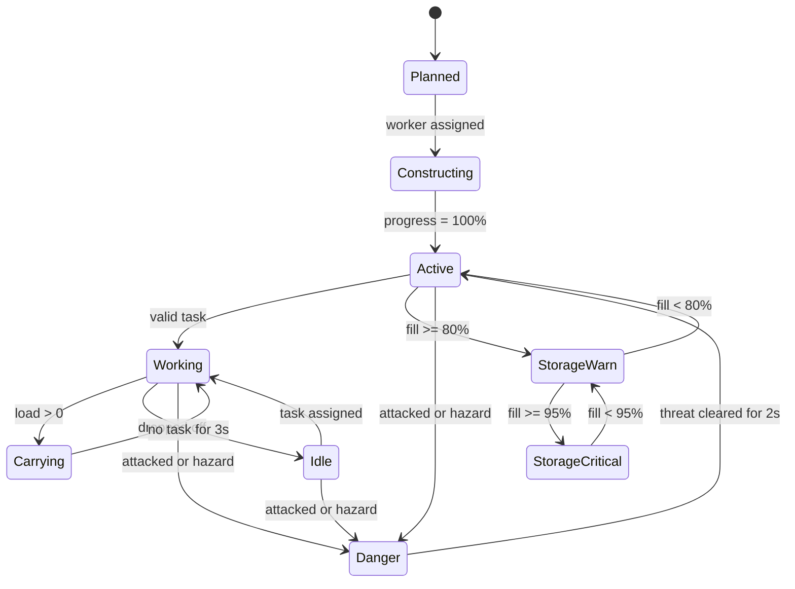

# Settlement Readability for an Age of Empires Style Town Viewer

## Executive summary

This report assumes a 2D top-down or isometric settlement viewer built in Pygame, with pan and zoom, sprite-based rendering, and no 3D lighting. The goal is fast civilian readability, not combat micro or competitive balance.

The clearest pattern across official Age of Empires materials is that readability improves when the game separates five things cleanly: shape, footprint, ownership, state, and urgency. AoE II and AoE IV both expose readability aids such as object highlights, idle pointers, friend-or-foe colors, colorblind modes, terrain grids, tooltip scaling and positioning, dark readability panels, strong-contrast UI modes, and text scaling. Official patch notes also show the dev teams making targeted clarity changes such as promoting enemy units above allied units on the minimap, enlarging landmarks visually without changing build footprint, fixing unreadable tooltips, and adding progress bars to transient statuses. Those are strong signals about what matters at a glance. citeturn16view3turn16view0turn3view2turn4view2turn19view0turn20view2turn20view3turn21view0

For a settlement viewer, the highest-value rule is this: **do not ask text to do work that silhouette, layering, and iconography should do first**. W3C contrast guidance and Microsoft’s icon guidance both point the same way, clear silhouettes, limited metaphors, strong contrast, minimal decorative detail, and no reliance on color alone. In practice, buildings and resources should be recognized by outline and footprint first, workers by body pose and carried-resource shape second, and text only on deliberate hover, selection, or inspection. citeturn24view0turn3view8turn3view9turn12view3

The recommended interaction model is outline-first and hybrid tooltip-first. Use a high-contrast neutral outer outline for hover and selection, then a smaller ownership-colored inner accent so state remains legible even for colorblind users or on noisy terrain. Use short cursor-adjacent tooltips only for names and counts, and send everything else to a fixed inspector panel. That matches AoE’s configurable floating versus fixed tooltip model and aligns with WCAG’s requirement that hover content be dismissible, hoverable, and persistent. citeturn16view1turn15view0turn15view1

For dynamic status, the cleanest at-a-glance stack is: ongoing work through low-amplitude animation, idle through a persistent overhead icon, construction through ghost plus scaffold plus progress, danger through a higher-priority red overlay and optional sound, and storage pressure through thresholded badges that escalate from amber to red. AoE II’s official idle-pointer option and AoE IV’s Town Bell addition both support the idea that work interruptions and danger need stronger surfacing than ordinary tasks. AoE II’s progress-style bars for temporary states are also a good precedent for construction and storage-capacity signaling. citeturn3view2turn21view0turn19view0

In Pygame, the implementation should be built around cached originals, layered rendering, and conservative event handling. Load atlas surfaces once and convert them for fast blitting, slice with subsurfaces, scale from originals rather than rescaling already-scaled frames, use layered groups for render order, and use dirty-rect rendering only when the scene is mostly static. For picking, broad-phase by rect or layer order and use masks only for the final candidate when transparent corners matter. citeturn8view2turn8view0turn8view1turn27search0turn27search1turn28search0turn28search1turn26view0

## Research basis and design lens

The strongest primary evidence for this topic comes less from formal “RTS readability theory” documents and more from official feature decisions in shipped games. AoE II’s accessibility page lists friend-or-foe color simplification, colorblind modes, terrain grid display and color control, HUD scaling, tooltip scaling and positioning, dark readability panels, object highlights, and narration of unit, building, and resource-node names. AoE IV’s accessibility page adds a strong-contrast mode and UI text scaling from 100% to 150%. Together, those official features define a practical readability model: simplify color semantics, improve spatial alignment, give the player control over highlight density, back-plate text, and scale UI up rather than asking players to live with tiny world labels. citeturn16view3turn16view0turn4view2

Official Age of Empires patch notes reinforce the same priorities. AoE II promoted community readability mods into built-in options with “Small Trees” and overhead idle-economy-unit pointers. AoE IV later changed minimap layering so enemies render above allies, enlarged landmark and wonder visuals while keeping the same underlying footprint, added or fixed tooltip behavior, aligned economic counters more cleanly in the HUD, and added one-click villager safety through Town Bell. These are not abstract UX opinions, they are production decisions from a mature RTS franchise about what players miss when readability is weak. citeturn20view0turn3view2turn20view2turn19view0

The standards side is equally clear. WCAG 2.2 requires at least 4.5:1 contrast for normal text and 3:1 for large text, while non-text UI indicators need meaningful visual contrast of at least 3:1. WCAG also requires that content shown on hover or focus be dismissible, hoverable, and persistent, and it limits flashing to no more than three times per second. Microsoft’s Xbox accessibility guidance adds three especially relevant gaming-specific requirements: avoid using color alone to communicate meaning, allow text scaling up to 200% at PC minimums of 18 px at 1080p, and provide additional channels for key visual and audio cues. citeturn3view7turn3view8turn15view1turn29search18turn12view1turn12view3turn13search2

For implementation, the Pygame documentation points toward a straightforward rendering architecture. `Surface.convert()` and `convert_alpha()` optimize repeated blits, `subsurface()` supports atlas slicing, `transform.scale()` is fast but destructive if repeatedly chained, and `LayeredUpdates` or `LayeredDirty` give explicit draw ordering. Pygame’s event system provides `MOUSEWHEEL`, window-resize events, event filtering, and custom user events for UI timers. Dirty-rect updates still exist, but Pygame’s own modern guide notes they are mainly helpful when the background is not heavily animating. citeturn8view2turn8view0turn8view1turn26view0turn27search0turn27search1

## Visual hierarchy rules

At-a-glance readability is mostly a **priority system**. The viewer should tell the player, in order: what this thing is, whether it is mine or not, what state it is in, and whether anything here is urgent. AoE IV’s minimap change, putting enemies above allies, is a very direct example of urgency outranking mere ownership. AoE II’s object-highlights menu, with separate modes for hover and selection, shows that interaction states also need a dedicated channel instead of piggybacking on ownership color. citeturn20view2turn16view0

A practical hierarchy for a settlement viewer is shown below.

| Priority | What the player should read first | Primary channel | Backup channel | Why this order works |
|---|---|---|---|---|
| Critical | Danger, fire, collapse, attack, starvation-equivalent alerts | Top-most overlay, red chevrons, optional sound | World badge plus fixed alert list | Urgent events must outrank ordinary ownership and selection, which matches AoE IV’s choice to layer enemies above allies in compact views and Xbox guidance to use multiple channels for key cues. citeturn20view2turn13search2 |
| Interactive | Hover and selection | High-contrast outline and footprint ring | Fixed inspector panel | AoE II explicitly exposes object highlights as a readability feature, and WCAG hover guidance requires extra content to remain usable. citeturn16view0turn15view1 |
| Identity | Building type, resource type, worker role | Silhouette and footprint | Small icon on demand | Microsoft’s icon guidance prioritizes distinctive silhouette, simple metaphor, and low decorative noise for small-size legibility. citeturn24view0 |
| Ownership | Self, ally, neutral, external owner | Banner, pennant, roof trim, badge shape | Inner accent color on selection ring | AoE II offers both unique-player colors and simplified friend-or-foe colors, which implies ownership should be configurable and not the only identifier. citeturn16view4turn12view3 |
| Activity | Working, idle, constructing, storing | Animation or progress | Small badge or bar | AoE II’s idle pointer option and temporary progress bars show that state should be visible without opening a panel. citeturn3view2turn21view0 |
| Detail | Counts, names, exact percentages | Text in inspector or tooltip | Narration or audio cue | AoE II and AoE IV both add text-scaling and readability options, but only after stronger non-text channels. citeturn16view3turn4view2turn12view1 |

Three rules matter most.

First, **reserve motion for change, not identity**. Workers can loop small work animations forever, because that motion conveys active work. Danger, however, should use slow pulsing only when it is newly relevant, and at less than three flashes per second. Avoid constant bouncing ownership markers or animated resource glows, because they compete with true alerts and violate reduce-motion principles. citeturn12view2turn29search18

Second, **do not rely on color alone**. If a storehouse is “full” only because it turns red, that fails the colorblind test. Pair hue with shape or position: add a crate icon with a slash, or a stacked-bar badge, or a corner chevron pattern. Microsoft’s gaming accessibility guidance is explicit on this point. citeturn12view3turn12view0

Third, **text belongs on dark panels, not directly on terrain**. AoE II exposes “Readability Panels” behind text, and Xbox accessibility guidance recommends keeping text as actual UI text over semi-opaque backgrounds, not baked into images. That is the correct default for Pygame as well. citeturn16view2turn12view0

## Building and resource silhouette guidance

The visual target is not realism, it is **fast classification at several zoom levels**. AoE II’s built-in “Small Trees” option is a strong example: the game did not make trees prettier, it made them less obstructive and improved gap readability. AoE IV’s landmark and wonder resize did something similar from the building side, larger visible mass while keeping gameplay footprint unchanged. Both choices suggest the same rule for a town viewer: let the visible art exaggerate recognition, while the logical footprint stays mechanically stable. citeturn20view0turn19view0

Shape language should be narrowly assigned. Housing should read as compact roof mass, storage as broad doors and stackable volume, production as chimneys or machinery, civic buildings as symmetry and banners, trees as canopy-over-trunk mass, stone as chunky low faceting, and gold as bright angular facets. Keep the number of defining silhouette features low, because Microsoft’s icon guidance explicitly favors singular metaphor, few shapes, few corners, and restricted detail if the object must still read at small sizes. citeturn24view0

For a sprite-based isometric viewer, a **64x32 base ground tile** is a strong default for 1080p desktop play. It is large enough to carry sprite anchors and footprint diamonds cleanly, but still small enough that a town can fit on screen. If you target lower-resolution laptops first, a 48x24 tile works as a fallback mode. The most important technical rule is anchor consistency: workers anchor at foot center, single-tile resources at ground-contact center, and multi-tile buildings at the center of the south edge of the occupied footprint. Use the same logical anchor for final art, construction ghost, selection ring, and placement preview, otherwise the sprite will “swim” while changing state.

### Recommended sprite canvases and anchors

The table below is a recommended production starting point, not a claim about AoE’s internal asset sizes.

| Entity class | Logical footprint | Recommended canvas on 64x32 grid | Anchor point | Silhouette note | Why |
|---|---|---:|---|---|---|
| Worker | 1 tile occupancy, narrow body | 28x36 px | (14, 30), feet center | Head, torso, tool, one carried-item slot | Small objects need a clean, balanced silhouette and minimal detail to remain legible when scaled down. citeturn24view0turn8view0 |
| Tree | 1x1 tile | 64x80 px | (32, 60), trunk-ground center | Broad canopy, narrow trunk, no thin twig noise | AoE II’s small-trees option shows resources often need obstruction reduction more than visual richness. citeturn20view0 |
| Stone or gold node | 1x1 tile | 64x48 px | (32, 40), base center | Chunky faceted mass, no filament detail | Keep detail on the most prominent layer only. citeturn24view0 |
| Small prop or crate pile | 1x1 tile | 48x40 px | (24, 32), base center | Rectilinear mass, readable even in grayscale | Non-color distinction is required when color perception is weak. citeturn12view3 |
| House or hut | 2x2 tiles | 128x112 px | (64, 96), south-edge center | One strong roof shape, one door/canopy cue | Show the concept in a small number of forms. citeturn24view0 |
| Workshop or storage building | 3x3 tiles | 192x144 px | (96, 120), south-edge center | Broader base, one machinery cue, one drop-off opening | Buildings should classify by silhouette before text. AoE II’s terrain grid and object highlight settings reinforce that ground footprint and shape must agree. citeturn16view3turn16view0 |
| Town center or large civic core | 4x4 tiles | 256x192 px | (128, 168), south-edge center | Largest civic mass, strong roofline and banner point | AoE IV’s visual-only landmark resizing supports exaggerating visible recognition beyond raw footprint. citeturn19view0 |

### Zoom and LOD policy

| Zoom band | What remains visible | What should drop away | Recommended LOD rule | Source support |
|---|---|---|---|---|
| 120% and above | Full sprite detail, worker tool loops, small ownership pennants | Only purely decorative clutter | Use highest-detail original sprites | Re-scale from originals, not already-scaled surfaces, because repeated resizing is destructive. citeturn8view0 |
| 80% to 120% | Full silhouette, primary state badges, short names on hover | Tiny props and secondary trims | Default play band | AoE IV’s 100% to 150% text-scaling and AoE II HUD/tooltip scaling both imply this is the main readable range. citeturn4view2turn16view3 |
| 50% to 80% | Silhouette, ownership pennant, critical alerts, construction bar on selection only | Carried-resource micro-icons, smoke wisps, decals | Swap to simplified sprite variants with fewer edges | Small-size readability depends on silhouette simplicity and controlled detail. citeturn24view0 |
| Below 50% | Footprint diamond, major roof mass, critical icon badges only | Decorative art, idle tool loops, detailed bars | Switch many entities to iconized top-shape or footprint-plus-badge | AoE’s readability tools such as small trees and object highlights exist because dense art loses usefulness at small scale. citeturn20view0turn16view0 |

A useful working rule is this: if an entity’s defining silhouette cannot be recognized in grayscale at 50% zoom, the sprite is carrying too much detail and not enough shape.

## Selection, hover, and status conventions

AoE II’s official accessibility options separate hover from selection, and its tooltip system supports fixed or cursor-adjacent positions. WCAG’s hover/focus guidance then adds the key usability constraint: hover-triggered content must be dismissible, hoverable, and persistent, and should not obscure the trigger more than necessary. The practical conclusion is that a town viewer should use **world-space outlines for interaction**, **small cursor tooltips for short labels**, and a **fixed inspector panel for detail**. citeturn16view0turn16view1turn15view0turn15view1

### Recommended interaction tokens

The values below are recommended implementation defaults for a mid-value terrain palette. They are starting tokens, then you should verify that the resulting on-scene contrast still clears at least 3:1 for non-text cues and 4.5:1 for text panels. citeturn3view8turn3view9turn12view0

| State | World-space treatment | Exact suggestion | Animation | Why |
|---|---|---|---|---|
| Hover | Thin outline plus light footprint tint | Outer outline `rgba(255, 212, 92, 216)` with 1 px stroke. Footprint fill `rgba(255, 212, 92, 48)` | Fade in 80 ms, fade out 120 ms | Hover should be lighter than selection and should indicate “cursor is here,” matching AoE’s separate hover highlighting. citeturn16view0 |
| Selection | Double-stroke outline plus footprint ring | Outer stroke `rgba(255,255,255,230)` 2 px, inner stroke ownership color at `rgba(owner, 210)`, footprint shadow `rgba(0,0,0,72)` | Optional breathe at 1 Hz, alpha swing no more than 10% | Neutral outer stroke keeps selection legible independent of ownership hue, which supports no-color-alone usage. citeturn12view3turn12view0 |
| Ownership only | Passive pennant or badge, no glow | Self blue `#4391FF`, ally teal `#36C4A9`, neutral gray `#B4B4B4`, external red `#E46A6A`, plus shape-coded pennant tips | Static | Ownership should be informational, not as visually loud as selection or danger. AoE II exposes both unique colors and friend-or-foe simplification. citeturn16view4 |
| Disabled or unavailable | Desaturate sprite and mute outline | Multiply saturation to 65%, add slate overlay `rgba(32, 40, 52, 92)` | Static | Reduces clutter while keeping silhouette readable. Contrast must still remain sufficient. citeturn12view0turn3view8 |
| Tooltip text panel | Dark back-plate with real text | Panel `rgba(12,16,24,210)`, body text `#F2F5F8`, header `#FFFFFF` | No motion | AoE II’s readability panels and Xbox contrast guidance both point toward back-plated real text, not text burned into art. citeturn16view2turn12view0 |

### Tooltip policy

| Approach | Use it for | Avoid it for | Recommended policy |
|---|---|---|---|
| Cursor-adjacent tooltip | Name, short status, “idle,” “full,” “gold vein” | Multi-line detail, production queues, storage breakdowns | Show after 150 to 250 ms, max two lines, never cover the trigger’s center point. Support `Esc` to dismiss. citeturn16view1turn15view0turn15view2 |
| Fixed inspector panel | Selected building or worker detail | Rapid hover-only scanning | Best default for anything more than short labels, because AoE II already treats fixed tooltips as a valid readability option. citeturn16view1 |
| Hybrid | Most town-viewer use cases | None, if implemented carefully | Recommended overall model: hover uses short cursor labels, selection opens fixed details. citeturn16view1turn15view1 |

Persistent indicators should be restricted to ownership, critical alerts, and long-lived process states. Transient indicators should be hover-only or selection-only. If everything is always on, nothing is actually glanceable.

That layer stack follows the same logic visible in AoE’s official readability features, static identity first, dynamic state above it, interaction above that, and HUD text separated into screen space. citeturn16view3turn16view0turn20view2

## Showing work, idle, construction, danger, and storage pressure

The cleanest rule for state display is: **one primary state channel, one backup channel, and no more**. If work is shown by animation, the backup can be a small carried-resource icon. If idle is shown by an overhead exclamation mark, the backup can be an idle counter in the HUD. If danger is shown by red chevrons, the backup can be a short ping sound and an alert list entry. This follows Microsoft’s “additional channels” guidance and mirrors AoE II’s choice to surface idle workers with persistent overhead pointers. citeturn13search2turn3view2

### Recommended state signals and thresholds

| State | Always-on signal | On-change signal | Threshold | Exact recommendation | Source support |
|---|---|---|---|---|---|
| Working | Short tool-loop animation, smoke puff, chopping swing, carry pose | None | Immediate while task valid | 2 to 4 frame loop at 2.5 to 4 fps. Do not pulse the whole sprite | Motion should communicate activity, not decoration. citeturn12view2 |
| Idle | Overhead idle badge | Soft single “attention” ping | Worker has no valid task for 3 seconds | Badge circle `rgba(24,24,24,216)` with exclamation icon `#FFC400`, 16x16 px at 100% zoom. Bounce once over 180 ms, then stay static | AoE II’s official idle pointers put an exclamation mark above idle economy units. citeturn3view2 |
| Construction | Ghost footprint, scaffold overlay, progress bar | Placement confirmation sound | From placement until completion | Ghost at 45% alpha, scaffold tint `rgba(115,216,255,140)`, progress bar 4 px tall above south edge. Show unless zoom is below 50%, then fold into a small hammer badge | AoE IV added progress bars in UI contexts and improved construction UI; AoE II uses transient progress readouts for temporary states. citeturn19view0turn21view0 |
| Danger | High-priority red corners or chevrons | Two-note alert sound | Damage in last 1.5 seconds, fire, raid, hazard | `rgba(255,92,92,230)` corner chevrons plus subtle alpha pulse at 1.5 Hz. Never exceed 3 flashes per second | Critical items should visually outrank ordinary states, but motion must remain below flash limits. citeturn20view2turn29search18turn12view2 |
| Storage pressure | Corner crate badge or fill badge | Soft low-frequency thud if crossing threshold | Warning at 80%, critical at 95% | 80% to 94% badge in amber `#FFB247`, 95% and up in red `#FF5C5C`, always paired with a shape change such as a slash or “stacked full” icon | Avoid color-only meaning, especially for red/amber thresholds. citeturn12view3turn12view0 |
| Carried resources | Small icon attached to worker top-right or near hands | None | Show only when load is non-zero and zoom is 80% or higher | 10x10 or 12x12 icon, simplified one-color-plus-shadow art | Fine-grain detail should disappear at low zoom to protect silhouette readability. citeturn24view0turn8view0 |

Construction deserves special care because it combines identity uncertainty and progress uncertainty. The placement preview should be readable as **where it will go** and **what it will become**. Use a footprint ghost first, then scaffold, then the final silhouette gradually replacing scaffold. Avoid full-opacity “future buildings” on placement, because they overclaim completion and reduce state honesty.

Storage pressure is the status most likely to be over-explained with text. Do not do that. The town viewer only needs thresholded visibility in-world. Exact counts belong in the inspector or HUD. AoE IV’s alignment fixes for villager-on-resource counts and idle counts reinforce the idea that numeric info is best grouped in stable UI, not sprayed across the map. citeturn20view2

One important implementation note: “Danger” should be an overlay priority, not a separate deep state model. If a building is both selected and in danger, danger styling should sit above selection color accents, because urgency beats interaction. That is the same principle AoE IV used when changing enemy layering on the minimap. citeturn20view2

## Accessibility requirements

The minimum accessibility bar for a town viewer is straightforward.

Text should default to at least **18 px on PC at 1080p**, with a scale option up to **200%**, and at least one **sans-serif** font option. Multi-line blocks should not become cramped when scaled. WCAG and Xbox guidance both stress that text should remain readable when enlarged, and that larger text, spacing, and back-plates materially improve clarity. AoE IV’s own scaling from 100% to 150% and AoE II’s HUD and tooltip scale options point the same way. citeturn12view1turn15view1turn4view2turn16view3

Non-text indicators, including outlines, badges, footprint rings, and progress bars, should maintain at least **3:1 non-text contrast** against adjacent terrain. That usually means a double-stroke, white over dark or ownership-color over dark, instead of a single thin colored line. For text, use dark back-plates by default rather than trying to keep white text readable on grass, snow, and roofs simultaneously. AoE II’s readability panels are the right precedent here. citeturn3view8turn12view0turn16view2

Ownership, warning, and category color must never stand alone. Pair ownership with pennant shape, warning with a badge shape, and priority with fixed screen position or icon class. Xbox’s accessibility guidance is explicit that color-alone signaling excludes players with color-vision deficiencies. AoE II’s use of colorblind modes and friend-or-foe simplification shows that even a major RTS sees this as a practical problem, not a theoretical one. citeturn12view3turn16view4

Hover UI must obey the same usability rules as web UI. If the user hovers a building and a tooltip appears, it should persist long enough to read, be dismissible without forcing the cursor off the target, and not disappear when the pointer moves onto the tooltip itself. In a game viewer, the simplest mapping is: `Esc` dismisses, selection pins, and fixed inspector content does not vanish until selection changes. citeturn15view0turn15view1turn15view2

Motion should be limited and optionally reducible. No alert should flash faster than three times per second, and constant ambient UI motion should be removable or avoidable. Slow alpha pulsing and one-shot attention bounces are safer than high-contrast strobes or size pops. citeturn29search18turn12view2

If you add narration later, nameable units, buildings, and resource nodes are the right targets. AoE II specifically supports narration of hovered UI text plus unit, building, and resource-node names, which is a good model for an accessible inspector or debug log in a Pygame viewer. citeturn16view0

## Pygame implementation checklist

The implementation should be done in descending order of payoff. Build the structure that protects readability first, then optimize.

### Priority checklist

| Priority | Implementation task | Concrete recommendation | Why it is high value | Source support |
|---|---|---|---|---|
| P0 | Define logical tile and anchor system | Use a 64x32 isometric tile basis, explicit world-to-screen transform, and per-asset south-edge or foot-center anchors | Anchor consistency is what keeps hover rings, ghosts, and final art from jittering | Stable footprint alignment is central to AoE’s terrain-grid, object-highlight, and visual-footprint clarity aids. citeturn16view3turn16view0turn19view0 |
| P0 | Build render layers explicitly | Terrain, preview grid, static resources, shadows, buildings, units, state badges, outlines, HUD | Readability comes from draw order as much as art quality | `LayeredUpdates` exists exactly to manage ordered layers. citeturn8view1 |
| P0 | Use atlas-based asset loading | Load atlas PNGs once with `convert_alpha()`, slice frames via `subsurface()` | Fast blits, fewer file opens, simpler batching | Pygame recommends converted surfaces for fast blitting, and subsurfaces preserve parent linkage. citeturn8view2 |
| P0 | Cache zoom tiers from originals | Pre-bake scaled surfaces at major zoom bands, for example 1.25x, 1.0x, 0.75x, 0.5x, from original art only | Avoid destructive repeated scaling and per-frame resizes | Pygame explicitly warns that repeated transforms lose detail and recommends re-transforming from the original surface. citeturn8view0 |
| P0 | Implement hover and selection with neutral-first outlines | Outer neutral outline then ownership-colored inner accent | Keeps interaction readable even when ownership hues are ambiguous | Supports no-color-alone and non-text contrast requirements. citeturn12view3turn3view8 |
| P1 | Add state badges with threshold logic | Idle after 3 s, storage warn at 80%, critical at 95%, danger after damage event | Prevents alert fatigue and keeps states interpretable | AoE’s official idle pointers and temporary progress displays justify selective persistent signaling. citeturn3view2turn21view0 |
| P1 | Use fixed inspector plus short hover tooltip | Hover for names only, selection for detail | Lowers world clutter and supports accessibility expectations | AoE II supports fixed or floating tooltips; WCAG defines hover behavior requirements. citeturn16view1turn15view1 |
| P1 | Use broad-phase then narrow-phase picking | First check layer and `rect`, then optional `mask` only for the top candidate | Fast enough for many sprites without accidental transparent-corner picks | Pygame supports rect and mask collision, with explicit performance guidance to cache masks. citeturn28search1turn28search0 |
| P1 | Add event-driven UI timers | Use `pygame.event.custom_type()` for alert expiry, delayed tooltips, and animation phase updates | Cleaner than polling every rule every frame | Pygame’s event system supports custom events and event filtering. citeturn26view0 |
| P2 | Filter the event queue | Allow only QUIT, mouse, keyboard, and window events that the viewer actually uses | Reduces unnecessary queue churn | `set_allowed()` and `set_blocked()` exist specifically for queue control. citeturn26view0 |
| P2 | Decide redraw strategy from scene behavior | Use full redraw with `display.flip()` for panning or heavy animation. Use dirty-rect techniques only if most of the scene stays static | Avoid premature micro-optimization and choose the right mode for the scene | Pygame’s modern guide says full redraw is fine on modern hardware, while dirty rects still help in mostly static scenes. citeturn27search0turn27search1 |

### Event and input handling

For interaction, the minimal useful Pygame event set is `MOUSEMOTION`, `MOUSEBUTTONDOWN`, `MOUSEBUTTONUP`, `MOUSEWHEEL`, `KEYDOWN`, `KEYUP`, and window-resize events such as `WINDOWRESIZED` or `WINDOWSIZECHANGED`. Use `MOUSEWHEEL` for zoom, because Pygame 2 exposes precise wheel deltas. Use a custom event for delayed tooltip appearance instead of immediate hover spam. Do not use keyboard grab in a normal game viewer. citeturn26view0

For picking, use this order:

1. Convert screen point to world point.
2. Query candidate sprites from the top visible layers first.
3. Broad-phase with `rect.collidepoint`.
4. If transparent corners matter, do one final `mask` test on the top candidate.
5. Resolve ties by render layer and then by south-most anchor, so nearer isometric objects win.

That approach matches Pygame’s strengths. `Rect` operations are cheap, `LayeredUpdates.get_sprites_at` preserves top order, and masks are available when precision matters. citeturn8view1turn28search1turn28search2

### Performance notes that matter in practice

Batch as much static drawing as possible. If your terrain chunk or static building layer does not change often, pre-render it to chunk surfaces and only redraw chunks that enter view or become invalid. Use `Surface.blits()` when you can submit many draws to the same surface in one go. Convert all frequently blitted surfaces once. Avoid scaling inside the hot draw loop except for a changing zoom band transition. citeturn8view2turn27search0

If the camera is usually moving, full redraw is simpler and often fast enough on modern PCs. If the camera is stationary and only a few workers animate, then `RenderUpdates` or `LayeredDirty` can earn their keep. Pygame’s own documentation says dirty updates are mainly useful when the destination background is not heavily animating, and `LayeredDirty` can switch between dirty-rect and full-screen modes automatically. citeturn8view1turn27search0turn27search1

### Low-resolution fallback

If the viewport is 1280x720 or the user chooses a compact mode, reduce information density instead of merely shrinking it.

Use these fallbacks:

- Switch to a 48x24 logical tile basis or a capped minimum zoom.
- Raise default world-space badge size from 16 px to 20 px.
- Remove non-critical carried-resource icons.
- Disable cursor-following tooltips, use fixed inspector only.
- Increase all text by at least one scaling step.
- Replace animated danger pulses with static framed badges if reduce-motion is on.
- Force double-stroke outlines, because thin single-color strokes disappear first.

That fallback strategy is more consistent with AoE’s official scaling, contrast, and readability-panel solutions than simply trying to cram the same UI into fewer pixels. citeturn16view3turn4view2turn16view2turn12view1

### Practical default configuration

A strong first playable build should ship with these defaults already enabled:

| Area | Recommended default |
|---|---|
| Tile basis | 64x32 isometric tiles |
| Text | Sans-serif, 18 px body at 1080p, scalable |
| Tooltip model | Short hover label plus fixed inspector |
| Highlight model | Hover on, selection on, neutral-first double stroke |
| Ownership model | Friend-or-foe by default, advanced per-owner colors optional |
| Grid | Placement grid visible while placing only |
| Idle signal | Overhead idle pointer after 3 seconds |
| Danger signal | Red chevrons plus optional soft alert sound |
| Reduce motion | Available at launch |
| Contrast mode | Dark text panels and stronger outline mode available at launch |

These defaults line up with the official AoE accessibility and readability features more closely than a “clean screen by default” approach that hides too much state. citeturn16view3turn16view0turn4view2turn3view2