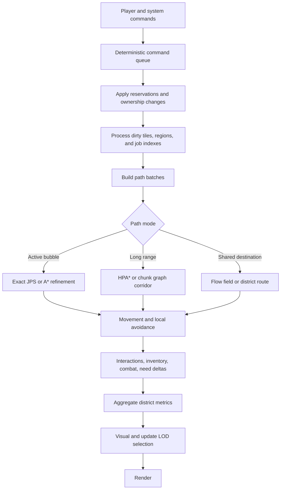
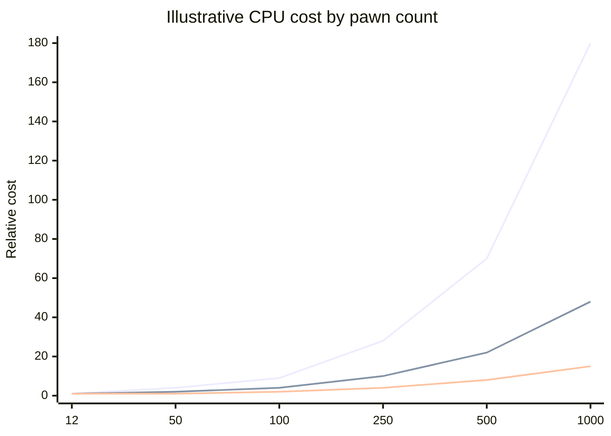
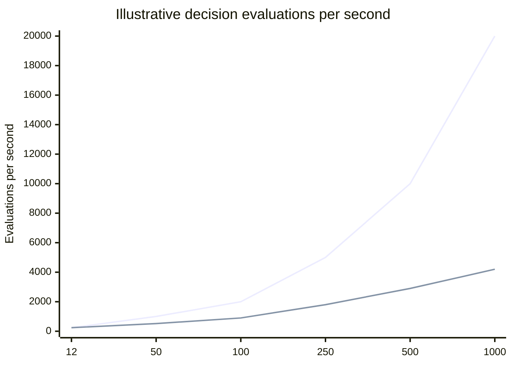

# Scalable Simulation Patterns in RimWorld, Townsmen, and Age of Empires

## Executive summary

The three games converge on the same core lesson: simulation scale is not won by making every agent smarter, it is won by making fewer decisions exact, making expensive decisions less frequent, and replacing per-agent global reasoning with indexed, hierarchical, or aggregate systems. RimWorld’s published materials point to reachability prechecks, local dirty-region recomputation, spread-out workloads, batched pathfinding, and parallelized rendering as its main scalability levers. Townsmen’s public evidence is thinner, but its official product pages and patch notes strongly suggest a building-anchored labor model with daily routines, bounded worker roles, and practical fixes around path reachability, missing work assignments, and dense coverage overlays. Age of Empires is the clearest published case study: Ensemble explicitly replaced one general-purpose pathing system with several specialized ones, used deterministic command turns instead of shipping per-unit state, and relied on a sprite-heavy 2D pipeline and variable detail to hit low-end hardware targets. citeturn23view0turn13search3turn14search5turn26view0turn9search0turn25view0turn16view0turn17view0turn36view0

For a deterministic Python/Pygame engine like Local Agent Town, the strongest transferable patterns are not the multithreading itself, because your current constraint is single-threaded, but the *shape* of the optimizations: exact reachability filters before exact pathfinding, job discovery via indexes instead of whole-world scans, long-range path abstraction, many-to-one movement via shared fields, cadence tiers, deterministic budgets, and aggressive visual/update LOD outside the active bubble. In practical terms, I would keep almost everything exact at about 12 pawns, start adding indexing and cadence staggering by roughly 32-64 active pawns, introduce hierarchical paths and shared flow fields by roughly 100-250, and move to district-level labor allocation plus offscreen ETA simulation by roughly 400-1000. Those thresholds are design recommendations, not published constants, but they follow directly from the scaling behavior described in the pathfinding, crowd, and AI-LOD literature, and from the ways these games publicly simplified their own workloads. citeturn33view0turn33view1turn33view2turn33view3turn33view4turn33view5turn35view0

At about 12 pawns, what must remain exact is the stuff the player reads as “truth”: job reservation and ownership, inventory transfers, health state, combat resolution, tile occupancy near interaction points, short-range pathing, and deterministic event order. At about 1000 pawns, what can be approximated is almost everything *outside* the player’s active bubble: long-range movement, job search breadth, local avoidance sophistication, animation phase fidelity, and even some need updates, so long as handoff back into exact simulation is deterministic and loss-bounded. That split matches the broad pattern in the literature on crowd LOD and time-budgeted AI, and it is also the cleanest way to preserve replay/debug determinism in a single-threaded local simulation. citeturn33view3turn33view4turn30search0turn35view0

## Scope, assumptions, and evidence quality

This report assumes that “Age of Empires” refers primarily to the classic Ensemble/Genie-era lineage, especially *Age of Empires* and *Age of Empires II*, because those are the entries with the best primary technical coverage from Ensemble on networking, pathfinding, rendering, and optimization. I use later official Age of Empires materials only where they clarify the franchise’s continuing approach to villager automation and local retasking. citeturn17view0turn16view0turn36view0turn19view0turn19view1

This report assumes that “Townsmen” refers to HandyGames’ *Townsmen* / *Townsmen - A Kingdom Rebuilt* family. HandyGames publishes product pages, press materials, and patch notes, but I did not find a deep technical postmortem or GDC-style systems talk comparable to the RimWorld and Age of Empires material. That means the Townsmen findings below are more often “appears to use,” grounded in official feature descriptions and bug-fix evidence rather than full engine disclosures. citeturn24search0turn26view0turn9search1turn25view0

For Local Agent Town, I assume a deterministic, fixed-tick, single-threaded Python/Pygame simulation on a 2D walkable grid, with no networking and no requirement for fully continuous navmesh motion. If the real engine is continuous-space or hex-based, some path recommendations shift, especially JPS and HPA*-style clustering. The recommendations below aim to preserve deterministic replays, exact debugging, and local responsiveness first, then scale outward by reducing the scope and cadence of exact per-agent updates. This section is an explicit assumption set, not a sourced claim.

## Comparative findings by focus area

### Job selection and task allocation

RimWorld’s public-facing material strongly suggests a heuristic, policy-constrained job system rather than a global optimal scheduler. Even in early alpha notes, Tynan described food choice as integrating distance, taste, and psychological preference to pick the “most optimal food source,” and other notes describe automatic rescue, apparel search under outfit constraints, minimum skill gates on bills, and timetable/work priority data. That pattern is important: the game seems to choose from a constrained candidate set using local rules and priorities, then commits a pawn to a job, rather than solving a colony-wide assignment optimization every tick. The 1.6 notes again emphasize optimizations to hauling and other job-heavy systems, which is consistent with reducing scan cost rather than increasing behavioral sophistication. citeturn22view0turn20search0turn14search1turn13search3

Townsmen appears to simplify job selection more aggressively. HandyGames’ official materials frame the game around “many different jobs,” “citizens with their own daily routines,” and a town that grows into “hundreds of inhabitants,” but the player-facing loop remains building-centric: send workers to cut trees, mine ore, build structures, and satisfy obvious production-chain roles. Patch notes also reveal explicit assignment couplings, such as a missing construction site when the assigned Townie was sick. That is exactly the kind of bug you expect in a system where a worker is bound to a worksite or task token, not running an expensive open-ended planner every frame. citeturn26view0turn24search0turn25view0

Age of Empires uses the bluntest and most scalable simplification of the three: very low autonomy for economic agents. In the classic model, villagers largely continue their current player-issued task until interrupted, resource-exhausted, or given another command. Ensemble’s AoE II postmortem says the computer-player AI was rebuilt as an expert-system, script-based AI, which is another form of bounded decision-making. Later official Age materials show the same philosophy evolving into narrowly scoped automation, not a full colony planner: official support documents describe villager autoqueue/autotrain, and an AoE IV update notes that villagers will automatically gather from nearby resources after repairing a farm or drop-off building. That is a local post-task chaining rule, not general-purpose autonomous job search. citeturn36view0turn19view0turn19view1

For Local Agent Town, the Age of Empires model is the most important warning. At 1000 pawns, do not let every idle pawn score every job. Use RimWorld-like policy filters and top-k candidate sets, but keep AoE’s discipline about autonomy scope. Good large-scale simulation often means *less* agent freedom, not more. Utility AI scales well when the candidate set is small and curves are simple, but not when every agent evaluates the whole map. citeturn34view0turn34view1

### Pathfinding and movement

RimWorld’s clearest published pathfinding simplification is the reachability index. Tynan describes classic A* failure on unreachable goals as a full-map scan that produces frame hitches, then explains the fix: every walkable square gets a zone index from an optimized flood fill, and agents first compare source and destination region indices before trying A*. He also notes that global regeneration on a 200×200 map was about 5.5 ms and therefore too expensive to do every frame, so the next step was local recomputation when walls or similar obstacles changed. That is a textbook example of replacing repeated exact path searches with a cheap, incrementally maintained coarse predicate. In 1.6, Ludeon says the pathfinding system became fully multithreaded and batched, confirming that path requests were significant enough to justify explicit batching at the engine level. citeturn23view0turn13search3

Townsmen’s public evidence suggests simpler, worksite-centric pathing with fewer disclosed abstractions. HandyGames issued a pathfinding patch after reports of Townies “standing around and doing nothing,” later fixed a case where “Harbor can now be reached by all Townies,” and also fixed a missing construction site when an assigned Townie was sick. Those are the signatures of a production-sim movement layer where access points, route validity, and worker ownership matter more than sophisticated crowd path planning. I did not find official evidence of hierarchical pathfinding, flow fields, or crowd-aware routing. The safe inference is that Townsmen optimizes scale more by limiting the number and type of movements agents can perform than by publishing novel path algorithms. citeturn9search0turn9search1turn25view0

Age of Empires gives the best primary-source blueprint. Herb Marselas writes that AoE’s original single “tile pathing” system worked adequately for short paths but often took too long for harder cases, so AoK added two more special-purpose pathing systems. “MIP-map pathing” approximated distant routes and quickly answered whether the general target area was even reachable; “low-level pathing” handled accurate short-distance movement; and the system could still fall back to the original tile pathing. The AoE II postmortem frames this similarly, saying a high-level pathfinder computed general routes ignoring walking people while lower-level pathfinders threaded paths through closely packed units. That is the cleanest published coarse-to-fine path stack in this set of games. citeturn16view0turn36view0

The academic literature reinforces exactly this shape. HPA* reduces search effort by abstracting the map into local clusters with cached crossings and is reported as up to 10x faster than optimized A* with paths within 1% of optimal in the published tests. Jump Point Search speeds up uniform-cost grid search while preserving optimality and requiring no extra memory. Cooperative pathfinding and other full multi-agent planners are useful in RTS-like environments, but full exact joint planning has much worse scaling than decoupled or aggregate approaches. For very large crowds, flow/continuum methods and congestion-aware routing trade away some per-agent individuality in exchange for thousands of agents at real-time rates. citeturn33view0turn33view1turn28search3turn33view2turn35view0

### Update cadence and batching

RimWorld is openly built around non-uniform work distribution. The community-documented conventional cadence is 60 ticks per real second at normal speed, but the more important official point is that Ludeon keeps moving expensive subsystems off “everyone every tick” behavior: 1.5 parallelized pawn drawing on a separate thread, 1.6 “spread out” workloads, batched pathfinding, and optimized hauling, alerts, animal pen calculations, and other broad systems. Even without importing RimWorld’s actual threading model into Local Agent Town, the design lesson is clear: keep the simulation deterministic, but do not update everything at the same cadence. citeturn11search0turn14search5turn13search3

Townsmen does not publicly document its simulation step or update buckets, but its official framing of “daily routines” and its bug history imply cadence separation by system. A city builder with hundreds of inhabitants, production chains, disasters, and optional military almost certainly survives by evaluating some systems on daily or event steps rather than every frame, even if HandyGames does not publish the exact buckets. The evidence is indirect but consistent: it talks about routines, seasons, weather, jobs, and production, not per-frame agent cognition. citeturn26view0turn24search0

Age of Empires publishes the strongest cadence story. Ensemble’s networking article says the game ran synchronous simulation turns, typically 200 ms long, with commands sent during one turn and scheduled for execution two turns in the future. The host adjusted frame rate and communication turn length based on measured processing time and ping, because rendering, AI, and pathing made turn cost fluctuate substantially. That was not just a network trick. It was a full simulation-time budgeter for a single-threaded RTS game targeting 15 fps on a Pentium 90 with a 28.8 modem. The deeper lesson is that deterministic games scale better when work is batched into fixed, budgeted windows instead of treated as continuously urgent. citeturn17view0

The broader AI-LOD literature points the same way. LOD Trader explicitly argues against fixed, simplistic thresholds and instead allocates detail under a budget each frame, while LOD-AI work shows distant agents updated drastically less often than near agents, with example update rates falling from every frame to roughly 20 Hz, then 1.66 Hz, 0.87 Hz, and 0.59 Hz as LOD decreases. For Local Agent Town, you do not need a per-frame optimizer as elaborate as LOD Trader to benefit from this idea. A deterministic bucket schedule with integer tick divisors gets most of the benefit. citeturn33view3turn33view4

### Visual LOD and thresholds where exact simulation stops paying off

RimWorld’s published visual scaling story is more about rendering architecture than classic distance-based LOD. In 1.5, Ludeon says pawns are drawn in parallel on a separate thread and the pawn render system was rewritten for easier visual addition/removal; in 1.6 they continued optimizing performance and spread out work further. I did not find a primary-source description of explicit, distance-based visual impostors for pawns in the materials reviewed, so I would not overclaim that kind of LOD. The credible claim is that RimWorld attacks rendering cost by pipeline simplification, parallelization, and broader workload spreading rather than by abandoning detailed on-screen silhouettes. citeturn14search5turn13search3

Townsmen’s official material suggests a more stylized visual target and a lower agent-count ambition. HandyGames talks about “cute inhabitants” and hundreds of citizens, not thousands, and one official patch fixes a “graphic bug” that happened when there were too many buildings with covering range on the map. That is telling. It implies that UI overlays and area-coverage visualization, not just agent brains, become scale problems. In a local engine, this means visual LOD is not only about pawn sprites, it is also about suppressing expensive overlays, influence radii, and debug draw once density rises. citeturn24search0turn26view0turn25view0

Age of Empires relied on an even stronger simplification: a 2D, sprite-based, tile world. Ensemble describes the Genie engine as a 2D single-threaded game-loop engine with 256-color sprites in a tile-based world full of thousands of objects. Marselas describes a graphics pipeline mixing software rendering and hardware composition, careful memory placement of sprites, and later a variable graphics-detail switch to hit CPU targets. The AoE II postmortem also notes reviewer praise that the game still looked strong despite staying in 256 colors. In other words, classic AoE sidestepped a large amount of 3D visual LOD complexity by choosing a rendering representation that was already a kind of visual compression. citeturn17view0turn16view0turn36view0

Age of Empires is also the only one of the three with a clear published threshold for when naïve exactness was already too expensive: Ensemble writes that if they had tried to pass per-unit status such as position, action, facing, and damage in real time, they would have been limited to about 250 moving units. That threshold is about networking, not local CPU alone, but it captures the same scaling truth: exact per-agent state handling becomes nonviable surprisingly early when every subsystem insists on high-frequency exactness. The crowd literature pushes that point further, with continuum and collision-LOD approaches explicitly arguing that full detailed crowd behavior is too expensive for large counts and that thousands of agents require mixed-fidelity strategies. RimWorld and Townsmen do not publish equivalent pawn-count cutoffs in the primary sources I found. citeturn17view0turn33view2turn33view5turn33view3

### Cross-game comparison

| Focus area | RimWorld | Townsmen | Age of Empires | What the pattern means for Local Agent Town |
|---|---|---|---|---|
| Job selection | Local heuristics under policy constraints, with automatic rescue, apparel search, bill skill gates, and optimized hauling rather than global assignment. citeturn22view0turn14search1 | Building-anchored jobs, daily routines, many job types, explicit worker-task bugs when a Townie is sick. citeturn26view0turn25view0 | Mostly player-issued villager work, scripted computer-player AI, narrow local automations only. citeturn36view0turn19view0turn19view1 | Keep autonomy bounded. Use policies, local candidate sets, and reservations. Avoid world-wide per-agent scans. |
| Pathfinding | Reachability region IDs before A*, local recomputation when topology changes, later batched pathfinding. citeturn23view0turn13search3 | Appears simpler and access-point centric, with official fixes for idle Townies and unreachable harbor routes. citeturn9search0turn9search1 | Explicit three-tier path stack: approximate long-range, accurate short-range, fallback tile pathing. citeturn16view0turn36view0 | Use coarse-to-fine routing: region reachability, HPA* or cluster graph for long range, exact local refinement near the goal. |
| Update cadence | Tick-based world with official emphasis on spreading out workloads and batching heavy systems. citeturn11search0turn13search3 | Public cadence unspecified, but official framing emphasizes routines, seasons, and production layers, implying mixed time scales. citeturn26view0turn24search0 | 200 ms deterministic turns with explicit speed control based on processing and latency. citeturn17view0 | Use a fixed master tick, but schedule systems at different divisors of that tick. |
| Batching | 1.6 explicitly says pathfinding is batched; 1.5 parallelizes pawn drawing. citeturn13search3turn14search5 | Evidence points more to bounded assignment and content-specific fixes than disclosed explicit batching. citeturn25view0 | Commands batched by turn, and simulation timing budgeted by turn. citeturn17view0 | Batch path requests, command processing, and district/resource computations in deterministic order. |
| Visual LOD | Public materials emphasize render-pipeline optimization, not strong public evidence of distance impostors. citeturn14search5turn13search3 | Overlay density becomes a visible problem when many coverage ranges are shown. citeturn25view0 | Sprite-based 2D rendering and variable graphics detail are themselves major scale simplifications. citeturn17view0turn16view0turn36view0 | LOD must cover overlays and animation cadence, not just geometry. |
| Published “too expensive” threshold | No primary pawn-count cutoff found. Official notes only say late-game colonies struggle and were optimized. citeturn13search3 | Official language centers on “hundreds of inhabitants,” not thousands. citeturn26view0turn24search0 | Naïve real-time per-unit state transmission would cap around 250 moving units. citeturn17view0 | In practice, switch before pain, not after. Start abstraction well below 1000. |

## Mapping the patterns to a deterministic Python and Pygame engine

The most valuable RimWorld pattern for Local Agent Town is the reachability predicate. Give every walkable tile a `region_id`, maintain a region graph at chunk boundaries, and reject impossible jobs before you even enqueue a path request. On a Python grid, this can be done with chunk-local flood fills and a deterministic dirty-set update order. That yields most of the user-visible benefit of “smarter pathfinding” without paying for more A* calls. This maps cleanly to your constraints because it is single-thread friendly, deterministic, and event-driven. citeturn23view0turn33view0turn33view1

The most valuable Age of Empires pattern is not networking, because you have no network, but command-time determinism. Put all job claims, work orders, and path requests into a deterministic command queue, sort ties by stable integer IDs, and then process them in fixed phases each tick. AoE’s turn system shows why this matters: once the game depends on exact simulation order, batching becomes a feature rather than a compromise. In Local Agent Town, this produces deterministic replays, easier debugging, and stable performance budgets. citeturn17view0

The most valuable Townsmen pattern is the conservative one: anchor labor to buildings, sites, and production chains whenever possible. If a forester hut needs one worker and produces wood routes from a known catchment, model that as a bounded work packet instead of a general “anyone can gather anything anywhere” search. Official Townsmen materials consistently describe jobs in exactly this role-oriented way, and their bug history also suggests the engine benefits from explicit assignment ownership. That trade reduces emergent flexibility, but it pays back massively in scan cost and predictability. citeturn26view0turn25view0

The strongest large-scale movement pattern for Local Agent Town is a hybrid stack: exact JPS or A* only inside the active bubble and for the last local refinement, HPA* or a chunk graph for long routes, and shared reverse-search flow fields for many-to-one traffic like “everyone hauling to warehouse A” or “everyone fleeing to gate B.” The literature is very clear that no single method is best at all scales. HPA* and JPS reduce classic grid-search cost, while flow and congestion-map approaches make sense when many agents share destinations or travel corridors. citeturn33view0turn33view1turn33view2turn35view0

For AI cadence and detail selection, borrow the *principle* of AI LOD, not the exact machinery. The literature shows two things that matter here: first, update rates can drop sharply for low-importance agents while still looking acceptable; second, budget-oriented LOD is better than naive distance-only switching. In a deterministic Python engine, the practical version is much simpler: define fixed cadence tiers, route agents into those tiers by importance, and only migrate tiers on deterministic checkpoints. citeturn33view3turn33view4

### Applicability matrix

| Pattern | Use in Local Agent Town | Why it fits | Main constraint |
|---|---|---|---|
| Region/reachability IDs before pathing | Yes, strongly | Huge win for unreachable-target rejection, very low conceptual cost. citeturn23view0 | Need dirty-tile tracking and incremental recompute. |
| JPS for exact local paths | Yes, if uniform-cost grid | Preserves optimality with no extra memory. citeturn33view1 | Less useful on weighted or highly irregular maps. |
| HPA* / chunk-graph long-range paths | Yes | Strong speedup for long routes and dynamic worlds. citeturn33view0 | Slight path suboptimality and more precompute/cache complexity. |
| Shared flow fields for common goals | Yes, selectively | Very good for many-to-one traffic and evacuations. citeturn33view2turn35view0 | Poor fit when every pawn has a unique target. |
| AoE-style deterministic command turns/phases | Yes | Excellent for replayability, debugging, and budgets. citeturn17view0 | Adds latency if phases are too coarse. |
| RimWorld-style batched path requests | Yes | Good with a deterministic per-tick path budget. citeturn13search3 | Must avoid starvation of low-priority agents. |
| Building-anchored labor and work packets | Yes | Cuts search breadth and simplifies reservations. citeturn26view0turn25view0 | Reduces emergent “free-form” labor behavior. |
| Multithreaded pathfinding/render | Not under current constraints | Officially effective in RimWorld. citeturn13search3turn14search5 | You are single-threaded unless you change the design. |
| Budgeted AI LOD | Yes | Strong fit for importance-tiered updates. citeturn33view3turn33view4 | Needs careful exact-to-approximate handoff rules. |

## Recommendations by scale

### What should remain exact at about twelve pawns

At roughly 12 pawns, keep the simulation honest. That means exact job reservation, exact inventory transfers, exact short-range pathfinding, exact collision/occupancy at interaction tiles, exact combat hit and health resolution, and exact individual need updates. At this scale, the CPU cost of these systems is still modest, while their local detail is exactly what makes the simulation legible and satisfying. RimWorld’s early notes on food search, rescue, bills, and apparel all point to the value of nuanced local decision rules at small colony sizes, and nothing in the literature suggests you need aggressive approximation this early. citeturn22view0turn34view0

I would still add two “future scale” systems even at 12 pawns: region IDs for reachability filtering and deterministic phase ordering. They cost little, improve correctness immediately, and prevent painful rewrites later. In other words, build the scaffolding early, even if exact per-agent updates remain the default behavior. citeturn23view0turn17view0

### What can be approximated at about one thousand pawns

At roughly 1000 pawns, long-range movement should not be exact per tile for every agent. Use exact tile stepping only inside the player-facing active bubble, around combat, or during resource exchange. Outside that bubble, agents should travel by corridor or graph edge with ETA/progress state, then re-enter exact stepping when they cross into active chunks. This matches the coarse-to-fine logic seen in AoE’s layered pathing and the performance logic of crowd-flow methods. citeturn16view0turn36view0turn33view2turn35view0

At 1000 pawns, job search also should not be global or symmetric. Replace raw jobs with *work packets* and district quotas. Instead of 80 separate “carry one wood” jobs, create a district packet such as “district north warehouse needs 40 wood,” then let a bounded number of carriers claim sub-quotas from that packet. This is the same general simplification underlying Townsmen’s building-centric labor, and it is also consistent with utility-AI literature, which scales when actions are few and scoring functions are simple. citeturn26view0turn34view0turn34view1

At 1000 pawns, sophisticated local collision avoidance should also be limited to the small fraction of agents whose exact spacing matters to the player. For dense shared movement elsewhere, favor lane-like or flow-like aggregate routing and allow soft density penalties rather than exact pairwise avoidance. The crowd literature repeatedly argues that full motion planning and rich all-agent collision handling are too expensive for large real-time counts, while mixed-fidelity approaches scale to thousands. citeturn33view5turn33view2turn35view0

At 1000 pawns, visual fidelity should be aggressively importance-based. Full sprites and frequent animation only for selected, nearby, or salient agents. Mid-tier agents can update animation every few ticks. Far-tier agents can collapse into simplified markers, route splines, or per-cell occupancy counts. Just as important, suppress expensive overlays. Townsmen’s coverage-range patch is a good warning that diagnostic or influence visualizations can become a performance problem on their own. citeturn25view0turn33view3turn33view4

### Suggested switching thresholds

The thresholds below are engineering recommendations for a deterministic, single-threaded Python/Pygame engine. They are not claims about the shipped thresholds of any of the games discussed. They are inferred from the published game patterns and from the algorithmic scaling literature. citeturn33view0turn33view1turn33view2turn33view3turn35view0

| Population or condition | Keep exact | Start approximating | Why this is the right moment |
|---|---|---|---|
| Up to about 16 active pawns | Almost everything | Nothing except optional render cadence | Rich local detail still affordable. citeturn34view0 |
| About 16 to 64 | Path refinement, inventories, combat, reservations | Job candidate generation via indexes; AI on tick buckets like every 1, 2, or 4 ticks | This is where whole-world scans start to become wasted work. citeturn23view0turn33view4 |
| About 64 to 150 | Near-goal movement and active-bubble interactions | HPA* for long paths, shared flow fields for common sinks, animation LOD | Long routes and repeated destinations dominate cost. citeturn33view0turn33view2 |
| About 150 to 400 | Selected, nearby, or conflict-involved pawns | District work packets, path budgets, corridor ETAs offscreen | Exact per-agent world search is now the wrong default. citeturn35view0turn33view3 |
| About 400 to 1000 | Player-near truth, combat, unique items, active construction zones | Offscreen movement, far-needs cadence, simplified local avoidance, strong visual/overlay LOD | At this point you need mixed fidelity by design, not as an emergency patch. citeturn30search0turn33view2turn33view5 |

A simple hard rule works well here: if a pawn is selected, visible, in combat, touching a scarce resource, or about to change ownership of an object, force it back into exact simulation immediately. Everything else can live on lower tiers without hurting player trust. That recommendation is a design inference, but it is strongly aligned with budget-based AI LOD work. citeturn33view3turn33view4

## Implementation sketches, trade-offs, and charts

### Deterministic update flow



The point of this flow is that everything expensive is either front-stopped by a cheap filter, shared across agents, or deferred into a deterministic batch. That is the common thread across RimWorld’s reachability and batching, AoE’s turn-batched command model, and the literature’s hierarchical and aggregate movement methods. citeturn23view0turn13search3turn17view0turn33view0turn35view0

### Recommended data structures

Use integer IDs everywhere. Store agents in arrays or lists indexed by ID. Maintain `region_id[tile]`, `chunk_id[tile]`, `occupancy[tile]`, and `job_packets_by_region[(region, job_type)]`. Use `heapq` for urgency queues, `deque` for BFS/flood recomputation, and stable sorted lists for deterministic batch processing. Cache long-range corridors by `(start_chunk, goal_chunk, topology_version)`, and cache shared flow fields by `(goal_key, topology_version, congestion_epoch)`. The reason for this design is simple: hierarchy, caching, and stable order are the real performance features. citeturn33view0turn33view1turn35view0

A minimal job packet can look like this in conceptual terms:

```python
JobPacket(
    packet_id: int,
    job_type: int,
    site_id: int,
    region_id: int,
    capacity: int,
    reserved: int,
    urgency: int,
    required_skill: int,
    value_seed: int,
    expiry_tick: int,
)
```

This is much cheaper to score than a large set of ad hoc task objects, and it naturally supports Townsmen-style building roles and RimWorld-style filters such as skill gates, ownership, and reservation. The exact struct is my implementation suggestion, but it is directly motivated by the sourced patterns above. citeturn26view0turn22view0turn34view0

### Core algorithms

For exact local paths on a uniform-cost grid, use JPS. For long routes, use HPA* or a simpler chunk graph. For mass movement to one goal, use a reverse BFS or flow field keyed to that goal. For dense traffic where shortest distance is not the same as shortest travel time, add a congestion penalty term from aggregate density and average velocity fields, rather than upgrading every pawn to a rich local planner. That hybrid is effectively the intersection of what AoE shipped publicly and what later crowd work recommends. citeturn16view0turn33view0turn33view1turn35view0

A deterministic cadence ladder that works well in practice is a 20 Hz master simulation tick, with agents assigned to update groups like: active every tick, near every 4 ticks, far every 20 ticks, and background every 100 ticks or event-driven. That is not a direct export of any one game’s cadence, but it is exactly the kind of tiering supported by AI-LOD work and by the games’ public shift toward spread-out workloads and batched updates. citeturn33view4turn13search3turn14search5

### Trade-offs

| Technique | Benefit | Cost or downside | Best use |
|---|---|---|---|
| Region reachability IDs | Extremely cheap rejection of impossible work and paths. citeturn23view0 | Need careful dirty updates on topology changes. | Any grid sim with doors, walls, and rooms. |
| JPS | Exact grid paths with strong speedups and no extra memory. citeturn33view1 | Best on uniform-cost grids, less ideal on complex weighted maps. | Active-bubble exact pathing. |
| HPA* | Large long-range speedups with low path error. citeturn33view0 | More caches, more invalidation logic. | Cross-map and offscreen travel. |
| Flow fields | Excellent for many-to-one routing and evacuations. citeturn33view2turn35view0 | Weak when targets are unique or constantly changing. | Warehouses, exits, rally points. |
| Job packets and district quotas | Huge reduction in job-search breadth. citeturn26view0turn34view0 | Can reduce emergent micro-behavior and individuality. | 100+ pawns, economies, hauling. |
| Offscreen ETA corridor travel | Massive scaling win for 400-1000 pawns. | Less detailed offscreen interactions. | Far agents outside the active bubble. |
| AI/update LOD | Predictable CPU budget. citeturn33view3turn33view4 | Requires robust tier handoffs to avoid visible popping. | Mid and far tiers. |
| Overlay and animation LOD | Frees both CPU and draw budget. citeturn25view0turn36view0 | Can hide useful state unless selectively restored. | Dense settlements and zoomed-out views. |

### Python and Pygame implementation steps

| Step | Technique | Concrete implementation |
|---|---|---|
| Build topology layer | Reachability regions | Flood-fill walkable tiles into `region_id`; maintain a `topology_version`; recompute only dirty chunks when doors/walls change. citeturn23view0 |
| Replace raw jobs | Job packets | Convert identical micro-jobs into packets keyed by site and district; keep capacities and reservations as integers. citeturn26view0turn34view0 |
| Add candidate indexes | Bounded job search | Maintain `jobs_by_region`, `jobs_by_type`, and `urgent_jobs_heap`; score only top-k candidates, typically 4-8. citeturn34view0turn34view1 |
| Add long-range path abstraction | HPA* or chunk graph | Partition map into 16×16 or 32×32 chunks; precompute chunk connectors; refine only in active/local chunks. citeturn33view0 |
| Add exact local pathing | JPS | Use JPS for local refinement on the uniform grid; cache short paths for a few ticks unless topology changes. citeturn33view1 |
| Add shared routing | Flow fields | For goals with many claimants, build a reverse distance and next-step field; reuse across all claimants. citeturn33view2turn35view0 |
| Add deterministic batching | Turn phases | Process commands, job claims, path requests, movement, and interactions in fixed sorted phases each tick. citeturn17view0 |
| Add cadence tiers | AI LOD | Assign agents to exact, near, far, and background buckets; update by fixed tick divisors. citeturn33view4turn33view3 |
| Add visual LOD | Sprite and overlay throttling | Reduce animation frequency, hide non-selected overlays, collapse far crowds to markers or count sprites. citeturn25view0turn36view0 |
| Add handoff rules | Exact/approximate boundary | Force exact mode for selected pawns, combatants, unique carriers, and agents entering active chunks. Supported by the AI-LOD budget principle. citeturn33view3turn33view4 |

### Illustrative cost chart

The chart below is a synthesis, not a benchmark. It illustrates the shape of cost growth implied by the published sources: full exact per-agent scans and exact pathing climb much faster than indexed search, hierarchical routing, and district/LOD approximations. The exact numbers are normalized placeholders, but the ordering and curve shape follow the HPA*, JPS, congestion-map, continuum, and AI-LOD literature. citeturn33view0turn33view1turn33view2turn33view3turn35view0



### Illustrative cadence chart

This second chart shows why cadence, not just algorithm choice, matters so much. Again, the values are illustrative for a 20 Hz master tick. The point is that tiered updates cap growth in decision work even as pawn count rises sharply. That follows directly from AI-LOD research and the way published game systems spread work out rather than treating every decision as equally urgent. citeturn33view3turn33view4turn13search3



### Bottom-line implementation advice

If I had to condense this into one engineering rule for Local Agent Town, it would be this: make *truth* exact only where the player can read it, and make *opportunity search* approximate everywhere else. RimWorld shows the value of prefilters and workload spreading, Townsmen shows the value of building-anchored labor and practical visual limits, and Age of Empires shows the power of specialized path layers and deterministic batching. Together, they argue for a simulation that is exact near the camera, exact near conflict, exact at state transfers, and aggressively abstract almost everywhere else. citeturn23view0turn13search3turn26view0turn25view0turn16view0turn17view0turn36view0